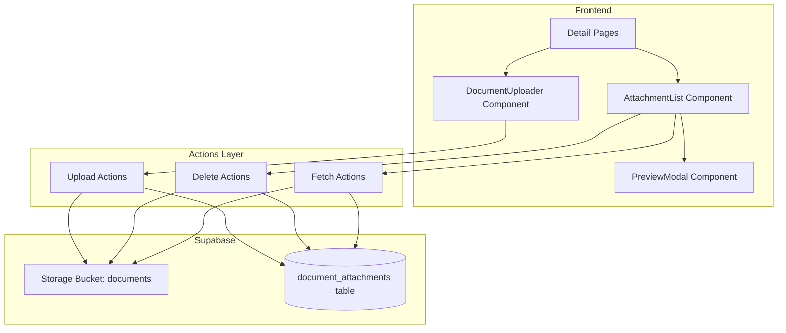

# Design Document: Document Attachments (v0.12)

## Overview

The Document Attachments feature enables users to upload, view, download, and manage file attachments on business entities in Gama ERP. The system uses Supabase Storage for secure file storage with signed URLs for access control. A reusable `DocumentUploader` component provides consistent attachment functionality across PJOs, Job Orders, Invoices, Customers, and Projects.

## Architecture



### Data Flow

1. **Upload Flow**: User selects file → Validate (type, size) → Upload to Storage → Create DB record → Update UI
2. **Preview/Download Flow**: User clicks action → Generate signed URL (1hr expiry) → Open/Download
3. **Delete Flow**: User confirms → Delete from Storage → Delete DB record → Update UI

## Components and Interfaces

### DocumentUploader Component

```typescript
interface DocumentUploaderProps {
  entityType: EntityType;
  entityId: string;
  maxFiles?: number;        // Default: 10
  maxSizeMB?: number;       // Default: 10
  allowedTypes?: string[];  // Default: ['application/pdf', 'image/jpeg', 'image/png']
  onUploadComplete?: (attachment: DocumentAttachment) => void;
  onError?: (error: string) => void;
}

type EntityType = 'pjo' | 'jo' | 'invoice' | 'customer' | 'project';
```

### AttachmentList Component

```typescript
interface AttachmentListProps {
  entityType: EntityType;
  entityId: string;
  attachments: DocumentAttachment[];
  onDelete?: (id: string) => void;
  isLoading?: boolean;
}
```

### PreviewModal Component

```typescript
interface PreviewModalProps {
  isOpen: boolean;
  onClose: () => void;
  attachment: DocumentAttachment | null;
  signedUrl: string | null;
}
```

### Server Actions

```typescript
// lib/attachments/actions.ts
async function uploadAttachment(
  entityType: EntityType,
  entityId: string,
  file: File,
  description?: string
): Promise<{ data: DocumentAttachment | null; error: string | null }>;

async function deleteAttachment(
  attachmentId: string
): Promise<{ success: boolean; error: string | null }>;

async function getAttachments(
  entityType: EntityType,
  entityId: string
): Promise<{ data: DocumentAttachment[]; error: string | null }>;

async function getSignedUrl(
  storagePath: string,
  expiresIn?: number  // Default: 3600 (1 hour)
): Promise<{ url: string | null; error: string | null }>;
```

### Utility Functions

```typescript
// lib/attachments/attachment-utils.ts
function generateStoragePath(
  entityType: EntityType,
  entityId: string,
  fileName: string
): string;

function validateFile(
  file: File,
  allowedTypes: string[],
  maxSizeMB: number
): { valid: boolean; error: string | null };

function validateFiles(
  files: File[],
  allowedTypes: string[],
  maxSizeMB: number
): { valid: boolean; errors: Map<string, string> };

function getFileIcon(mimeType: string): LucideIcon;

function formatFileSize(bytes: number): string;
```

## Data Models

### Database Table

```sql
CREATE TABLE document_attachments (
  id UUID PRIMARY KEY DEFAULT gen_random_uuid(),
  
  -- Link to parent entity
  entity_type VARCHAR(30) NOT NULL,  -- 'pjo', 'jo', 'invoice', 'customer', 'project'
  entity_id UUID NOT NULL,
  
  -- File info
  file_name VARCHAR(255) NOT NULL,
  file_type VARCHAR(100),            -- MIME type
  file_size INTEGER,                 -- bytes
  storage_path VARCHAR(500) NOT NULL, -- Path in Supabase Storage
  
  -- Metadata
  description VARCHAR(500),
  uploaded_by UUID REFERENCES user_profiles(id),
  created_at TIMESTAMPTZ DEFAULT NOW(),
  
  CONSTRAINT valid_entity_type CHECK (
    entity_type IN ('pjo', 'jo', 'invoice', 'customer', 'project')
  )
);

CREATE INDEX idx_attachments_entity ON document_attachments(entity_type, entity_id);
CREATE INDEX idx_attachments_uploaded_by ON document_attachments(uploaded_by);
```

### TypeScript Types

```typescript
// types/attachments.ts
export type AttachmentEntityType = 'pjo' | 'jo' | 'invoice' | 'customer' | 'project';

export interface DocumentAttachment {
  id: string;
  entity_type: AttachmentEntityType;
  entity_id: string;
  file_name: string;
  file_type: string | null;
  file_size: number | null;
  storage_path: string;
  description: string | null;
  uploaded_by: string | null;
  created_at: string;
  // Joined data
  uploader_name?: string;
}

export interface AttachmentUploadResult {
  data: DocumentAttachment | null;
  error: string | null;
}

export interface FileValidationResult {
  valid: boolean;
  error: string | null;
}

export const ALLOWED_MIME_TYPES = [
  'application/pdf',
  'image/jpeg',
  'image/png'
] as const;

export const MAX_FILE_SIZE_MB = 10;
export const MAX_FILE_SIZE_BYTES = MAX_FILE_SIZE_MB * 1024 * 1024;
export const SIGNED_URL_EXPIRY_SECONDS = 3600; // 1 hour
```

## Correctness Properties

*A property is a characteristic or behavior that should hold true across all valid executions of a system-essentially, a formal statement about what the system should do. Properties serve as the bridge between human-readable specifications and machine-verifiable correctness guarantees.*

### Property 1: Storage path generation follows consistent format
*For any* entity type, entity ID, and filename, the generated storage path SHALL follow the format `{entity_type}/{entity_id}/{filename}`.
**Validates: Requirements 1.4, 2.3, 2.4, 3.3, 3.4**

### Property 2: File type validation correctly identifies allowed types
*For any* file, the validation function SHALL return valid=true if and only if the file's MIME type is in the allowed types list.
**Validates: Requirements 4.1, 4.2**

### Property 3: File size validation correctly enforces limits
*For any* file, the validation function SHALL return valid=true if and only if the file size is less than or equal to the maximum allowed size.
**Validates: Requirements 4.3, 4.4**

### Property 4: Batch validation validates each file independently
*For any* array of files, the batch validation result SHALL be the conjunction of individual file validations, with errors mapped to each invalid file.
**Validates: Requirements 4.6**

### Property 5: File icon selection returns correct icon for MIME type
*For any* MIME type, the icon selection function SHALL return a document icon for PDFs and an image icon for image types.
**Validates: Requirements 5.3, 5.4**

### Property 6: Attachment display includes all required fields
*For any* attachment with complete data, the rendered output SHALL contain file name, file type icon, file size, upload date, and description (if provided).
**Validates: Requirements 5.1, 5.2, 9.2**

### Property 7: Signed URL generation uses correct expiry
*For any* signed URL request, the generated URL SHALL have an expiration time of 1 hour (3600 seconds).
**Validates: Requirements 6.4**

### Property 8: Upload creates record with correct entity reference
*For any* successful upload, the created database record SHALL have entity_type and entity_id matching the upload parameters, and uploaded_by matching the current user.
**Validates: Requirements 1.5, 2.5, 12.3**

### Property 9: Delete removes both storage file and database record
*For any* confirmed deletion, both the storage file at the attachment's storage_path AND the database record SHALL be removed.
**Validates: Requirements 8.2, 8.3**

### Property 10: Max files limit disables upload when reached
*For any* entity with attachment count equal to maxFiles, the upload button SHALL be disabled.
**Validates: Requirements 11.5**

## Error Handling

### Upload Errors
| Error Condition | User Message | Action |
|----------------|--------------|--------|
| Invalid file type | "File type not allowed. Please upload PDF, JPEG, or PNG files." | Show error, don't upload |
| File too large | "File exceeds 10MB limit. Please choose a smaller file." | Show error, don't upload |
| Storage upload failed | "Failed to upload file. Please try again." | Show error with retry option |
| Database insert failed | "Failed to save attachment. Please try again." | Delete from storage, show error |
| Max files reached | "Maximum number of attachments reached." | Disable upload button |

### Download/Preview Errors
| Error Condition | User Message | Action |
|----------------|--------------|--------|
| Signed URL failed | "Unable to access file. Please try again." | Show error toast |
| File not found | "File no longer exists." | Show error, refresh list |

### Delete Errors
| Error Condition | User Message | Action |
|----------------|--------------|--------|
| Storage delete failed | "Failed to delete file. Please try again." | Show error, retain attachment |
| Database delete failed | "Failed to remove attachment record." | Show error, retain attachment |

## Testing Strategy

### Property-Based Testing Library
- **Library**: fast-check (TypeScript property-based testing)
- **Minimum iterations**: 100 per property test

### Property-Based Tests

Each correctness property will be implemented as a property-based test:

1. **Storage path generation**: Generate random entity types, UUIDs, and filenames; verify path format
2. **File type validation**: Generate files with random MIME types; verify correct accept/reject
3. **File size validation**: Generate files with random sizes; verify correct accept/reject
4. **Batch validation**: Generate arrays of mixed valid/invalid files; verify individual results
5. **Icon selection**: Generate random MIME types; verify correct icon mapping
6. **Attachment display**: Generate random attachments; verify all fields present in output
7. **Signed URL expiry**: Verify expiry parameter is always 3600
8. **Upload record creation**: Verify entity reference and uploader ID match inputs
9. **Delete cascade**: Verify both storage and DB operations are called
10. **Max files limit**: Generate attachment counts; verify button state

### Unit Tests

- Component rendering tests for DocumentUploader, AttachmentList, PreviewModal
- Empty state rendering
- Loading state rendering
- Error message display
- Confirmation dialog behavior

### Integration Tests

- Full upload flow (file → storage → database → UI update)
- Full delete flow (confirm → storage → database → UI update)
- Preview/download with signed URLs
