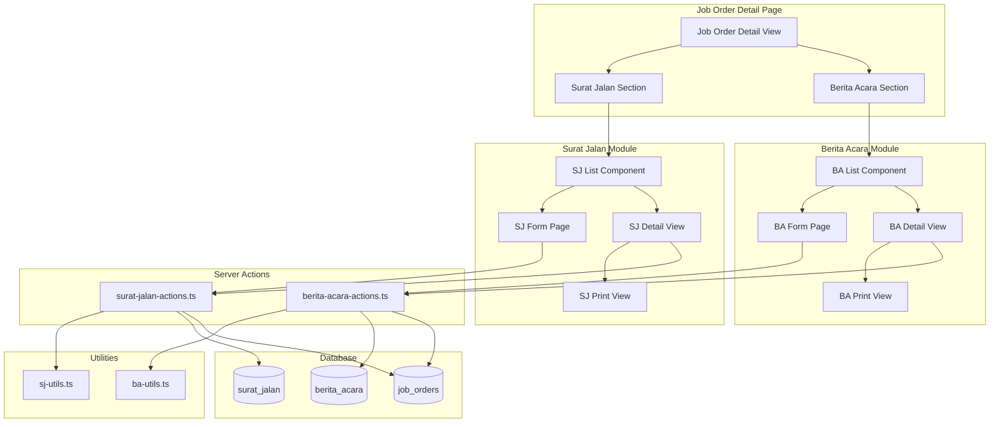

# Design Document: Surat Jalan and Berita Acara Document Management

## Overview

This feature adds document management capabilities for Surat Jalan (Delivery Notes) and Berita Acara (Handover Reports) to the Gama ERP system. These documents are essential for logistics operations:

- **Surat Jalan (SJ)**: Mandatory delivery notes that accompany cargo during transport, containing vehicle, driver, route, and cargo information
- **Berita Acara (BA)**: Conditional handover reports that formally record work completion and cargo condition upon delivery

The feature integrates with the existing Job Orders module and triggers invoice term unlocking based on document status changes (SJ delivered → unlocks 'surat_jalan' terms, BA signed → unlocks 'berita_acara' terms).

## Architecture



## Components and Interfaces

### New Pages

| Route | Component | Purpose |
|-------|-----------|---------|
| `/job-orders/[id]/surat-jalan/new` | `SuratJalanFormPage` | Create new Surat Jalan |
| `/job-orders/[id]/surat-jalan/[sjId]` | `SuratJalanDetailPage` | View SJ details |
| `/job-orders/[id]/surat-jalan/[sjId]/edit` | `SuratJalanEditPage` | Edit SJ (status update) |
| `/job-orders/[id]/berita-acara/new` | `BeritaAcaraFormPage` | Create new Berita Acara |
| `/job-orders/[id]/berita-acara/[baId]` | `BeritaAcaraDetailPage` | View BA details |
| `/job-orders/[id]/berita-acara/[baId]/edit` | `BeritaAcaraEditPage` | Edit BA |

### New Components

| Component | Location | Purpose |
|-----------|----------|---------|
| `SuratJalanSection` | `components/surat-jalan/surat-jalan-section.tsx` | Section in JO detail showing SJ list |
| `SuratJalanList` | `components/surat-jalan/surat-jalan-list.tsx` | Table of SJ documents |
| `SuratJalanForm` | `components/surat-jalan/surat-jalan-form.tsx` | Form for creating/editing SJ |
| `SuratJalanDetailView` | `components/surat-jalan/surat-jalan-detail-view.tsx` | Full SJ detail display |
| `SuratJalanStatusBadge` | `components/ui/sj-status-badge.tsx` | Status badge for SJ |
| `BeritaAcaraSection` | `components/berita-acara/berita-acara-section.tsx` | Section in JO detail showing BA list |
| `BeritaAcaraList` | `components/berita-acara/berita-acara-list.tsx` | Table of BA documents |
| `BeritaAcaraForm` | `components/berita-acara/berita-acara-form.tsx` | Form for creating/editing BA |
| `BeritaAcaraDetailView` | `components/berita-acara/berita-acara-detail-view.tsx` | Full BA detail display |
| `BeritaAcaraStatusBadge` | `components/ui/ba-status-badge.tsx` | Status badge for BA |
| `PhotoGallery` | `components/berita-acara/photo-gallery.tsx` | Display photos in BA |
| `PhotoUploader` | `components/berita-acara/photo-uploader.tsx` | Upload photos for BA |

### Server Actions

| File | Functions |
|------|-----------|
| `app/(main)/job-orders/surat-jalan-actions.ts` | `createSuratJalan`, `updateSuratJalanStatus`, `getSuratJalanList`, `getSuratJalan`, `generateSJNumber` |
| `app/(main)/job-orders/berita-acara-actions.ts` | `createBeritaAcara`, `updateBeritaAcara`, `updateBeritaAcaraStatus`, `getBeritaAcaraList`, `getBeritaAcara`, `generateBANumber` |

### Utility Functions

| File | Functions |
|------|-----------|
| `lib/sj-utils.ts` | `canTransitionSJStatus`, `getSJStatusLabel`, `validateSJForm`, `formatSJNumber` |
| `lib/ba-utils.ts` | `canTransitionBAStatus`, `getBAStatusLabel`, `validateBAForm`, `formatBANumber`, `isValidCargoCondition` |

## Data Models

### Surat Jalan Table

```sql
CREATE TABLE surat_jalan (
  id UUID PRIMARY KEY DEFAULT gen_random_uuid(),
  sj_number VARCHAR(50) UNIQUE NOT NULL,
  jo_id UUID NOT NULL REFERENCES job_orders(id) ON DELETE CASCADE,
  
  -- Delivery details
  delivery_date DATE NOT NULL,
  vehicle_plate VARCHAR(20),
  driver_name VARCHAR(100),
  driver_phone VARCHAR(30),
  
  -- Route
  origin VARCHAR(500),
  destination VARCHAR(500),
  
  -- Cargo
  cargo_description TEXT,
  quantity DECIMAL(10,2),
  quantity_unit VARCHAR(20),
  weight_kg DECIMAL(12,2),
  
  -- Status
  status VARCHAR(30) DEFAULT 'issued',
  issued_at TIMESTAMPTZ DEFAULT NOW(),
  delivered_at TIMESTAMPTZ,
  
  -- Signatures
  sender_name VARCHAR(100),
  sender_signature_url VARCHAR(500),
  receiver_name VARCHAR(100),
  receiver_signature_url VARCHAR(500),
  
  -- Notes
  notes TEXT,
  
  created_by UUID REFERENCES user_profiles(id),
  created_at TIMESTAMPTZ DEFAULT NOW(),
  updated_at TIMESTAMPTZ DEFAULT NOW()
);

CREATE INDEX idx_surat_jalan_jo ON surat_jalan(jo_id);
CREATE INDEX idx_surat_jalan_status ON surat_jalan(status);
```

### Berita Acara Table

```sql
CREATE TABLE berita_acara (
  id UUID PRIMARY KEY DEFAULT gen_random_uuid(),
  ba_number VARCHAR(50) UNIQUE NOT NULL,
  jo_id UUID NOT NULL REFERENCES job_orders(id) ON DELETE CASCADE,
  
  -- Handover details
  handover_date DATE NOT NULL,
  location VARCHAR(500),
  
  -- Work summary
  work_description TEXT,
  cargo_condition VARCHAR(50), -- 'good', 'minor_damage', 'major_damage'
  condition_notes TEXT,
  
  -- Status
  status VARCHAR(30) DEFAULT 'draft',
  
  -- Signatures
  company_representative VARCHAR(100),
  company_signature_url VARCHAR(500),
  client_representative VARCHAR(100),
  client_signature_url VARCHAR(500),
  signed_at TIMESTAMPTZ,
  
  -- Attachments
  photo_urls JSONB DEFAULT '[]',
  
  notes TEXT,
  
  created_by UUID REFERENCES user_profiles(id),
  created_at TIMESTAMPTZ DEFAULT NOW(),
  updated_at TIMESTAMPTZ DEFAULT NOW()
);

CREATE INDEX idx_berita_acara_jo ON berita_acara(jo_id);
CREATE INDEX idx_berita_acara_status ON berita_acara(status);
```

### Job Orders Table Updates

```sql
ALTER TABLE job_orders
ADD COLUMN IF NOT EXISTS has_surat_jalan BOOLEAN DEFAULT FALSE,
ADD COLUMN IF NOT EXISTS has_berita_acara BOOLEAN DEFAULT FALSE,
ADD COLUMN IF NOT EXISTS requires_berita_acara BOOLEAN DEFAULT FALSE;
```

### TypeScript Interfaces

```typescript
// SJ Status type
export type SJStatus = 'issued' | 'in_transit' | 'delivered' | 'returned'

// BA Status type
export type BAStatus = 'draft' | 'pending_signature' | 'signed' | 'archived'

// Cargo Condition type
export type CargoCondition = 'good' | 'minor_damage' | 'major_damage'

// Surat Jalan interface
export interface SuratJalan {
  id: string
  sj_number: string
  jo_id: string
  delivery_date: string
  vehicle_plate: string | null
  driver_name: string | null
  driver_phone: string | null
  origin: string | null
  destination: string | null
  cargo_description: string | null
  quantity: number | null
  quantity_unit: string | null
  weight_kg: number | null
  status: SJStatus
  issued_at: string
  delivered_at: string | null
  sender_name: string | null
  sender_signature_url: string | null
  receiver_name: string | null
  receiver_signature_url: string | null
  notes: string | null
  created_by: string | null
  created_at: string
  updated_at: string
}

// Berita Acara interface
export interface BeritaAcara {
  id: string
  ba_number: string
  jo_id: string
  handover_date: string
  location: string | null
  work_description: string | null
  cargo_condition: CargoCondition | null
  condition_notes: string | null
  status: BAStatus
  company_representative: string | null
  company_signature_url: string | null
  client_representative: string | null
  client_signature_url: string | null
  signed_at: string | null
  photo_urls: string[]
  notes: string | null
  created_by: string | null
  created_at: string
  updated_at: string
}

// Form data interfaces
export interface SuratJalanFormData {
  delivery_date: string
  vehicle_plate: string
  driver_name: string
  driver_phone?: string
  origin: string
  destination: string
  cargo_description: string
  quantity?: number
  quantity_unit?: string
  weight_kg?: number
  sender_name?: string
  notes?: string
}

export interface BeritaAcaraFormData {
  handover_date: string
  location: string
  work_description: string
  cargo_condition: CargoCondition
  condition_notes?: string
  company_representative: string
  client_representative: string
  photo_urls?: string[]
  notes?: string
}
```

## Correctness Properties

*A property is a characteristic or behavior that should hold true across all valid executions of a system-essentially, a formal statement about what the system should do. Properties serve as the bridge between human-readable specifications and machine-verifiable correctness guarantees.*

### Property 1: SJ Number Generation Format
*For any* year and existing document count, the generated SJ number SHALL follow the format `SJ-YYYY-NNNN` where YYYY is the year and NNNN is a zero-padded sequential number starting from 0001.
**Validates: Requirements 1.2, 8.1**

### Property 2: BA Number Generation Format
*For any* year and existing document count, the generated BA number SHALL follow the format `BA-YYYY-NNNN` where YYYY is the year and NNNN is a zero-padded sequential number starting from 0001.
**Validates: Requirements 3.2, 8.2**

### Property 3: SJ Status Transition Validity
*For any* Surat Jalan with current status S, a transition to status T is valid if and only if:
- S = 'issued' AND T ∈ {'in_transit'}
- S = 'in_transit' AND T ∈ {'delivered', 'returned'}
All other transitions SHALL be rejected.
**Validates: Requirements 2.1**

### Property 4: BA Status Transition Validity
*For any* Berita Acara with current status S, a transition to status T is valid if and only if:
- S = 'draft' AND T ∈ {'pending_signature'}
- S = 'pending_signature' AND T ∈ {'signed', 'archived'}
All other transitions SHALL be rejected.
**Validates: Requirements 4.1**

### Property 5: SJ Form Validation
*For any* Surat Jalan form submission, the form SHALL be valid if and only if all of the following fields contain non-empty values: delivery_date, vehicle_plate, driver_name, origin, destination, cargo_description.
**Validates: Requirements 1.4**

### Property 6: BA Form Validation
*For any* Berita Acara form submission, the form SHALL be valid if and only if all of the following fields contain non-empty values: handover_date, location, work_description, cargo_condition, company_representative, client_representative.
**Validates: Requirements 3.3**

### Property 7: Cargo Condition Validation
*For any* cargo condition value V, V is valid if and only if V ∈ {'good', 'minor_damage', 'major_damage'}.
**Validates: Requirements 3.5**

### Property 8: SJ Delivery Triggers JO Update and Invoice Term Unlock
*For any* Surat Jalan that transitions to 'delivered' status, the system SHALL:
1. Set delivered_at to the current timestamp
2. Update the associated Job Order's has_surat_jalan flag to true
3. For any invoice term with trigger='surat_jalan', the term status SHALL become 'ready'
**Validates: Requirements 2.2, 2.4**

### Property 9: BA Signed Triggers JO Update and Invoice Term Unlock
*For any* Berita Acara that transitions to 'signed' status, the system SHALL:
1. Set signed_at to the current timestamp
2. Update the associated Job Order's has_berita_acara flag to true
3. For any invoice term with trigger='berita_acara', the term status SHALL become 'ready'
**Validates: Requirements 4.2, 4.3**

### Property 10: SJ Auto-fill from JO
*For any* Job Order with associated PJO containing route (pol, pod) and cargo (commodity, quantity, quantity_unit) data, when creating a new Surat Jalan, the form SHALL pre-populate origin with pol, destination with pod, cargo_description with commodity, quantity with quantity, and quantity_unit with quantity_unit.
**Validates: Requirements 1.3**

### Property 11: SJ Initial Status
*For any* newly created Surat Jalan, the status SHALL be 'issued' and issued_at SHALL be set to the creation timestamp.
**Validates: Requirements 1.5**

### Property 12: BA Initial Status
*For any* newly created Berita Acara, the status SHALL be 'draft'.
**Validates: Requirements 3.4**

### Property 13: Photo Storage Format
*For any* Berita Acara with uploaded photos, the photo_urls field SHALL be a JSON array of string URLs.
**Validates: Requirements 5.2**

## Error Handling

| Error Scenario | Handling Strategy |
|----------------|-------------------|
| Invalid status transition | Return error message with valid transitions |
| Missing required fields | Return validation error with field names |
| Invalid cargo condition | Return error with valid options |
| JO not found | Return 404 error |
| Duplicate document number | Database constraint prevents, retry with new number |
| Photo upload failure | Return error, allow retry |
| Unauthorized access | Return 403 error |

## Testing Strategy

### Property-Based Testing

The project uses **Vitest** with **fast-check** for property-based testing. Each correctness property will be implemented as a property-based test.

Configuration:
- Minimum 100 iterations per property test
- Tests located in `__tests__/` directory
- Each test tagged with property reference comment

### Unit Tests

Unit tests will cover:
- Utility function edge cases
- Component rendering with various props
- Server action error handling
- Form validation edge cases

### Test Files

| File | Coverage |
|------|----------|
| `__tests__/sj-utils.test.ts` | SJ utility functions and properties |
| `__tests__/ba-utils.test.ts` | BA utility functions and properties |
| `__tests__/surat-jalan-actions.test.ts` | SJ server actions |
| `__tests__/berita-acara-actions.test.ts` | BA server actions |
