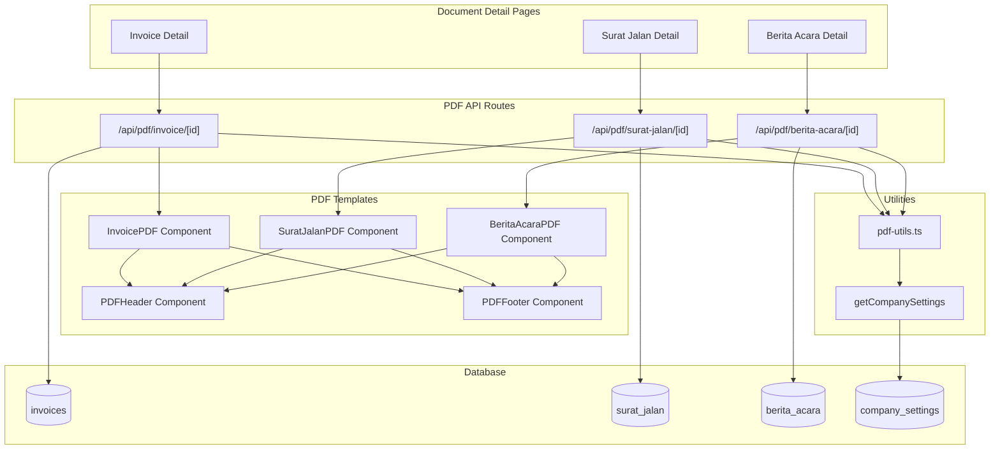

# Design Document: PDF Export for Documents

## Overview

The PDF Export feature enables generation of professional PDF documents for Invoices, Surat Jalan, and Berita Acara in Gama ERP. Using `@react-pdf/renderer`, PDFs are generated server-side via Next.js API routes, ensuring consistent output across all browsers and devices.

The feature provides:
- Company-branded document headers with logo support
- Properly formatted tables and financial data
- Signature spaces for delivery and handover documents
- View (inline) and Download options for all document types

## Architecture



## Components and Interfaces

### API Routes

| Route | Method | Purpose |
|-------|--------|---------|
| `/api/pdf/invoice/[id]` | GET | Generate Invoice PDF |
| `/api/pdf/surat-jalan/[id]` | GET | Generate Surat Jalan PDF |
| `/api/pdf/berita-acara/[id]` | GET | Generate Berita Acara PDF |

Query parameters:
- `download=true` - Returns PDF with attachment disposition (download)
- Default (no param) - Returns PDF with inline disposition (view in browser)

### PDF Template Components

| Component | Location | Purpose |
|-----------|----------|---------|
| `InvoicePDF` | `lib/pdf/invoice-pdf.tsx` | Invoice document template |
| `SuratJalanPDF` | `lib/pdf/surat-jalan-pdf.tsx` | Delivery note template |
| `BeritaAcaraPDF` | `lib/pdf/berita-acara-pdf.tsx` | Handover report template |
| `PDFHeader` | `lib/pdf/components/pdf-header.tsx` | Reusable company header |
| `PDFFooter` | `lib/pdf/components/pdf-footer.tsx` | Reusable page footer |
| `PDFTable` | `lib/pdf/components/pdf-table.tsx` | Reusable table component |
| `SignatureBlock` | `lib/pdf/components/signature-block.tsx` | Signature space component |

### Utility Functions

| File | Functions |
|------|-----------|
| `lib/pdf/pdf-utils.ts` | `getCompanySettings`, `formatCurrencyForPDF`, `formatDateForPDF` |

### UI Components

| Component | Location | Purpose |
|-----------|----------|---------|
| `PDFButtons` | `components/pdf/pdf-buttons.tsx` | View/Download button group |

## Data Models

### Company Settings Keys Used

```typescript
interface CompanySettingsForPDF {
  company_name: string
  company_legal_name?: string
  company_address?: string
  company_phone?: string
  company_email?: string
  company_tax_id?: string
  logo_url?: string
  bank_name?: string
  bank_account?: string
  bank_account_name?: string
}
```

### Invoice PDF Props

```typescript
interface InvoicePDFProps {
  invoice: {
    invoice_number: string
    invoice_date: string
    due_date: string
    subtotal: number
    tax_amount: number
    total_amount: number
    term_description?: string
    notes?: string
  }
  customer: {
    name: string
    address?: string
  }
  jobOrder: {
    jo_number: string
  }
  lineItems: Array<{
    description: string
    quantity: number
    unit?: string
    unit_price: number
    subtotal: number
  }>
  company: CompanySettingsForPDF
}
```

### Surat Jalan PDF Props

```typescript
interface SuratJalanPDFProps {
  suratJalan: {
    sj_number: string
    delivery_date: string
    vehicle_plate?: string
    driver_name?: string
    driver_phone?: string
    origin?: string
    destination?: string
    cargo_description?: string
    quantity?: number
    quantity_unit?: string
    weight_kg?: number
    sender_name?: string
    receiver_name?: string
    notes?: string
  }
  jobOrder: {
    jo_number: string
  }
  company: CompanySettingsForPDF
}
```

### Berita Acara PDF Props

```typescript
interface BeritaAcaraPDFProps {
  beritaAcara: {
    ba_number: string
    handover_date: string
    location?: string
    work_description?: string
    cargo_condition?: string
    condition_notes?: string
    company_representative?: string
    client_representative?: string
    photo_urls?: string[]
    notes?: string
  }
  jobOrder: {
    jo_number: string
  }
  customer: {
    name: string
  }
  company: CompanySettingsForPDF
}
```

## PDF Styling

### Common Styles

```typescript
const commonStyles = StyleSheet.create({
  page: {
    padding: 40,
    fontSize: 10,
    fontFamily: 'Helvetica',
  },
  header: {
    flexDirection: 'row',
    justifyContent: 'space-between',
    marginBottom: 30,
  },
  logo: {
    width: 100,
    height: 50,
    objectFit: 'contain',
  },
  title: {
    fontSize: 24,
    fontWeight: 'bold',
    marginBottom: 20,
  },
  sectionTitle: {
    fontSize: 12,
    fontWeight: 'bold',
    marginBottom: 10,
    marginTop: 15,
  },
  row: {
    flexDirection: 'row',
    justifyContent: 'space-between',
    marginBottom: 5,
  },
  table: {
    marginTop: 20,
  },
  tableHeader: {
    flexDirection: 'row',
    backgroundColor: '#f0f0f0',
    padding: 8,
    fontWeight: 'bold',
  },
  tableRow: {
    flexDirection: 'row',
    borderBottomWidth: 1,
    borderBottomColor: '#eee',
    padding: 8,
  },
  tableRowAlt: {
    backgroundColor: '#fafafa',
  },
  footer: {
    position: 'absolute',
    bottom: 40,
    left: 40,
    right: 40,
    textAlign: 'center',
    fontSize: 9,
    color: '#666',
  },
  signatureBlock: {
    width: '45%',
    marginTop: 40,
  },
  signatureLine: {
    borderTopWidth: 1,
    borderTopColor: '#000',
    marginTop: 60,
    paddingTop: 5,
  },
})
```

### Invoice Table Columns

| Column | Width | Alignment |
|--------|-------|-----------|
| Description | 40% | Left |
| Qty | 15% | Center |
| Unit | 15% | Center |
| Price | 15% | Right |
| Amount | 15% | Right |

## Correctness Properties

### Property 1: PDF Content-Type Header
*For any* PDF generation request, the response SHALL have Content-Type header set to "application/pdf".
**Validates: Requirements 5.2**

### Property 2: PDF Disposition Header
*For any* PDF request without download parameter, Content-Disposition SHALL be "inline".
*For any* PDF request with download=true parameter, Content-Disposition SHALL be "attachment; filename={document_number}.pdf".
**Validates: Requirements 1.2, 1.3, 2.2, 2.3, 3.2, 3.3**

### Property 3: Invoice Total Calculation
*For any* Invoice PDF, the displayed grand total SHALL equal subtotal + tax_amount, and tax_amount SHALL equal subtotal × 0.11.
**Validates: Requirements 1.9**

### Property 4: Company Header Presence
*For any* generated PDF, the company header SHALL include company_name from settings.
*If* logo_url is configured, the header SHALL include the logo image.
**Validates: Requirements 4.1, 4.2, 4.3**

### Property 5: Required Fields Presence
*For any* Invoice PDF: invoice_number, invoice_date, due_date, customer name, line items table, and totals SHALL be present.
*For any* Surat Jalan PDF: sj_number, delivery_date, origin, destination, and cargo_description SHALL be present.
*For any* Berita Acara PDF: ba_number, handover_date, work_description, and cargo_condition SHALL be present.
**Validates: Requirements 1.5-1.10, 2.5-2.9, 3.5-3.9**

### Property 6: Currency Formatting
*For any* monetary value displayed in a PDF, the value SHALL be formatted with Indonesian Rupiah format (Rp X.XXX.XXX).
**Validates: Requirements 1.8, 1.9**

### Property 7: Date Formatting
*For any* date displayed in a PDF, the date SHALL be formatted as DD/MM/YYYY.
**Validates: Requirements 6.3**

## Error Handling

| Error Scenario | Handling Strategy |
|----------------|-------------------|
| Document not found | Return 404 response |
| Company settings missing | Use default values, proceed with generation |
| Logo URL invalid/unreachable | Skip logo, show company name only |
| Line items empty | Show empty table with headers |
| Database error | Return 500 response with error message |
| PDF generation failure | Return 500 response with error details |

## Testing Strategy

### Unit Tests

Unit tests will cover:
- PDF utility functions (formatting, settings retrieval)
- API route parameter handling
- Error response generation

### Integration Tests

Integration tests will cover:
- Full PDF generation with mock data
- Company settings integration
- Response headers verification

### Test Files

| File | Coverage |
|------|----------|
| `__tests__/pdf-utils.test.ts` | PDF utility functions |

## Implementation Notes

### @react-pdf/renderer Usage

```typescript
import { renderToBuffer } from '@react-pdf/renderer'
import { Document, Page, Text, View, StyleSheet, Image } from '@react-pdf/renderer'

// Generate PDF buffer
const buffer = await renderToBuffer(<InvoicePDF {...props} />)

// Return as response
return new Response(buffer, {
  headers: {
    'Content-Type': 'application/pdf',
    'Content-Disposition': `inline; filename="${filename}.pdf"`,
  },
})
```

### Company Settings Retrieval

```typescript
export async function getCompanySettings(): Promise<CompanySettingsForPDF> {
  const supabase = await createClient()
  
  const { data } = await supabase
    .from('company_settings')
    .select('key, value')
  
  const settings: Record<string, string> = {}
  data?.forEach(row => {
    if (row.value) settings[row.key] = row.value
  })
  
  return {
    company_name: settings.company_name || 'PT. Gama Intisamudera',
    company_address: settings.company_address,
    company_phone: settings.company_phone,
    logo_url: settings.logo_url,
    bank_name: settings.bank_name,
    bank_account: settings.bank_account,
    bank_account_name: settings.bank_account_name,
  }
}
```

### Currency Formatting for PDF

```typescript
export function formatCurrencyForPDF(amount: number): string {
  return `Rp ${amount.toLocaleString('id-ID')}`
}
```

### Date Formatting for PDF

```typescript
export function formatDateForPDF(dateString: string): string {
  const date = new Date(dateString)
  return date.toLocaleDateString('id-ID', {
    day: '2-digit',
    month: '2-digit',
    year: 'numeric',
  })
}
```
