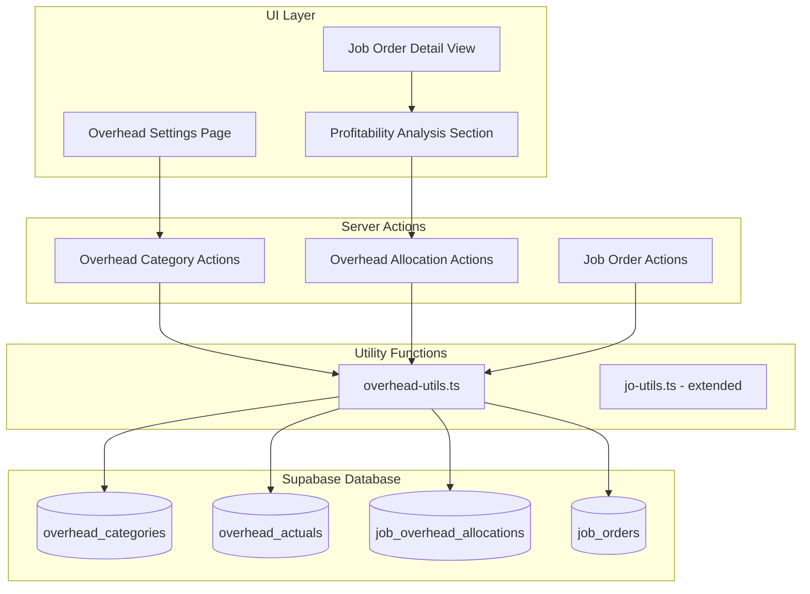
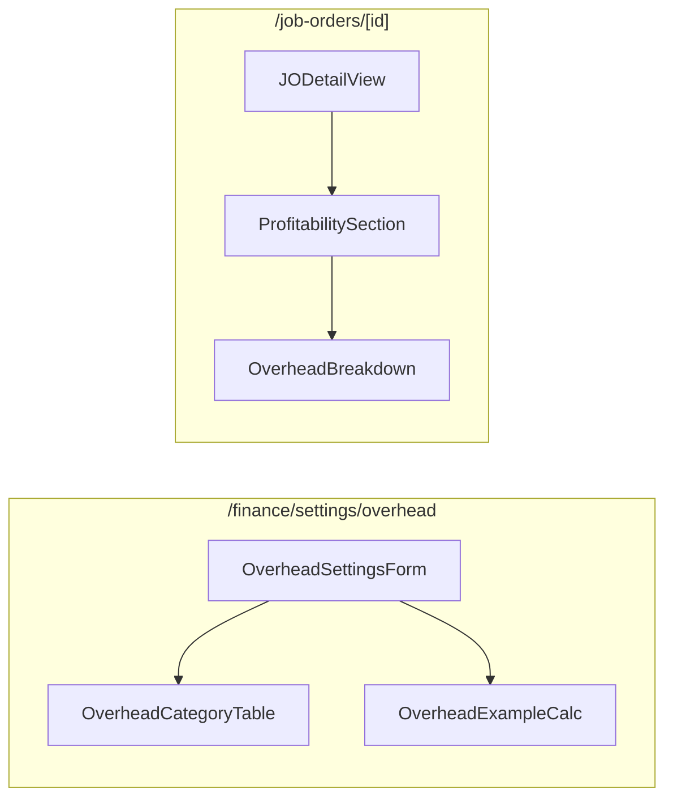

# Design Document: Overhead Allocation

## Overview

The Overhead Allocation feature enables Gama ERP to calculate true job profitability by allocating indirect business costs (overhead) to job orders. This transforms the profit calculation from a simple `Revenue - Direct Costs` to a comprehensive `Revenue - Direct Costs - Allocated Overhead`, providing accurate net profit and margin figures.

The system uses a revenue percentage-based allocation method as the primary approach, where each overhead category (office rent, utilities, admin salaries, etc.) is allocated to jobs proportionally based on their revenue contribution. This is a standard cost accounting practice that ensures overhead is distributed fairly across all revenue-generating activities.

## Architecture



### Component Architecture



## Components and Interfaces

### Server Actions

#### `/app/(main)/finance/settings/overhead/actions.ts`

```typescript
'use server'

// Get all overhead categories
export async function getOverheadCategories(): Promise<{
  data: OverheadCategory[] | null;
  error: string | null;
}>

// Update overhead category rate
export async function updateOverheadCategoryRate(
  categoryId: string,
  rate: number
): Promise<{ success: boolean; error: string | null }>

// Toggle overhead category active status
export async function toggleOverheadCategoryActive(
  categoryId: string,
  isActive: boolean
): Promise<{ success: boolean; error: string | null }>

// Create new overhead category
export async function createOverheadCategory(
  data: CreateOverheadCategoryInput
): Promise<{ data: OverheadCategory | null; error: string | null }>

// Get total overhead rate (sum of active revenue_percentage categories)
export async function getTotalOverheadRate(): Promise<{
  rate: number;
  error: string | null;
}>
```

#### `/app/(main)/job-orders/overhead-actions.ts`

```typescript
'use server'

// Calculate and allocate overhead for a single job
export async function allocateJobOverhead(
  joId: string
): Promise<{ totalOverhead: number; error: string | null }>

// Get overhead breakdown for a job
export async function getJobOverheadBreakdown(
  joId: string
): Promise<{
  allocations: JobOverheadAllocationWithCategory[];
  total: number;
  error: string | null;
}>

// Batch recalculate overhead for jobs in a period
export async function batchRecalculateOverhead(
  year: number,
  month: number
): Promise<{ count: number; error: string | null }>

// Recalculate overhead for a single job (user-triggered)
export async function recalculateJobOverhead(
  joId: string
): Promise<{ success: boolean; error: string | null }>
```

### UI Components

#### `components/overhead/overhead-settings-form.tsx`

Main form component for the overhead settings page. Displays allocation method selector, category table with inline editing, and example calculation.

```typescript
interface OverheadSettingsFormProps {
  categories: OverheadCategory[];
  totalRate: number;
}
```

#### `components/overhead/overhead-category-table.tsx`

Table component displaying overhead categories with inline rate editing and active toggle.

```typescript
interface OverheadCategoryTableProps {
  categories: OverheadCategory[];
  onRateChange: (categoryId: string, rate: number) => Promise<void>;
  onActiveToggle: (categoryId: string, isActive: boolean) => Promise<void>;
}
```

#### `components/overhead/overhead-example-calc.tsx`

Displays an example calculation showing how overhead affects job profitability.

```typescript
interface OverheadExampleCalcProps {
  totalRate: number;
  sampleRevenue?: number; // Default: 100,000,000
}
```

#### `components/job-orders/profitability-section.tsx`

New section on job order detail view showing complete profitability analysis.

```typescript
interface ProfitabilitySectionProps {
  jobOrder: JobOrderWithFinancials;
  overheadBreakdown: JobOverheadAllocationWithCategory[];
  onRecalculate: () => Promise<void>;
}
```

#### `components/job-orders/overhead-breakdown.tsx`

Displays itemized overhead allocation by category.

```typescript
interface OverheadBreakdownProps {
  allocations: JobOverheadAllocationWithCategory[];
  total: number;
}
```

### Utility Functions

#### `lib/overhead-utils.ts`

```typescript
// Calculate overhead allocation for a job
export function calculateOverheadAllocation(
  revenue: number,
  categories: OverheadCategory[]
): OverheadAllocationResult[]

// Calculate gross profit
export function calculateGrossProfit(
  revenue: number,
  directCosts: number
): number

// Calculate net profit
export function calculateNetProfit(
  grossProfit: number,
  totalOverhead: number
): number

// Calculate margin percentage
export function calculateMargin(
  profit: number,
  revenue: number
): number

// Format overhead allocation for display
export function formatOverheadAllocation(
  allocation: JobOverheadAllocationWithCategory
): FormattedOverheadAllocation

// Validate allocation rate (0-100 for percentage)
export function validateAllocationRate(
  rate: number,
  method: AllocationMethod
): { valid: boolean; error?: string }

// Get total overhead rate from categories
export function sumOverheadRates(
  categories: OverheadCategory[]
): number
```

## Data Models

### TypeScript Types

```typescript
// types/overhead.ts

export type AllocationMethod = 
  | 'revenue_percentage' 
  | 'fixed_per_job' 
  | 'manual' 
  | 'none';

export interface OverheadCategory {
  id: string;
  category_code: string;
  category_name: string;
  description: string | null;
  allocation_method: AllocationMethod;
  default_rate: number;
  is_active: boolean;
  display_order: number;
  created_at: string;
}

export interface CreateOverheadCategoryInput {
  category_code: string;
  category_name: string;
  description?: string;
  allocation_method: AllocationMethod;
  default_rate: number;
  is_active?: boolean;
  display_order?: number;
}

export interface OverheadActual {
  id: string;
  category_id: string;
  period_year: number;
  period_month: number;
  actual_amount: number;
  notes: string | null;
  created_by: string | null;
  created_at: string;
}

export interface JobOverheadAllocation {
  id: string;
  jo_id: string;
  category_id: string;
  allocation_method: string;
  allocation_rate: number;
  base_amount: number;
  allocated_amount: number;
  period_year: number | null;
  period_month: number | null;
  notes: string | null;
  created_at: string;
}

export interface JobOverheadAllocationWithCategory extends JobOverheadAllocation {
  category: OverheadCategory;
}

export interface OverheadAllocationResult {
  categoryId: string;
  categoryCode: string;
  categoryName: string;
  method: AllocationMethod;
  rate: number;
  baseAmount: number;
  allocatedAmount: number;
}

export interface JobProfitability {
  revenue: number;
  directCosts: number;
  grossProfit: number;
  grossMargin: number;
  totalOverhead: number;
  netProfit: number;
  netMargin: number;
  overheadBreakdown: OverheadAllocationResult[];
}

export interface FormattedOverheadAllocation {
  categoryName: string;
  rateDisplay: string; // e.g., "2.0%"
  allocatedAmountDisplay: string; // e.g., "Rp 2,000,000"
}
```

### Database Schema

```sql
-- Overhead categories table
CREATE TABLE overhead_categories (
  id UUID PRIMARY KEY DEFAULT gen_random_uuid(),
  category_code VARCHAR(30) UNIQUE NOT NULL,
  category_name VARCHAR(100) NOT NULL,
  description TEXT,
  allocation_method VARCHAR(30) DEFAULT 'revenue_percentage',
  default_rate DECIMAL(5,2),
  is_active BOOLEAN DEFAULT TRUE,
  display_order INTEGER DEFAULT 0,
  created_at TIMESTAMPTZ DEFAULT NOW()
);

-- Overhead actuals table (monthly actual expenses)
CREATE TABLE overhead_actuals (
  id UUID PRIMARY KEY DEFAULT gen_random_uuid(),
  category_id UUID NOT NULL REFERENCES overhead_categories(id),
  period_year INTEGER NOT NULL,
  period_month INTEGER NOT NULL,
  actual_amount DECIMAL(15,2) NOT NULL,
  notes TEXT,
  created_by UUID REFERENCES user_profiles(id),
  created_at TIMESTAMPTZ DEFAULT NOW(),
  UNIQUE(category_id, period_year, period_month)
);

-- Job overhead allocations table
CREATE TABLE job_overhead_allocations (
  id UUID PRIMARY KEY DEFAULT gen_random_uuid(),
  jo_id UUID NOT NULL REFERENCES job_orders(id) ON DELETE CASCADE,
  category_id UUID NOT NULL REFERENCES overhead_categories(id),
  allocation_method VARCHAR(30) NOT NULL,
  allocation_rate DECIMAL(5,2),
  base_amount DECIMAL(15,2),
  allocated_amount DECIMAL(15,2) NOT NULL,
  period_year INTEGER,
  period_month INTEGER,
  notes TEXT,
  created_at TIMESTAMPTZ DEFAULT NOW(),
  UNIQUE(jo_id, category_id)
);

-- Add columns to job_orders
ALTER TABLE job_orders
ADD COLUMN IF NOT EXISTS total_overhead DECIMAL(15,2) DEFAULT 0,
ADD COLUMN IF NOT EXISTS net_profit DECIMAL(15,2) DEFAULT 0,
ADD COLUMN IF NOT EXISTS net_margin DECIMAL(5,2) DEFAULT 0;

-- Indexes
CREATE INDEX idx_overhead_actuals_period ON overhead_actuals(period_year, period_month);
CREATE INDEX idx_job_overhead_jo ON job_overhead_allocations(jo_id);
CREATE INDEX idx_overhead_categories_active ON overhead_categories(is_active);
```

### Default Data

```sql
INSERT INTO overhead_categories (category_code, category_name, allocation_method, default_rate, display_order) VALUES
  ('office_rent', 'Office Rent', 'revenue_percentage', 2.0, 1),
  ('utilities', 'Utilities (Electric, Water, Internet)', 'revenue_percentage', 0.5, 2),
  ('admin_salary', 'Admin Staff Salaries', 'revenue_percentage', 5.0, 3),
  ('insurance', 'Company Insurance', 'revenue_percentage', 1.0, 4),
  ('depreciation', 'Equipment Depreciation', 'revenue_percentage', 2.0, 5),
  ('marketing', 'Marketing Expenses', 'revenue_percentage', 1.5, 6),
  ('professional', 'Professional Services (Legal, Audit)', 'revenue_percentage', 1.0, 7),
  ('miscellaneous', 'Miscellaneous Overhead', 'revenue_percentage', 1.0, 8);
```


## Correctness Properties

*A property is a characteristic or behavior that should hold true across all valid executions of a system—essentially, a formal statement about what the system should do. Properties serve as the bridge between human-readable specifications and machine-verifiable correctness guarantees.*

### Property 1: Total Overhead Rate Calculation

*For any* set of overhead categories, the total overhead rate SHALL equal the sum of `default_rate` values for all categories where `is_active = true` AND `allocation_method = 'revenue_percentage'`.

**Validates: Requirements 1.4**

### Property 2: Active Category Inclusion in Allocation

*For any* job order with positive revenue and any set of overhead categories, the allocation result SHALL contain exactly one allocation record for each category where `is_active = true`, and zero records for inactive categories.

**Validates: Requirements 1.3, 2.1**

### Property 3: Revenue Percentage Allocation Formula

*For any* job revenue `R` and allocation rate `r` (where `r` is a percentage), the allocated amount SHALL equal `R × r / 100`.

**Validates: Requirements 2.2**

### Property 4: Allocation Idempotence

*For any* job order, calculating overhead allocation twice in succession SHALL produce identical allocation records and job order financial fields (total_overhead, net_profit, net_margin).

**Validates: Requirements 2.5**

### Property 5: Profitability Calculation Consistency

*For any* job order with revenue `R`, direct costs `C`, and total overhead `O`:
- Gross profit SHALL equal `R - C`
- Gross margin SHALL equal `(R - C) / R × 100` when `R > 0`, else `0`
- Net profit SHALL equal `(R - C) - O`
- Net margin SHALL equal `((R - C) - O) / R × 100` when `R > 0`, else `0`

**Validates: Requirements 3.1, 3.2, 3.5, 3.6**

### Property 6: Total Overhead Sum Consistency

*For any* job order with overhead allocations, the `total_overhead` field on the job order SHALL equal the sum of `allocated_amount` values across all allocation records for that job.

**Validates: Requirements 2.6, 3.4**

### Property 7: Category Rate Update Persistence

*For any* overhead category and valid rate value, after updating the category's rate, querying that category SHALL return the new rate value.

**Validates: Requirements 1.2**

### Property 8: Unique Category Code Constraint

*For any* existing overhead category with code `X`, attempting to create a new category with the same code `X` SHALL fail with an error.

**Validates: Requirements 1.6**

### Property 9: Unique Allocation Constraint

*For any* job order and overhead category, attempting to insert two allocation records with the same (jo_id, category_id) combination SHALL fail with an error.

**Validates: Requirements 6.6**

### Property 10: Batch Recalculation Coverage

*For any* period (year, month) containing N job orders, batch recalculation SHALL process exactly N jobs and return count N.

**Validates: Requirements 4.1, 4.2**

## Error Handling

### Input Validation Errors

| Error Condition | Response | User Message |
|----------------|----------|--------------|
| Invalid allocation rate (negative or > 100 for percentage) | Reject update | "Allocation rate must be between 0 and 100%" |
| Duplicate category code | Reject creation | "Category code already exists" |
| Empty category name | Reject creation | "Category name is required" |
| Invalid job order ID | Return error | "Job order not found" |

### Database Errors

| Error Condition | Response | User Message |
|----------------|----------|--------------|
| Unique constraint violation | Catch and return error | "This allocation already exists" |
| Foreign key violation | Catch and return error | "Referenced record not found" |
| Connection timeout | Retry once, then error | "Unable to save changes. Please try again." |

### Business Logic Errors

| Error Condition | Response | User Message |
|----------------|----------|--------------|
| Zero revenue job allocation | Return 0 overhead | (No error - valid case) |
| No active categories | Return 0 overhead | (No error - valid case) |
| Unauthorized access | Deny and redirect | "You don't have permission to access overhead settings" |

### Error Response Format

```typescript
interface ActionResult<T> {
  data: T | null;
  error: string | null;
  success: boolean;
}
```

## Testing Strategy

### Property-Based Testing

We will use **fast-check** as the property-based testing library for TypeScript. Each correctness property will be implemented as a property-based test with a minimum of 100 iterations.

#### Test Configuration

```typescript
// vitest.config.ts additions
export default defineConfig({
  test: {
    // ... existing config
    testTimeout: 30000, // Allow time for PBT iterations
  },
});
```

#### Property Test Structure

Each property test will:
1. Generate random valid inputs using fast-check arbitraries
2. Execute the function under test
3. Assert the property holds for all generated inputs
4. Be tagged with the property number and requirements reference

```typescript
// Example structure
describe('Overhead Allocation Properties', () => {
  it('Property 3: Revenue Percentage Allocation Formula', () => {
    // **Feature: overhead-allocation, Property 3: Revenue Percentage Allocation Formula**
    // **Validates: Requirements 2.2**
    fc.assert(
      fc.property(
        fc.float({ min: 0, max: 1000000000 }), // revenue
        fc.float({ min: 0, max: 100 }),        // rate
        (revenue, rate) => {
          const result = calculateAllocation(revenue, rate);
          const expected = revenue * rate / 100;
          return Math.abs(result - expected) < 0.01; // floating point tolerance
        }
      ),
      { numRuns: 100 }
    );
  });
});
```

### Unit Tests

Unit tests will complement property tests by covering:

1. **Specific examples** - Known input/output pairs for sanity checks
2. **Edge cases** - Zero revenue, empty categories, boundary values
3. **Error conditions** - Invalid inputs, constraint violations
4. **Integration points** - Database operations, server actions

#### Unit Test Coverage

| Component | Test Focus |
|-----------|------------|
| `overhead-utils.ts` | Calculation functions, validation |
| `overhead-actions.ts` | CRUD operations, error handling |
| `overhead-category-table.tsx` | Rendering, user interactions |
| `profitability-section.tsx` | Display formatting, calculations |

### Test File Organization

```
__tests__/
  overhead-utils.test.ts          # Unit + Property tests for utils
  overhead-actions.test.ts        # Integration tests for server actions
  overhead-components.test.tsx    # Component tests
```

### Generators for Property Tests

```typescript
// Custom arbitraries for overhead domain
const overheadCategoryArb = fc.record({
  id: fc.uuid(),
  category_code: fc.string({ minLength: 1, maxLength: 30 }),
  category_name: fc.string({ minLength: 1, maxLength: 100 }),
  allocation_method: fc.constantFrom('revenue_percentage', 'fixed_per_job', 'manual', 'none'),
  default_rate: fc.float({ min: 0, max: 100 }),
  is_active: fc.boolean(),
  display_order: fc.integer({ min: 0, max: 100 }),
});

const jobOrderFinancialsArb = fc.record({
  total_revenue: fc.float({ min: 0, max: 1000000000 }),
  total_cost: fc.float({ min: 0, max: 1000000000 }),
});

const activeCategoriesArb = fc.array(overheadCategoryArb, { minLength: 0, maxLength: 10 })
  .map(cats => cats.filter(c => c.is_active && c.allocation_method === 'revenue_percentage'));
```
