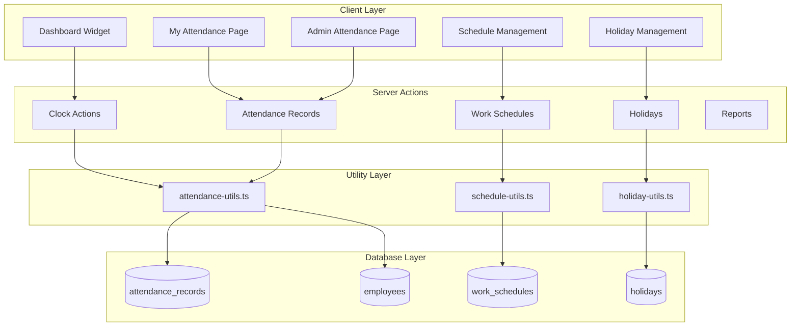

# Design Document: HR Attendance Tracking

## Overview

The HR Attendance Tracking module provides comprehensive attendance management for Gama ERP. It enables employees to clock in/out, view their attendance history, and provides administrators with tools to manage, correct, and report on attendance data across the organization.

The system integrates with the existing employee management module and follows the established patterns for role-based access control. Key features include automatic late detection based on configurable work schedules, overtime calculation, holiday management, and a dashboard widget for quick attendance actions.

## Architecture



## Components and Interfaces

### Server Actions

#### Clock Actions (`app/(main)/hr/attendance/clock-actions.ts`)

```typescript
// Clock in for current user
async function clockIn(): Promise<{ success: boolean; record?: AttendanceRecord; error?: string }>

// Clock out for current user
async function clockOut(): Promise<{ success: boolean; record?: AttendanceRecord; error?: string }>

// Get today's attendance for current user
async function getTodayAttendance(): Promise<AttendanceRecord | null>
```

#### Attendance Actions (`app/(main)/hr/attendance/actions.ts`)

```typescript
// Get attendance records with filters
async function getAttendanceRecords(filters: AttendanceFilters): Promise<AttendanceRecord[]>

// Get attendance summary for a date
async function getAttendanceSummary(date: string): Promise<AttendanceSummary>

// Create or update attendance record (admin)
async function upsertAttendanceRecord(data: AttendanceRecordInput): Promise<AttendanceRecord>

// Mark employee as absent
async function markAbsent(employeeId: string, date: string, notes?: string): Promise<void>

// Get monthly attendance summary for employee
async function getMonthlyAttendanceSummary(employeeId: string, year: number, month: number): Promise<MonthlySummary>
```

#### Schedule Actions (`app/(main)/hr/attendance/schedule-actions.ts`)

```typescript
// Get all work schedules
async function getWorkSchedules(): Promise<WorkSchedule[]>

// Get default schedule
async function getDefaultSchedule(): Promise<WorkSchedule>

// Get employee's schedule
async function getEmployeeSchedule(employeeId: string): Promise<WorkSchedule>

// Create or update schedule
async function upsertWorkSchedule(data: WorkScheduleInput): Promise<WorkSchedule>

// Set schedule as default
async function setDefaultSchedule(scheduleId: string): Promise<void>
```

#### Holiday Actions (`app/(main)/hr/attendance/holiday-actions.ts`)

```typescript
// Get holidays for date range
async function getHolidays(startDate: string, endDate: string): Promise<Holiday[]>

// Create holiday
async function createHoliday(data: HolidayInput): Promise<Holiday>

// Update holiday
async function updateHoliday(id: string, data: HolidayInput): Promise<Holiday>

// Delete holiday
async function deleteHoliday(id: string): Promise<void>

// Check if date is holiday
async function isHoliday(date: string): Promise<boolean>
```

### React Components

#### Dashboard Widget (`components/attendance/attendance-widget.tsx`)

Compact widget for dashboard showing current attendance status with clock in/out buttons.

```typescript
interface AttendanceWidgetProps {
  employeeId: string;
}
```

#### My Attendance Page (`components/attendance/my-attendance-view.tsx`)

Employee's personal attendance view with calendar and monthly summary.

```typescript
interface MyAttendanceViewProps {
  employeeId: string;
  initialMonth?: number;
  initialYear?: number;
}
```

#### Admin Attendance List (`components/attendance/attendance-list.tsx`)

Admin view showing all employee attendance for a selected date.

```typescript
interface AttendanceListProps {
  date: string;
  departmentId?: string;
  status?: AttendanceStatus;
}
```

#### Attendance Summary Cards (`components/attendance/attendance-summary-cards.tsx`)

Summary cards showing present, late, absent, and on-leave counts.

```typescript
interface AttendanceSummaryCardsProps {
  summary: AttendanceSummary;
}
```

#### Attendance Calendar (`components/attendance/attendance-calendar.tsx`)

Calendar view showing attendance status for each day of the month.

```typescript
interface AttendanceCalendarProps {
  records: AttendanceRecord[];
  holidays: Holiday[];
  month: number;
  year: number;
  onDateClick?: (date: string) => void;
}
```

#### Manual Entry Dialog (`components/attendance/manual-entry-dialog.tsx`)

Dialog for creating or editing attendance records.

```typescript
interface ManualEntryDialogProps {
  open: boolean;
  onOpenChange: (open: boolean) => void;
  employeeId?: string;
  date?: string;
  existingRecord?: AttendanceRecord;
  onSuccess: () => void;
}
```

#### Schedule Form (`components/attendance/schedule-form.tsx`)

Form for creating/editing work schedules.

```typescript
interface ScheduleFormProps {
  schedule?: WorkSchedule;
  onSuccess: () => void;
  onCancel: () => void;
}
```

#### Holiday Form (`components/attendance/holiday-form.tsx`)

Form for creating/editing holidays.

```typescript
interface HolidayFormProps {
  holiday?: Holiday;
  onSuccess: () => void;
  onCancel: () => void;
}
```

## Data Models

### Database Tables

#### attendance_records

| Column | Type | Description |
|--------|------|-------------|
| id | UUID | Primary key |
| employee_id | UUID | Foreign key to employees |
| attendance_date | DATE | The date of attendance |
| clock_in | TIMESTAMPTZ | Clock-in timestamp |
| clock_out | TIMESTAMPTZ | Clock-out timestamp |
| work_hours | DECIMAL(4,2) | Calculated work hours (max 8) |
| overtime_hours | DECIMAL(4,2) | Hours exceeding 8 |
| clock_in_location | VARCHAR(200) | Optional location |
| clock_out_location | VARCHAR(200) | Optional location |
| status | VARCHAR(20) | Attendance status |
| late_minutes | INTEGER | Minutes late |
| early_leave_minutes | INTEGER | Minutes left early |
| notes | TEXT | Additional notes |
| is_corrected | BOOLEAN | Whether record was corrected |
| corrected_by | UUID | User who made correction |
| correction_reason | TEXT | Reason for correction |
| created_at | TIMESTAMPTZ | Creation timestamp |
| updated_at | TIMESTAMPTZ | Last update timestamp |

Unique constraint: (employee_id, attendance_date)

#### work_schedules

| Column | Type | Description |
|--------|------|-------------|
| id | UUID | Primary key |
| schedule_name | VARCHAR(100) | Name of schedule |
| work_start | TIME | Start of work day |
| work_end | TIME | End of work day |
| break_start | TIME | Start of break |
| break_end | TIME | End of break |
| late_grace_minutes | INTEGER | Grace period for late |
| work_days | INTEGER[] | Array of work days (0-6) |
| is_default | BOOLEAN | Whether this is default |
| is_active | BOOLEAN | Whether schedule is active |
| created_at | TIMESTAMPTZ | Creation timestamp |

#### holidays

| Column | Type | Description |
|--------|------|-------------|
| id | UUID | Primary key |
| holiday_date | DATE | Date of holiday (unique) |
| holiday_name | VARCHAR(200) | Name of holiday |
| is_national | BOOLEAN | National holiday flag |
| is_company | BOOLEAN | Company-specific holiday |
| created_at | TIMESTAMPTZ | Creation timestamp |

### TypeScript Types

```typescript
// types/attendance.ts

export type AttendanceStatus = 
  | 'present' 
  | 'late' 
  | 'early_leave' 
  | 'absent' 
  | 'half_day' 
  | 'on_leave' 
  | 'holiday' 
  | 'wfh';

export interface AttendanceRecord {
  id: string;
  employee_id: string;
  attendance_date: string;
  clock_in: string | null;
  clock_out: string | null;
  work_hours: number | null;
  overtime_hours: number | null;
  clock_in_location: string | null;
  clock_out_location: string | null;
  status: AttendanceStatus;
  late_minutes: number;
  early_leave_minutes: number;
  notes: string | null;
  is_corrected: boolean;
  corrected_by: string | null;
  correction_reason: string | null;
  created_at: string;
  updated_at: string;
  // Joined data
  employee?: {
    employee_code: string;
    full_name: string;
    department?: {
      id: string;
      department_name: string;
    };
  };
}

export interface AttendanceRecordInput {
  employee_id: string;
  attendance_date: string;
  clock_in?: string;
  clock_out?: string;
  status?: AttendanceStatus;
  notes?: string;
  correction_reason?: string;
}

export interface AttendanceSummary {
  total: number;
  present: number;
  late: number;
  absent: number;
  onLeave: number;
  holiday: number;
}

export interface MonthlySummary {
  daysWorked: number;
  lateDays: number;
  totalHours: number;
  overtimeHours: number;
  absentDays: number;
}

export interface AttendanceFilters {
  date?: string;
  dateFrom?: string;
  dateTo?: string;
  departmentId?: string;
  employeeId?: string;
  status?: AttendanceStatus;
}

export interface WorkSchedule {
  id: string;
  schedule_name: string;
  work_start: string;
  work_end: string;
  break_start: string | null;
  break_end: string | null;
  late_grace_minutes: number;
  work_days: number[];
  is_default: boolean;
  is_active: boolean;
  created_at: string;
}

export interface WorkScheduleInput {
  schedule_name: string;
  work_start: string;
  work_end: string;
  break_start?: string;
  break_end?: string;
  late_grace_minutes?: number;
  work_days?: number[];
  is_default?: boolean;
}

export interface Holiday {
  id: string;
  holiday_date: string;
  holiday_name: string;
  is_national: boolean;
  is_company: boolean;
  created_at: string;
}

export interface HolidayInput {
  holiday_date: string;
  holiday_name: string;
  is_national?: boolean;
  is_company?: boolean;
}
```


## Correctness Properties

*A property is a characteristic or behavior that should hold true across all valid executions of a system—essentially, a formal statement about what the system should do. Properties serve as the bridge between human-readable specifications and machine-verifiable correctness guarantees.*

### Property 1: Clock-In Creates Valid Record

*For any* employee who clocks in, the system shall create an attendance record with a clock_in timestamp within a reasonable tolerance (e.g., 1 second) of the actual clock-in time, and the attendance_date shall match the current date.

**Validates: Requirements 1.1**

### Property 2: Late Status Determination

*For any* clock-in time and work schedule, if the clock-in time is after (work_start + late_grace_minutes), the status shall be 'late' and late_minutes shall equal the difference in minutes; otherwise, the status shall be 'present' and late_minutes shall be 0.

**Validates: Requirements 1.2, 1.3**

### Property 3: Clock-In Idempotence

*For any* employee who has already clocked in today, attempting to clock in again shall not create a new record and shall return an error, leaving exactly one attendance record for that employee on that date.

**Validates: Requirements 1.4**

### Property 4: Clock-Out Requires Clock-In

*For any* employee who has not clocked in today, attempting to clock out shall fail with an error and no clock_out timestamp shall be recorded.

**Validates: Requirements 2.4**

### Property 5: Work Hours Calculation

*For any* attendance record with both clock_in and clock_out times, work_hours shall equal (clock_out - clock_in - 1 hour for lunch), capped at 8 hours, and overtime_hours shall equal any excess beyond 8 hours. If the calculated value is negative, work_hours shall be 0.

**Validates: Requirements 2.2, 2.3**

### Property 6: Monthly Summary Accuracy

*For any* employee and month, the monthly summary shall correctly aggregate: daysWorked as count of records with status 'present' or 'late', lateDays as count of records with status 'late', totalHours as sum of work_hours, and overtimeHours as sum of overtime_hours.

**Validates: Requirements 3.3**

### Property 7: Attendance Summary Counts

*For any* date, the attendance summary shall correctly count: total as number of active employees, present as records with status 'present', late as records with status 'late', absent as employees without records minus on_leave count, and onLeave as records with status 'on_leave'.

**Validates: Requirements 4.2**

### Property 8: Department Filter Correctness

*For any* department filter applied to attendance records, all returned records shall have employees belonging to that department, and no records from other departments shall be included.

**Validates: Requirements 4.3, 9.3**

### Property 9: Status Filter Correctness

*For any* status filter applied to attendance records, all returned records shall have that exact status, and no records with different statuses shall be included.

**Validates: Requirements 4.4**

### Property 10: Manual Entry Persistence

*For any* valid attendance record input, creating or updating a record shall persist all provided fields correctly, and retrieving the record shall return the same values.

**Validates: Requirements 4.5**

### Property 11: Mark Absent Creates Correct Record

*For any* employee marked as absent for a date, an attendance record shall exist with status 'absent', and if notes were provided, they shall be stored in the record.

**Validates: Requirements 4.6**

### Property 12: Schedule Data Validation

*For any* work schedule, it shall contain valid work_start and work_end times, late_grace_minutes as a non-negative integer, and work_days as an array containing only integers 0-6.

**Validates: Requirements 5.1, 5.2, 5.3**

### Property 13: Schedule Resolution Priority

*For any* employee, if they have a schedule_id assigned, getEmployeeSchedule shall return that schedule; otherwise, it shall return the default schedule (where is_default is true).

**Validates: Requirements 5.4, 5.5**

### Property 14: Holiday Creation Persistence

*For any* valid holiday input, creating a holiday shall persist the date, name, is_national, and is_company fields correctly, and retrieving the holiday shall return the same values.

**Validates: Requirements 6.1**

### Property 15: Holiday Status Auto-Assignment

*For any* date that is a holiday, attendance records created for that date shall have status 'holiday' unless explicitly set otherwise by an admin.

**Validates: Requirements 6.2**

### Property 16: Holiday Uniqueness

*For any* attempt to create a holiday with a date that already exists, the operation shall fail with an error and no duplicate shall be created.

**Validates: Requirements 6.3**

### Property 17: Correction Audit Trail

*For any* attendance record that is edited, is_corrected shall be true, corrected_by shall contain the editing user's ID, and if a correction_reason was provided, it shall be stored.

**Validates: Requirements 7.1, 7.2**

### Property 18: Recalculation on Correction

*For any* attendance record where clock_in or clock_out is modified, work_hours and overtime_hours shall be recalculated according to Property 5.

**Validates: Requirements 7.4**

### Property 19: Widget State Consistency

*For any* attendance widget state, if no clock_in exists, a Clock In button shall be shown; if clock_in exists but no clock_out, a Clock Out button shall be shown; if both exist, the total work hours shall be displayed.

**Validates: Requirements 8.2, 8.3, 8.4, 8.5**

### Property 20: Report Date Range Filtering

*For any* date range specified in a report request, all returned records shall have attendance_date within that range (inclusive), and no records outside the range shall be included.

**Validates: Requirements 9.1**

### Property 21: Report Data Completeness

*For any* attendance report record, it shall include employee_code, full_name, department_name, attendance_date, clock_in, clock_out, work_hours, overtime_hours, and status.

**Validates: Requirements 9.2**

### Property 22: Report Aggregate Statistics

*For any* attendance report grouped by employee, the aggregate statistics shall correctly calculate total present days, late days, and absent days by counting records with the respective statuses.

**Validates: Requirements 9.5**

### Property 23: Role-Based Access Control

*For any* user role and attendance operation:
- All roles can view their own attendance and clock in/out
- HR, Admin, Owner can view all attendance, create manual entries, edit records, manage schedules and holidays
- Manager can view only their department's attendance
- Other roles cannot access admin features

**Validates: Requirements 10.1, 10.2, 10.3, 10.4, 10.5**

## Error Handling

### Clock-In Errors

| Error Condition | Error Message | HTTP Status |
|-----------------|---------------|-------------|
| Already clocked in today | "You have already clocked in today at {time}" | 400 |
| Employee not found | "Employee record not found" | 404 |
| Database error | "Failed to record clock-in. Please try again." | 500 |

### Clock-Out Errors

| Error Condition | Error Message | HTTP Status |
|-----------------|---------------|-------------|
| Not clocked in today | "You must clock in before clocking out" | 400 |
| Already clocked out | "You have already clocked out today at {time}" | 400 |
| Database error | "Failed to record clock-out. Please try again." | 500 |

### Manual Entry Errors

| Error Condition | Error Message | HTTP Status |
|-----------------|---------------|-------------|
| Invalid employee | "Employee not found" | 404 |
| Invalid date format | "Invalid date format. Use YYYY-MM-DD" | 400 |
| Invalid time format | "Invalid time format. Use HH:MM" | 400 |
| Clock-out before clock-in | "Clock-out time cannot be before clock-in time" | 400 |
| Unauthorized | "You do not have permission to edit attendance records" | 403 |

### Schedule Errors

| Error Condition | Error Message | HTTP Status |
|-----------------|---------------|-------------|
| Invalid time format | "Invalid time format for {field}" | 400 |
| Invalid work days | "Work days must be numbers 0-6" | 400 |
| No default schedule | "No default schedule configured" | 500 |

### Holiday Errors

| Error Condition | Error Message | HTTP Status |
|-----------------|---------------|-------------|
| Duplicate date | "A holiday already exists for this date" | 400 |
| Invalid date | "Invalid date format" | 400 |
| Holiday not found | "Holiday not found" | 404 |

## Testing Strategy

### Unit Tests

Unit tests will verify specific examples and edge cases:

1. **Clock-in/out edge cases**
   - Clock-in exactly at work start time
   - Clock-in exactly at grace period boundary
   - Clock-out resulting in exactly 8 hours
   - Clock-out resulting in negative hours (handled gracefully)

2. **Calculation edge cases**
   - Work hours with fractional minutes
   - Overtime calculation at boundary (8.01 hours)
   - Late minutes calculation with various grace periods

3. **Date handling**
   - Timezone considerations for clock times
   - Date boundary handling (clock-in before midnight, clock-out after)
   - Holiday detection across timezones

4. **Permission edge cases**
   - Manager viewing own department
   - Manager attempting to view other department
   - Employee attempting admin actions

### Property-Based Tests

Property-based tests will use `fast-check` library to verify universal properties:

1. **Property tests for calculations**
   - Work hours calculation (Property 5)
   - Late minutes calculation (Property 2)
   - Monthly summary aggregation (Property 6)
   - Attendance summary counts (Property 7)

2. **Property tests for filtering**
   - Department filter correctness (Property 8)
   - Status filter correctness (Property 9)
   - Date range filter correctness (Property 20)

3. **Property tests for data integrity**
   - Clock-in idempotence (Property 3)
   - Holiday uniqueness (Property 16)
   - Correction audit trail (Property 17)

4. **Property tests for state transitions**
   - Widget state consistency (Property 19)
   - Schedule resolution priority (Property 13)

### Test Configuration

- Minimum 100 iterations per property test
- Tests tagged with: **Feature: hr-attendance-tracking, Property {number}: {property_text}**
- Use `fast-check` for property-based testing in TypeScript
