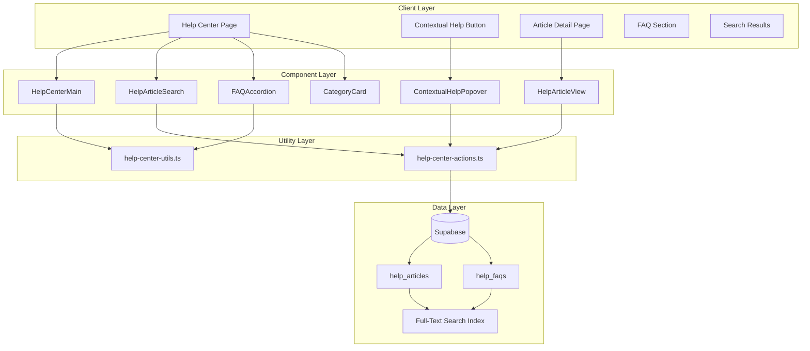

# Design Document: Help Center & Documentation

## Overview

This document describes the technical design for the Help Center & Documentation feature (v0.38) in GAMA ERP. The feature provides an in-app help center with searchable documentation, FAQs, and contextual help to assist users in understanding and using the system effectively.

The Help Center integrates with the existing role-based access control system to show relevant content based on user roles, and leverages PostgreSQL's full-text search capabilities for efficient content discovery.

## Architecture



## Components and Interfaces

### Database Types

```typescript
// types/help-center.ts

// Help article categories
export type HelpArticleCategory = 
  | 'getting_started'
  | 'quotations'
  | 'jobs'
  | 'finance'
  | 'hr'
  | 'reports'
  | 'troubleshooting';

// Help article interface
export interface HelpArticle {
  id: string;
  articleSlug: string;
  title: string;
  summary: string | null;
  content: string;
  category: HelpArticleCategory;
  tags: string[];
  applicableRoles: string[];
  relatedRoutes: string[];
  relatedArticles: string[];
  viewCount: number;
  helpfulCount: number;
  notHelpfulCount: number;
  isPublished: boolean;
  displayOrder: number;
  createdAt: string;
  updatedAt: string;
}

// Database row type for help_articles
export interface HelpArticleRow {
  id: string;
  article_slug: string;
  title: string;
  summary: string | null;
  content: string;
  category: HelpArticleCategory;
  tags: string[];
  applicable_roles: string[];
  related_routes: string[];
  related_articles: string[];
  view_count: number;
  helpful_count: number;
  not_helpful_count: number;
  is_published: boolean;
  display_order: number;
  created_at: string;
  updated_at: string;
}

// FAQ interface
export interface HelpFAQ {
  id: string;
  question: string;
  answer: string;
  category: HelpArticleCategory;
  applicableRoles: string[];
  displayOrder: number;
  createdAt: string;
}

// Database row type for help_faqs
export interface HelpFAQRow {
  id: string;
  question: string;
  answer: string;
  category: HelpArticleCategory;
  applicable_roles: string[];
  display_order: number;
  created_at: string;
}

// Search result interface
export interface HelpSearchResult {
  id: string;
  type: 'article' | 'faq';
  title: string;
  snippet: string;
  category: HelpArticleCategory;
  url: string;
  relevance: number;
}

// Category with article count
export interface HelpCategoryInfo {
  category: HelpArticleCategory;
  label: string;
  icon: string;
  articleCount: number;
}

// Feedback type
export type FeedbackType = 'helpful' | 'not_helpful';
```

### Utility Functions

```typescript
// lib/help-center-utils.ts

/**
 * Transform database row to HelpArticle interface
 */
export function mapDbRowToArticle(row: HelpArticleRow): HelpArticle;

/**
 * Transform database row to HelpFAQ interface
 */
export function mapDbRowToFAQ(row: HelpFAQRow): HelpFAQ;

/**
 * Filter articles based on user role
 */
export function filterArticlesByRole(
  articles: HelpArticle[],
  userRole: string
): HelpArticle[];

/**
 * Filter FAQs based on user role
 */
export function filterFAQsByRole(
  faqs: HelpFAQ[],
  userRole: string
): HelpFAQ[];

/**
 * Filter articles by related route for contextual help
 */
export function filterArticlesByRoute(
  articles: HelpArticle[],
  currentRoute: string
): HelpArticle[];

/**
 * Group articles by category
 */
export function groupArticlesByCategory(
  articles: HelpArticle[]
): Record<HelpArticleCategory, HelpArticle[]>;

/**
 * Sort articles by display order
 */
export function sortArticlesByDisplayOrder(
  articles: HelpArticle[]
): HelpArticle[];

/**
 * Sort FAQs by display order
 */
export function sortFAQsByDisplayOrder(
  faqs: HelpFAQ[]
): HelpFAQ[];

/**
 * Get category display info (label and icon)
 */
export function getCategoryDisplayInfo(
  category: HelpArticleCategory
): { label: string; icon: string };

/**
 * Calculate category article counts
 */
export function calculateCategoryCounts(
  articles: HelpArticle[]
): HelpCategoryInfo[];

/**
 * Highlight search terms in text
 */
export function highlightSearchTerms(
  text: string,
  searchQuery: string
): string;

/**
 * Generate article URL from slug
 */
export function getArticleUrl(slug: string): string;

/**
 * Check if search query is valid (minimum length)
 */
export function isValidSearchQuery(query: string): boolean;
```

### Server Actions

```typescript
// lib/help-center-actions.ts

/**
 * Search help articles and FAQs using full-text search
 */
export async function searchHelpContent(
  query: string,
  userRole: string
): Promise<HelpSearchResult[]>;

/**
 * Get all published articles for a user's role
 */
export async function getArticlesForRole(
  userRole: string
): Promise<HelpArticle[]>;

/**
 * Get article by slug
 */
export async function getArticleBySlug(
  slug: string
): Promise<HelpArticle | null>;

/**
 * Get contextual articles for a route
 */
export async function getContextualArticles(
  route: string,
  userRole: string
): Promise<HelpArticle[]>;

/**
 * Get all FAQs for a user's role
 */
export async function getFAQsForRole(
  userRole: string
): Promise<HelpFAQ[]>;

/**
 * Increment article view count
 */
export async function incrementViewCount(
  articleId: string
): Promise<void>;

/**
 * Record article feedback
 */
export async function recordFeedback(
  articleId: string,
  feedbackType: FeedbackType
): Promise<void>;
```

### React Components

```typescript
// components/help-center/help-center-main.tsx
// Main help center page with search, categories, and FAQs

// components/help-center/help-article-search.tsx
// Search input with results dropdown

// components/help-center/help-article-view.tsx
// Article detail view with markdown rendering

// components/help-center/help-article-card.tsx
// Card component for article in list/grid view

// components/help-center/faq-accordion.tsx
// Expandable FAQ list

// components/help-center/category-card.tsx
// Category card with icon and article count

// components/help-center/contextual-help-popover.tsx
// Popover showing relevant help for current page

// components/help-center/help-feedback.tsx
// "Was this helpful?" feedback buttons

// components/help-center/quick-links.tsx
// Quick links section (Getting Started, Tours, Shortcuts)
```

## Data Models

### help_articles Table

```sql
CREATE TABLE help_articles (
  id UUID PRIMARY KEY DEFAULT gen_random_uuid(),
  article_slug VARCHAR(100) UNIQUE NOT NULL,
  title VARCHAR(200) NOT NULL,
  summary TEXT,
  content TEXT NOT NULL,
  category VARCHAR(50) NOT NULL,
  tags TEXT[] DEFAULT '{}',
  applicable_roles TEXT[] DEFAULT '{owner,admin,manager,finance,ops,sales,viewer}',
  related_routes TEXT[] DEFAULT '{}',
  related_articles UUID[] DEFAULT '{}',
  view_count INTEGER DEFAULT 0,
  helpful_count INTEGER DEFAULT 0,
  not_helpful_count INTEGER DEFAULT 0,
  is_published BOOLEAN DEFAULT TRUE,
  display_order INTEGER DEFAULT 0,
  created_at TIMESTAMPTZ DEFAULT NOW(),
  updated_at TIMESTAMPTZ DEFAULT NOW()
);

-- Full-text search index
CREATE INDEX idx_help_articles_search ON help_articles 
  USING gin(to_tsvector('english', title || ' ' || COALESCE(summary, '') || ' ' || content));

-- Category index for filtering
CREATE INDEX idx_help_articles_category ON help_articles(category);

-- Published articles index
CREATE INDEX idx_help_articles_published ON help_articles(is_published) WHERE is_published = TRUE;
```

### help_faqs Table

```sql
CREATE TABLE help_faqs (
  id UUID PRIMARY KEY DEFAULT gen_random_uuid(),
  question TEXT NOT NULL,
  answer TEXT NOT NULL,
  category VARCHAR(50) NOT NULL,
  applicable_roles TEXT[] DEFAULT '{owner,admin,manager,finance,ops,sales,viewer}',
  display_order INTEGER DEFAULT 0,
  created_at TIMESTAMPTZ DEFAULT NOW()
);

-- Full-text search index
CREATE INDEX idx_help_faqs_search ON help_faqs 
  USING gin(to_tsvector('english', question || ' ' || answer));

-- Category index
CREATE INDEX idx_help_faqs_category ON help_faqs(category);
```

### Search RPC Function

```sql
CREATE OR REPLACE FUNCTION search_help_content(
  search_query TEXT,
  user_role TEXT,
  max_results INTEGER DEFAULT 20
)
RETURNS TABLE (
  id UUID,
  type TEXT,
  title TEXT,
  snippet TEXT,
  category VARCHAR(50),
  url TEXT,
  relevance REAL
) AS $$
BEGIN
  RETURN QUERY
  -- Search articles
  SELECT 
    a.id,
    'article'::TEXT as type,
    a.title,
    COALESCE(a.summary, LEFT(a.content, 200)) as snippet,
    a.category,
    '/help/articles/' || a.article_slug as url,
    ts_rank(
      to_tsvector('english', a.title || ' ' || COALESCE(a.summary, '') || ' ' || a.content),
      plainto_tsquery('english', search_query)
    ) as relevance
  FROM help_articles a
  WHERE a.is_published = TRUE
    AND (a.applicable_roles @> ARRAY[user_role] OR a.applicable_roles = '{}')
    AND to_tsvector('english', a.title || ' ' || COALESCE(a.summary, '') || ' ' || a.content) 
        @@ plainto_tsquery('english', search_query)
  
  UNION ALL
  
  -- Search FAQs
  SELECT 
    f.id,
    'faq'::TEXT as type,
    f.question as title,
    LEFT(f.answer, 200) as snippet,
    f.category,
    '/help#faq-' || f.id as url,
    ts_rank(
      to_tsvector('english', f.question || ' ' || f.answer),
      plainto_tsquery('english', search_query)
    ) as relevance
  FROM help_faqs f
  WHERE (f.applicable_roles @> ARRAY[user_role] OR f.applicable_roles = '{}')
    AND to_tsvector('english', f.question || ' ' || f.answer) 
        @@ plainto_tsquery('english', search_query)
  
  ORDER BY relevance DESC
  LIMIT max_results;
END;
$$ LANGUAGE plpgsql;
```


## Correctness Properties

*A property is a characteristic or behavior that should hold true across all valid executions of a system—essentially, a formal statement about what the system should do. Properties serve as the bridge between human-readable specifications and machine-verifiable correctness guarantees.*

### Property 1: Article Data Transformation Round-Trip

*For any* valid HelpArticleRow from the database, transforming it to a HelpArticle using `mapDbRowToArticle` SHALL preserve all field values with correct camelCase naming.

**Validates: Requirements 1.1**

### Property 2: FAQ Data Transformation Round-Trip

*For any* valid HelpFAQRow from the database, transforming it to a HelpFAQ using `mapDbRowToFAQ` SHALL preserve all field values with correct camelCase naming.

**Validates: Requirements 2.1**

### Property 3: Category Validation

*For any* string value, the category validation function SHALL return true only for valid categories ('getting_started', 'quotations', 'jobs', 'finance', 'hr', 'reports', 'troubleshooting') and false for all other values.

**Validates: Requirements 1.3**

### Property 4: Category Article Count Calculation

*For any* array of HelpArticle objects, `calculateCategoryCounts` SHALL return category info where each category's articleCount equals the number of articles with that category in the input array.

**Validates: Requirements 4.3**

### Property 5: Search Results Relevance Ordering

*For any* array of HelpSearchResult objects, after sorting by relevance, the results SHALL be in descending order by relevance score (higher relevance first).

**Validates: Requirements 5.1, 5.2**

### Property 6: Search Term Highlighting

*For any* non-empty text string and non-empty search query, `highlightSearchTerms` SHALL return a string where all occurrences of the search terms are wrapped in highlight markers, and the original text content is preserved.

**Validates: Requirements 5.3**

### Property 7: FAQ Grouping and Sorting

*For any* array of HelpFAQ objects, `groupFAQsByCategory` SHALL return a record where each FAQ appears exactly once in its corresponding category group, and FAQs within each group are sorted by display_order in ascending order.

**Validates: Requirements 7.1, 7.4**

### Property 8: Route-Based Article Filtering

*For any* array of HelpArticle objects and any route string, `filterArticlesByRoute` SHALL return only articles where the related_routes array contains the given route, and SHALL return an empty array if no articles match.

**Validates: Requirements 8.2**

### Property 9: Role-Based Content Filtering

*For any* array of HelpArticle or HelpFAQ objects and any user role string, the role-based filter functions SHALL return only items where the applicable_roles array contains the user's role OR the applicable_roles array is empty (available to all).

**Validates: Requirements 9.1, 9.2, 9.3**

### Property 10: Category-Based Article Filtering and Sorting

*For any* array of HelpArticle objects and any valid category, filtering by category SHALL return only articles with matching category, and the results SHALL be sorted by display_order in ascending order.

**Validates: Requirements 10.1, 10.2**

### Property 11: Display Order Sorting Invariant

*For any* array of HelpArticle or HelpFAQ objects, after sorting by display_order, for all consecutive pairs (a, b) in the result, a.displayOrder SHALL be less than or equal to b.displayOrder.

**Validates: Requirements 7.4, 10.2**

## Error Handling

### Search Errors
- Empty search query: Return empty results array, do not execute database query
- Search query too short (< 2 characters): Return empty results with validation message
- Database search error: Log error, return empty results, display user-friendly message

### Article Retrieval Errors
- Article not found by slug: Return null, display 404 page
- Article not published: Return null (treat as not found)
- User role not in applicable_roles: Filter out article from results

### Feedback Recording Errors
- Invalid article ID: Log error, show toast notification
- Database update failure: Log error, show retry option

### Contextual Help Errors
- No articles for current route: Display general help options
- Route parsing error: Fall back to general help

## Testing Strategy

### Property-Based Testing

The feature will use **fast-check** for property-based testing in TypeScript. Each correctness property will be implemented as a property test with minimum 100 iterations.

**Test File**: `__tests__/help-center-utils.property.test.ts`

Property tests will cover:
1. Data transformation functions (mapDbRowToArticle, mapDbRowToFAQ)
2. Filtering functions (filterArticlesByRole, filterFAQsByRole, filterArticlesByRoute)
3. Sorting functions (sortArticlesByDisplayOrder, sortFAQsByDisplayOrder)
4. Grouping functions (groupArticlesByCategory, calculateCategoryCounts)
5. Search highlighting (highlightSearchTerms)
6. Validation functions (isValidCategory, isValidSearchQuery)

### Unit Testing

**Test File**: `__tests__/help-center-utils.test.ts`

Unit tests will cover:
- Specific examples for each utility function
- Edge cases (empty arrays, null values, special characters)
- Category display info mapping
- URL generation from slugs

**Test File**: `__tests__/help-center-actions.test.ts`

Unit tests for server actions:
- Search function with mocked Supabase client
- Article retrieval by slug
- View count increment
- Feedback recording

### Component Testing

Component tests will verify:
- Help center main page renders all sections
- Search input triggers search on input
- FAQ accordion expands/collapses
- Category cards display correct counts
- Contextual help popover shows relevant articles
- Feedback buttons update counts

### Test Configuration

```typescript
// Property test configuration
const propertyTestConfig = {
  numRuns: 100,
  verbose: true,
};

// Test tag format
// Feature: help-center, Property N: [property description]
```
