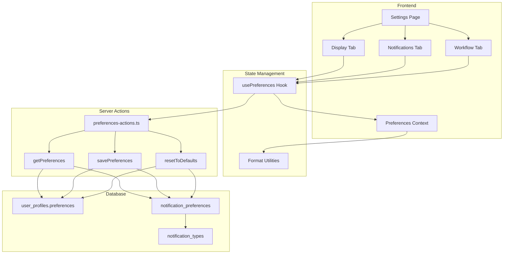
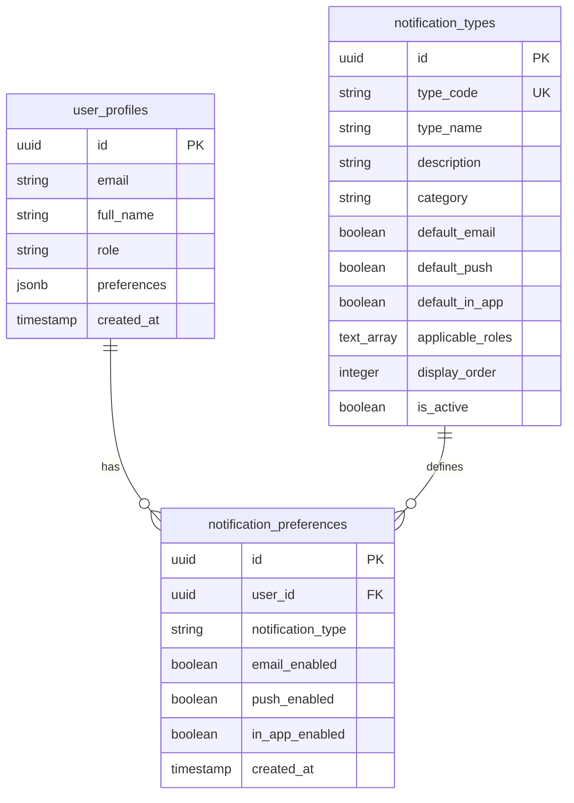

# Design Document: User Preferences & Settings

## Overview

This design document describes the implementation of user preferences and settings for Gama ERP (v0.39). The feature enables users to customize their experience through display settings (theme, language, date/number formats), notification preferences (channels and per-type controls), and workflow configurations (auto-save, confirmations, dashboard refresh).

The system uses a flexible JSONB structure for storing preferences, allowing easy extension without schema migrations. Notification preferences are stored both at the global level (in the JSONB) and at the granular per-type level (in a separate table).

## Architecture



## Components and Interfaces

### Database Schema

#### 1. User Profiles Preferences Column

```sql
-- Add preferences JSONB column to user_profiles
ALTER TABLE user_profiles
ADD COLUMN IF NOT EXISTS preferences JSONB DEFAULT '{
  "display": {
    "theme": "light",
    "language": "id",
    "dateFormat": "DD/MM/YYYY",
    "numberFormat": "id-ID",
    "timezone": "Asia/Jakarta",
    "compactMode": false
  },
  "notifications": {
    "email": true,
    "push": true,
    "desktop": false,
    "sound": true,
    "digest": "daily"
  },
  "dashboard": {
    "showOnboarding": true,
    "autoRefresh": true,
    "refreshInterval": 300
  },
  "workflow": {
    "defaultCustomer": null,
    "autoSave": true,
    "confirmDelete": true
  }
}';
```

#### 2. Notification Preferences Table

```sql
CREATE TABLE notification_preferences (
  id UUID PRIMARY KEY DEFAULT gen_random_uuid(),
  user_id UUID NOT NULL REFERENCES user_profiles(id) ON DELETE CASCADE,
  notification_type VARCHAR(50) NOT NULL,
  email_enabled BOOLEAN DEFAULT TRUE,
  push_enabled BOOLEAN DEFAULT TRUE,
  in_app_enabled BOOLEAN DEFAULT TRUE,
  created_at TIMESTAMPTZ DEFAULT NOW(),
  updated_at TIMESTAMPTZ DEFAULT NOW(),
  UNIQUE(user_id, notification_type)
);

-- RLS Policy
ALTER TABLE notification_preferences ENABLE ROW LEVEL SECURITY;

CREATE POLICY "Users can manage own notification preferences"
  ON notification_preferences
  FOR ALL
  USING (user_id = auth.uid())
  WITH CHECK (user_id = auth.uid());
```

#### 3. Notification Types Table

```sql
CREATE TABLE notification_types (
  id UUID PRIMARY KEY DEFAULT gen_random_uuid(),
  type_code VARCHAR(50) UNIQUE NOT NULL,
  type_name VARCHAR(100) NOT NULL,
  description TEXT,
  category VARCHAR(50) NOT NULL,
  default_email BOOLEAN DEFAULT TRUE,
  default_push BOOLEAN DEFAULT TRUE,
  default_in_app BOOLEAN DEFAULT TRUE,
  applicable_roles TEXT[] DEFAULT '{}',
  display_order INTEGER DEFAULT 0,
  is_active BOOLEAN DEFAULT TRUE,
  created_at TIMESTAMPTZ DEFAULT NOW()
);

-- Seed notification types
INSERT INTO notification_types (type_code, type_name, description, category, applicable_roles, display_order) VALUES
  ('bkk_pending', 'BKK Pending Approval', 'When a BKK request needs your approval', 'approvals', '{owner,admin,manager}', 1),
  ('bkk_approved', 'BKK Approved', 'When your BKK request is approved', 'approvals', '{owner,admin,manager,finance,ops}', 2),
  ('bkk_released', 'BKK Released', 'When cash has been released', 'finance', '{owner,admin,manager,finance,ops}', 3),
  ('leave_request', 'Leave Request', 'When a team member requests leave', 'hr', '{owner,admin,manager}', 4),
  ('leave_approved', 'Leave Approved', 'When your leave is approved', 'hr', '{owner,admin,manager,finance,ops,sales}', 5),
  ('invoice_overdue', 'Invoice Overdue', 'When an invoice becomes overdue', 'finance', '{owner,admin,manager,finance}', 6),
  ('payment_received', 'Payment Received', 'When a customer payment is recorded', 'finance', '{owner,admin,manager,finance}', 7),
  ('quotation_won', 'Quotation Won', 'When a quotation is marked as won', 'operations', '{owner,admin,manager,sales}', 8),
  ('job_completed', 'Job Completed', 'When a job order is completed', 'operations', '{owner,admin,manager,ops}', 9),
  ('cert_expiring', 'Certificate Expiring', 'When an employee certificate is expiring', 'hr', '{owner,admin,manager}', 10);

-- RLS Policy (read-only for all authenticated users)
ALTER TABLE notification_types ENABLE ROW LEVEL SECURITY;

CREATE POLICY "Authenticated users can read notification types"
  ON notification_types
  FOR SELECT
  TO authenticated
  USING (is_active = true);
```

### TypeScript Interfaces

```typescript
// types/user-preferences.ts

export interface DisplayPreferences {
  theme: 'light' | 'dark' | 'system';
  language: 'id' | 'en';
  dateFormat: 'DD/MM/YYYY' | 'MM/DD/YYYY' | 'YYYY-MM-DD';
  numberFormat: 'id-ID' | 'en-US';
  timezone: string;
  compactMode: boolean;
}

export interface NotificationChannelPreferences {
  email: boolean;
  push: boolean;
  desktop: boolean;
  sound: boolean;
  digest: 'none' | 'daily' | 'weekly';
}

export interface DashboardPreferences {
  showOnboarding: boolean;
  autoRefresh: boolean;
  refreshInterval: number; // seconds
}

export interface WorkflowPreferences {
  defaultCustomer: string | null;
  autoSave: boolean;
  confirmDelete: boolean;
}

export interface UserPreferences {
  display: DisplayPreferences;
  notifications: NotificationChannelPreferences;
  dashboard: DashboardPreferences;
  workflow: WorkflowPreferences;
}

export interface NotificationType {
  id: string;
  type_code: string;
  type_name: string;
  description: string | null;
  category: 'approvals' | 'finance' | 'operations' | 'hr' | 'system';
  default_email: boolean;
  default_push: boolean;
  default_in_app: boolean;
  applicable_roles: string[];
  display_order: number;
}

export interface NotificationPreference {
  id: string;
  user_id: string;
  notification_type: string;
  email_enabled: boolean;
  push_enabled: boolean;
  in_app_enabled: boolean;
}

export interface NotificationTypeWithPreference extends NotificationType {
  email_enabled: boolean;
  push_enabled: boolean;
  in_app_enabled: boolean;
}

export const DEFAULT_PREFERENCES: UserPreferences = {
  display: {
    theme: 'light',
    language: 'id',
    dateFormat: 'DD/MM/YYYY',
    numberFormat: 'id-ID',
    timezone: 'Asia/Jakarta',
    compactMode: false,
  },
  notifications: {
    email: true,
    push: true,
    desktop: false,
    sound: true,
    digest: 'daily',
  },
  dashboard: {
    showOnboarding: true,
    autoRefresh: true,
    refreshInterval: 300,
  },
  workflow: {
    defaultCustomer: null,
    autoSave: true,
    confirmDelete: true,
  },
};
```

### Component Structure

```
components/settings/
├── settings-tabs.tsx           # Main tabbed container
├── profile-tab.tsx             # User profile settings (existing)
├── display-settings-tab.tsx    # Theme, language, formats
├── notification-settings-tab.tsx # Channels and per-type settings
├── workflow-settings-tab.tsx   # Auto-save, confirm delete, refresh
└── notification-type-row.tsx   # Individual notification type toggle row
```

### Server Actions

```typescript
// app/(main)/settings/preferences/actions.ts

'use server'

import { createClient } from '@/lib/supabase/server'
import { UserPreferences, DEFAULT_PREFERENCES } from '@/types/user-preferences'

export async function getUserPreferences(): Promise<{
  success: boolean;
  data?: UserPreferences;
  error?: string;
}> {
  // Fetch from user_profiles.preferences
  // Merge with defaults for any missing keys
}

export async function saveUserPreferences(
  preferences: Partial<UserPreferences>
): Promise<{ success: boolean; error?: string }> {
  // Update user_profiles.preferences JSONB
}

export async function resetPreferencesToDefaults(): Promise<{
  success: boolean;
  error?: string;
}> {
  // Reset to DEFAULT_PREFERENCES
}

export async function getNotificationTypes(): Promise<{
  success: boolean;
  data?: NotificationTypeWithPreference[];
  error?: string;
}> {
  // Fetch notification_types filtered by user role
  // Join with notification_preferences for user's settings
}

export async function saveNotificationPreference(
  typeCode: string,
  channel: 'email' | 'push' | 'in_app',
  enabled: boolean
): Promise<{ success: boolean; error?: string }> {
  // Upsert notification_preferences record
}
```

### Preferences Context

```typescript
// contexts/preferences-context.tsx

'use client'

import { createContext, useContext, useEffect, useState } from 'react'
import { UserPreferences, DEFAULT_PREFERENCES } from '@/types/user-preferences'
import { getUserPreferences } from '@/app/(main)/settings/preferences/actions'

interface PreferencesContextType {
  preferences: UserPreferences;
  isLoading: boolean;
  updatePreferences: (updates: Partial<UserPreferences>) => void;
  formatDate: (date: Date | string) => string;
  formatCurrency: (amount: number) => string;
  formatNumber: (num: number) => string;
}

export const PreferencesContext = createContext<PreferencesContextType | null>(null)

export function PreferencesProvider({ children }: { children: React.ReactNode }) {
  // Load preferences on mount
  // Provide formatting functions based on preferences
  // Apply theme to document root
}

export function usePreferences() {
  const context = useContext(PreferencesContext)
  if (!context) {
    throw new Error('usePreferences must be used within PreferencesProvider')
  }
  return context
}
```

### Format Utilities

```typescript
// lib/user-preferences-utils.ts

import { format } from 'date-fns'
import { DisplayPreferences } from '@/types/user-preferences'

export function formatDateWithPreferences(
  date: Date | string,
  preferences: DisplayPreferences
): string {
  const d = new Date(date)
  switch (preferences.dateFormat) {
    case 'DD/MM/YYYY':
      return format(d, 'dd/MM/yyyy')
    case 'MM/DD/YYYY':
      return format(d, 'MM/dd/yyyy')
    case 'YYYY-MM-DD':
      return format(d, 'yyyy-MM-dd')
    default:
      return format(d, 'dd/MM/yyyy')
  }
}

export function formatCurrencyWithPreferences(
  amount: number,
  preferences: DisplayPreferences
): string {
  return new Intl.NumberFormat(preferences.numberFormat, {
    style: 'currency',
    currency: 'IDR',
    minimumFractionDigits: 0,
    maximumFractionDigits: 0,
  }).format(amount)
}

export function formatNumberWithPreferences(
  num: number,
  preferences: DisplayPreferences
): string {
  return new Intl.NumberFormat(preferences.numberFormat).format(num)
}

export function applyTheme(theme: 'light' | 'dark' | 'system'): void {
  const root = document.documentElement
  
  if (theme === 'system') {
    const prefersDark = window.matchMedia('(prefers-color-scheme: dark)').matches
    root.classList.toggle('dark', prefersDark)
  } else {
    root.classList.toggle('dark', theme === 'dark')
  }
}

export function getDateFormatPreview(dateFormat: string): string {
  const now = new Date()
  switch (dateFormat) {
    case 'DD/MM/YYYY':
      return format(now, 'dd/MM/yyyy')
    case 'MM/DD/YYYY':
      return format(now, 'MM/dd/yyyy')
    case 'YYYY-MM-DD':
      return format(now, 'yyyy-MM-dd')
    default:
      return format(now, 'dd/MM/yyyy')
  }
}

export function getNumberFormatPreview(numberFormat: string): string {
  const sample = 1234567.89
  return new Intl.NumberFormat(numberFormat, {
    style: 'currency',
    currency: 'IDR',
    minimumFractionDigits: 0,
    maximumFractionDigits: 0,
  }).format(sample)
}
```

## Data Models

### Entity Relationship Diagram



### Preferences JSONB Structure

```json
{
  "display": {
    "theme": "light",
    "language": "id",
    "dateFormat": "DD/MM/YYYY",
    "numberFormat": "id-ID",
    "timezone": "Asia/Jakarta",
    "compactMode": false
  },
  "notifications": {
    "email": true,
    "push": true,
    "desktop": false,
    "sound": true,
    "digest": "daily"
  },
  "dashboard": {
    "showOnboarding": true,
    "autoRefresh": true,
    "refreshInterval": 300
  },
  "workflow": {
    "defaultCustomer": null,
    "autoSave": true,
    "confirmDelete": true
  }
}
```

## Correctness Properties

*A property is a characteristic or behavior that should hold true across all valid executions of a system—essentially, a formal statement about what the system should do. Properties serve as the bridge between human-readable specifications and machine-verifiable correctness guarantees.*


### Property 1: Preferences Round-Trip Consistency

*For any* valid UserPreferences object, saving the preferences and then loading them should return an equivalent object with all display, notification, dashboard, and workflow settings preserved.

**Validates: Requirements 2.1, 2.2, 2.5, 2.6, 3.1, 3.2, 3.3, 3.4, 3.5, 3.6, 5.1, 5.2, 5.3, 5.4, 5.5**

### Property 2: Date Formatting Consistency

*For any* valid Date and any supported date format preference (DD/MM/YYYY, MM/DD/YYYY, YYYY-MM-DD), the formatDateWithPreferences function should produce a string that matches the expected pattern for that format.

**Validates: Requirements 2.3, 2.7, 7.2**

### Property 3: Number Formatting Consistency

*For any* valid number and any supported number format preference (id-ID, en-US), the formatCurrencyWithPreferences and formatNumberWithPreferences functions should produce strings using the correct locale-specific separators.

**Validates: Requirements 2.4, 7.3**

### Property 4: Notification Type Role Filtering

*For any* user role and set of notification types, the filtered notification types should only include types where the user's role is present in the applicable_roles array.

**Validates: Requirements 4.2**

### Property 5: Notification Type Category Grouping

*For any* set of notification types, grouping by category should produce groups where all types within a group have the same category value, and no type appears in multiple groups.

**Validates: Requirements 4.1**

### Property 6: Per-Type Notification Preference Round-Trip

*For any* notification type code and any combination of channel preferences (email_enabled, push_enabled, in_app_enabled), saving the preference and then loading it should return the same values.

**Validates: Requirements 4.3, 4.4**

### Property 7: Notification Preference Fallback to Defaults

*For any* notification type without a user-specific preference record, the system should return the default values from the notification_types table (default_email, default_push, default_in_app).

**Validates: Requirements 4.6**

### Property 8: Master Channel Override Logic

*For any* notification type preference and master channel setting, if the master channel is disabled (e.g., notifications.email = false), the effective preference for that channel should be false regardless of the per-type setting.

**Validates: Requirements 4.5**

### Property 9: Theme Application

*For any* theme preference (light, dark, system), applying the theme should result in the correct CSS class on the document root ('dark' class present for dark theme, absent for light theme, and system-dependent for system theme).

**Validates: Requirements 7.4**

### Property 10: Default Preferences Initialization

*For any* newly created user without explicit preferences, the preferences should match the DEFAULT_PREFERENCES constant with light theme, Indonesian language, DD/MM/YYYY date format, and Asia/Jakarta timezone.

**Validates: Requirements 1.5**

## Error Handling

### Database Errors

| Error Scenario | Handling Strategy |
|----------------|-------------------|
| Failed to load preferences | Return DEFAULT_PREFERENCES, log error |
| Failed to save preferences | Return error message, retain form state |
| Duplicate notification preference | Use upsert (ON CONFLICT UPDATE) |
| Invalid JSONB structure | Merge with defaults to fill missing keys |

### Validation Errors

| Error Scenario | Handling Strategy |
|----------------|-------------------|
| Invalid theme value | Reject with validation error |
| Invalid date format | Reject with validation error |
| Invalid refresh interval | Clamp to valid range (60-900 seconds) |
| Invalid notification type | Ignore, log warning |

### User Feedback

- Success: Toast notification "Settings saved successfully"
- Error: Toast notification with error message, form state preserved
- Reset: Confirmation dialog before reset, success toast after

## Testing Strategy

### Unit Tests

Unit tests will cover:
- Format utility functions (date, currency, number formatting)
- Preference merging with defaults
- Notification type filtering by role
- Notification type grouping by category
- Theme application logic
- Validation functions

### Property-Based Tests

Property-based tests will use `fast-check` library with minimum 100 iterations per test.

Each property test will be tagged with:
- **Feature: user-preferences, Property {number}: {property_text}**

Property tests will cover:
1. Preferences round-trip consistency
2. Date formatting pattern matching
3. Number formatting locale consistency
4. Role-based notification filtering
5. Category-based notification grouping
6. Per-type preference round-trip
7. Default fallback behavior
8. Master channel override logic
9. Theme CSS class application
10. Default initialization

### Integration Tests

Integration tests will verify:
- Settings page tab navigation
- Save and load flow end-to-end
- Reset to defaults flow
- Notification preferences UI interaction
- Theme switching visual effect

### Test File Structure

```
__tests__/
├── user-preferences-utils.test.ts      # Unit tests for utilities
├── user-preferences-utils.property.test.ts  # Property-based tests
├── notification-preferences.test.ts    # Notification preference logic
└── settings-page.test.tsx              # Component integration tests
```
