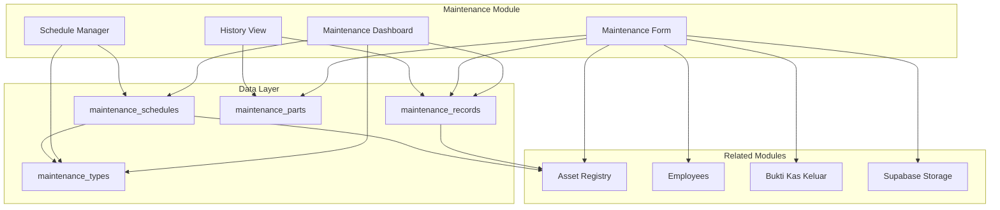

# Design Document: Equipment Maintenance Tracking

## Overview

This design document describes the implementation of the Equipment Maintenance Tracking module (v0.42) for the Gama ERP system. The module extends the existing Equipment/Asset Registry (v0.41) to provide comprehensive maintenance scheduling, tracking, and cost management capabilities.

The system supports both preventive (scheduled) and reactive (unscheduled) maintenance with flexible scheduling based on kilometers, operating hours, or calendar time. It integrates with the existing asset registry, employee management, and BKK (cash disbursement) modules.

## Architecture



### Component Structure

```
app/(main)/equipment/maintenance/
├── page.tsx                    # Dashboard with tabs
├── maintenance-client.tsx      # Client component with state
├── new/
│   └── page.tsx               # Log new maintenance
├── [id]/
│   └── page.tsx               # View maintenance record details
└── schedules/
    ├── page.tsx               # Manage schedules
    └── new/
        └── page.tsx           # Create new schedule

components/maintenance/
├── index.ts                   # Barrel exports
├── maintenance-summary-cards.tsx
├── upcoming-maintenance-list.tsx
├── maintenance-record-form.tsx
├── maintenance-parts-table.tsx
├── maintenance-history-table.tsx
├── maintenance-schedule-form.tsx
├── maintenance-schedule-list.tsx
├── maintenance-cost-summary.tsx
└── maintenance-type-select.tsx

lib/
├── maintenance-utils.ts       # Pure utility functions
└── maintenance-actions.ts     # Server actions
```

## Components and Interfaces

### MaintenanceSummaryCards

Displays four KPI cards on the dashboard:
- Overdue count (red)
- Due Soon count (yellow)
- In Progress count (blue)
- Cost MTD (formatted currency)

```typescript
interface MaintenanceSummaryCardsProps {
  overdueCount: number;
  dueSoonCount: number;
  inProgressCount: number;
  costMTD: number;
}
```

### UpcomingMaintenanceList

Displays grouped lists of overdue and due-soon maintenance items with quick actions.

```typescript
interface UpcomingMaintenanceListProps {
  items: UpcomingMaintenance[];
  onLogCompletion: (scheduleId: string, assetId: string) => void;
  onScheduleService: (scheduleId: string, assetId: string) => void;
}
```

### MaintenanceRecordForm

Form for logging completed maintenance with parts, costs, and attachments.

```typescript
interface MaintenanceRecordFormProps {
  assets: Asset[];
  maintenanceTypes: MaintenanceType[];
  employees: Employee[];
  scheduleId?: string;  // Pre-fill if from schedule
  assetId?: string;     // Pre-fill if from asset
  onSubmit: (data: MaintenanceRecordInput) => Promise<void>;
  onCancel: () => void;
}
```

### MaintenancePartsTable

Editable table for adding/removing parts used in maintenance.

```typescript
interface MaintenancePartsTableProps {
  parts: MaintenancePartInput[];
  onChange: (parts: MaintenancePartInput[]) => void;
  readOnly?: boolean;
}
```

### MaintenanceHistoryTable

Filterable table showing maintenance history with export capability.

```typescript
interface MaintenanceHistoryTableProps {
  records: MaintenanceRecordWithDetails[];
  filters: MaintenanceHistoryFilters;
  onFilterChange: (filters: MaintenanceHistoryFilters) => void;
  onExport: () => void;
  onViewDetails: (recordId: string) => void;
}
```

### MaintenanceScheduleForm

Form for creating/editing maintenance schedules.

```typescript
interface MaintenanceScheduleFormProps {
  assets: Asset[];
  maintenanceTypes: MaintenanceType[];
  schedule?: MaintenanceSchedule;
  onSubmit: (data: MaintenanceScheduleInput) => Promise<void>;
  onCancel: () => void;
}
```

## Data Models

### Database Tables

```sql
-- Maintenance types (reference data)
CREATE TABLE maintenance_types (
  id UUID PRIMARY KEY DEFAULT gen_random_uuid(),
  type_code VARCHAR(30) UNIQUE NOT NULL,
  type_name VARCHAR(100) NOT NULL,
  description TEXT,
  is_scheduled BOOLEAN DEFAULT TRUE,
  default_interval_km INTEGER,
  default_interval_hours INTEGER,
  default_interval_days INTEGER,
  applicable_categories UUID[] DEFAULT '{}',
  is_active BOOLEAN DEFAULT TRUE,
  display_order INTEGER DEFAULT 0,
  created_at TIMESTAMPTZ DEFAULT NOW()
);

-- Maintenance schedules (planned maintenance)
CREATE TABLE maintenance_schedules (
  id UUID PRIMARY KEY DEFAULT gen_random_uuid(),
  asset_id UUID NOT NULL REFERENCES assets(id),
  maintenance_type_id UUID NOT NULL REFERENCES maintenance_types(id),
  trigger_type VARCHAR(20) NOT NULL, -- 'km', 'hours', 'days', 'date'
  trigger_value INTEGER,
  trigger_date DATE,
  next_due_km INTEGER,
  next_due_hours INTEGER,
  next_due_date DATE,
  warning_km INTEGER DEFAULT 1000,
  warning_days INTEGER DEFAULT 14,
  is_active BOOLEAN DEFAULT TRUE,
  created_at TIMESTAMPTZ DEFAULT NOW(),
  updated_at TIMESTAMPTZ DEFAULT NOW()
);

-- Maintenance records (completed work)
CREATE TABLE maintenance_records (
  id UUID PRIMARY KEY DEFAULT gen_random_uuid(),
  record_number VARCHAR(30) UNIQUE NOT NULL,
  asset_id UUID NOT NULL REFERENCES assets(id),
  maintenance_type_id UUID NOT NULL REFERENCES maintenance_types(id),
  schedule_id UUID REFERENCES maintenance_schedules(id),
  maintenance_date DATE NOT NULL,
  started_at TIMESTAMPTZ,
  completed_at TIMESTAMPTZ,
  odometer_km INTEGER,
  hour_meter DECIMAL(10,2),
  performed_at VARCHAR(20) DEFAULT 'internal',
  workshop_name VARCHAR(200),
  workshop_address TEXT,
  description TEXT NOT NULL,
  findings TEXT,
  recommendations TEXT,
  technician_name VARCHAR(200),
  technician_employee_id UUID REFERENCES employees(id),
  labor_cost DECIMAL(15,2) DEFAULT 0,
  parts_cost DECIMAL(15,2) DEFAULT 0,
  external_cost DECIMAL(15,2) DEFAULT 0,
  total_cost DECIMAL(15,2) GENERATED ALWAYS AS (labor_cost + parts_cost + external_cost) STORED,
  bkk_id UUID REFERENCES bukti_kas_keluar(id),
  status VARCHAR(20) DEFAULT 'completed',
  documents JSONB DEFAULT '[]',
  photos JSONB DEFAULT '[]',
  notes TEXT,
  created_by UUID REFERENCES user_profiles(id),
  created_at TIMESTAMPTZ DEFAULT NOW(),
  updated_at TIMESTAMPTZ DEFAULT NOW()
);

-- Maintenance parts used
CREATE TABLE maintenance_parts (
  id UUID PRIMARY KEY DEFAULT gen_random_uuid(),
  maintenance_record_id UUID NOT NULL REFERENCES maintenance_records(id) ON DELETE CASCADE,
  part_number VARCHAR(100),
  part_name VARCHAR(200) NOT NULL,
  quantity DECIMAL(10,2) NOT NULL,
  unit VARCHAR(20) DEFAULT 'pcs',
  unit_price DECIMAL(15,2) NOT NULL,
  total_price DECIMAL(15,2) GENERATED ALWAYS AS (quantity * unit_price) STORED,
  supplier VARCHAR(200),
  warranty_months INTEGER,
  created_at TIMESTAMPTZ DEFAULT NOW()
);
```

### TypeScript Types

```typescript
// types/maintenance.ts

export type MaintenanceTriggerType = 'km' | 'hours' | 'days' | 'date';
export type MaintenancePerformedAt = 'internal' | 'external' | 'field';
export type MaintenanceRecordStatus = 'scheduled' | 'in_progress' | 'completed' | 'cancelled';
export type MaintenanceUrgency = 'overdue' | 'due_soon' | 'ok';

export interface MaintenanceType {
  id: string;
  typeCode: string;
  typeName: string;
  description?: string;
  isScheduled: boolean;
  defaultIntervalKm?: number;
  defaultIntervalHours?: number;
  defaultIntervalDays?: number;
  applicableCategories: string[];
  isActive: boolean;
  displayOrder: number;
}

export interface MaintenanceSchedule {
  id: string;
  assetId: string;
  maintenanceTypeId: string;
  triggerType: MaintenanceTriggerType;
  triggerValue?: number;
  triggerDate?: string;
  nextDueKm?: number;
  nextDueHours?: number;
  nextDueDate?: string;
  warningKm: number;
  warningDays: number;
  isActive: boolean;
  createdAt: string;
  updatedAt: string;
  // Joined fields
  asset?: Asset;
  maintenanceType?: MaintenanceType;
}

export interface MaintenanceRecord {
  id: string;
  recordNumber: string;
  assetId: string;
  maintenanceTypeId: string;
  scheduleId?: string;
  maintenanceDate: string;
  startedAt?: string;
  completedAt?: string;
  odometerKm?: number;
  hourMeter?: number;
  performedAt: MaintenancePerformedAt;
  workshopName?: string;
  workshopAddress?: string;
  description: string;
  findings?: string;
  recommendations?: string;
  technicianName?: string;
  technicianEmployeeId?: string;
  laborCost: number;
  partsCost: number;
  externalCost: number;
  totalCost: number;
  bkkId?: string;
  status: MaintenanceRecordStatus;
  documents: string[];
  photos: string[];
  notes?: string;
  createdBy?: string;
  createdAt: string;
  updatedAt: string;
  // Joined fields
  asset?: Asset;
  maintenanceType?: MaintenanceType;
  parts?: MaintenancePart[];
}

export interface MaintenancePart {
  id: string;
  maintenanceRecordId: string;
  partNumber?: string;
  partName: string;
  quantity: number;
  unit: string;
  unitPrice: number;
  totalPrice: number;
  supplier?: string;
  warrantyMonths?: number;
}

export interface UpcomingMaintenance {
  scheduleId: string;
  assetId: string;
  assetCode: string;
  assetName: string;
  registrationNumber?: string;
  maintenanceType: string;
  triggerType: MaintenanceTriggerType;
  nextDueDate?: string;
  nextDueKm?: number;
  currentKm?: number;
  remaining: number;
  status: MaintenanceUrgency;
}

export interface MaintenanceCostSummary {
  assetId: string;
  assetCode: string;
  assetName: string;
  month: string;
  maintenanceCount: number;
  totalLabor: number;
  totalParts: number;
  totalExternal: number;
  totalCost: number;
}

// Input types for forms
export interface MaintenanceRecordInput {
  assetId: string;
  maintenanceTypeId: string;
  scheduleId?: string;
  maintenanceDate: string;
  odometerKm?: number;
  hourMeter?: number;
  performedAt: MaintenancePerformedAt;
  workshopName?: string;
  workshopAddress?: string;
  description: string;
  findings?: string;
  recommendations?: string;
  technicianName?: string;
  technicianEmployeeId?: string;
  laborCost: number;
  externalCost: number;
  bkkId?: string;
  photos?: string[];
  documents?: string[];
  notes?: string;
  parts: MaintenancePartInput[];
}

export interface MaintenancePartInput {
  partNumber?: string;
  partName: string;
  quantity: number;
  unit: string;
  unitPrice: number;
  supplier?: string;
  warrantyMonths?: number;
}

export interface MaintenanceScheduleInput {
  assetId: string;
  maintenanceTypeId: string;
  triggerType: MaintenanceTriggerType;
  triggerValue?: number;
  triggerDate?: string;
  nextDueKm?: number;
  nextDueDate?: string;
  warningKm?: number;
  warningDays?: number;
}

export interface MaintenanceHistoryFilters {
  assetId?: string;
  maintenanceTypeId?: string;
  dateFrom?: string;
  dateTo?: string;
  status?: MaintenanceRecordStatus;
}

export interface MaintenanceDashboardStats {
  overdueCount: number;
  dueSoonCount: number;
  inProgressCount: number;
  costMTD: number;
}
```

### Utility Functions

```typescript
// lib/maintenance-utils.ts

/**
 * Calculate parts cost from array of parts
 */
export function calculatePartsCost(parts: MaintenancePartInput[]): number {
  return parts.reduce((sum, part) => sum + (part.quantity * part.unitPrice), 0);
}

/**
 * Calculate total maintenance cost
 */
export function calculateTotalCost(
  laborCost: number,
  partsCost: number,
  externalCost: number
): number {
  return laborCost + partsCost + externalCost;
}

/**
 * Determine maintenance urgency status
 */
export function getMaintenanceUrgency(
  triggerType: MaintenanceTriggerType,
  nextDueDate: string | undefined,
  nextDueKm: number | undefined,
  currentKm: number | undefined,
  warningDays: number,
  warningKm: number
): MaintenanceUrgency {
  const today = new Date();
  today.setHours(0, 0, 0, 0);
  
  if (triggerType === 'date' || triggerType === 'days') {
    if (!nextDueDate) return 'ok';
    const dueDate = new Date(nextDueDate);
    dueDate.setHours(0, 0, 0, 0);
    
    if (dueDate <= today) return 'overdue';
    
    const warningDate = new Date(dueDate);
    warningDate.setDate(warningDate.getDate() - warningDays);
    if (today >= warningDate) return 'due_soon';
    
    return 'ok';
  }
  
  if (triggerType === 'km') {
    if (!nextDueKm || currentKm === undefined) return 'ok';
    
    if (currentKm >= nextDueKm) return 'overdue';
    if (currentKm >= nextDueKm - warningKm) return 'due_soon';
    
    return 'ok';
  }
  
  return 'ok';
}

/**
 * Calculate remaining days or km until maintenance due
 */
export function calculateRemaining(
  triggerType: MaintenanceTriggerType,
  nextDueDate: string | undefined,
  nextDueKm: number | undefined,
  currentKm: number | undefined
): number {
  if (triggerType === 'date' || triggerType === 'days') {
    if (!nextDueDate) return 999;
    const today = new Date();
    const dueDate = new Date(nextDueDate);
    const diffTime = dueDate.getTime() - today.getTime();
    return Math.ceil(diffTime / (1000 * 60 * 60 * 24));
  }
  
  if (triggerType === 'km') {
    if (!nextDueKm || currentKm === undefined) return 999999;
    return nextDueKm - currentKm;
  }
  
  return 999999;
}

/**
 * Calculate next due date based on trigger type and interval
 */
export function calculateNextDueDate(
  triggerType: MaintenanceTriggerType,
  triggerValue: number | undefined,
  completionDate: Date
): Date | null {
  if (triggerType === 'days' && triggerValue) {
    const nextDate = new Date(completionDate);
    nextDate.setDate(nextDate.getDate() + triggerValue);
    return nextDate;
  }
  
  if (triggerType === 'date') {
    // For specific date types like KIR, add 6 months
    const nextDate = new Date(completionDate);
    nextDate.setMonth(nextDate.getMonth() + 6);
    return nextDate;
  }
  
  return null;
}

/**
 * Calculate next due km based on current km and interval
 */
export function calculateNextDueKm(
  currentKm: number,
  intervalKm: number
): number {
  return currentKm + intervalKm;
}

/**
 * Format maintenance record number
 */
export function formatMaintenanceRecordNumber(sequence: number, year: number): string {
  return `MNT-${year}-${String(sequence).padStart(5, '0')}`;
}

/**
 * Validate maintenance record input
 */
export function validateMaintenanceRecordInput(
  input: MaintenanceRecordInput
): { valid: boolean; errors: string[] } {
  const errors: string[] = [];
  
  if (!input.assetId) errors.push('Asset is required');
  if (!input.maintenanceTypeId) errors.push('Maintenance type is required');
  if (!input.maintenanceDate) errors.push('Maintenance date is required');
  if (!input.description?.trim()) errors.push('Description is required');
  if (input.laborCost < 0) errors.push('Labor cost cannot be negative');
  if (input.externalCost < 0) errors.push('External cost cannot be negative');
  
  for (const part of input.parts) {
    if (!part.partName?.trim()) errors.push('Part name is required');
    if (part.quantity <= 0) errors.push('Part quantity must be positive');
    if (part.unitPrice < 0) errors.push('Part unit price cannot be negative');
  }
  
  return { valid: errors.length === 0, errors };
}

/**
 * Validate maintenance schedule input
 */
export function validateMaintenanceScheduleInput(
  input: MaintenanceScheduleInput
): { valid: boolean; errors: string[] } {
  const errors: string[] = [];
  
  if (!input.assetId) errors.push('Asset is required');
  if (!input.maintenanceTypeId) errors.push('Maintenance type is required');
  if (!input.triggerType) errors.push('Trigger type is required');
  
  if (input.triggerType === 'km' && !input.triggerValue) {
    errors.push('Interval (km) is required for km-based schedules');
  }
  if (input.triggerType === 'days' && !input.triggerValue) {
    errors.push('Interval (days) is required for time-based schedules');
  }
  if (input.triggerType === 'date' && !input.triggerDate) {
    errors.push('Due date is required for date-based schedules');
  }
  
  return { valid: errors.length === 0, errors };
}
```


## Correctness Properties

*A property is a characteristic or behavior that should hold true across all valid executions of a system—essentially, a formal statement about what the system should do. Properties serve as the bridge between human-readable specifications and machine-verifiable correctness guarantees.*

### Property 1: Maintenance Urgency Determination

*For any* maintenance schedule with a trigger type (km or date/days), given the current date, current km reading, next due values, and warning thresholds, the urgency status should be:
- 'overdue' if past the due date or km
- 'due_soon' if within the warning threshold
- 'ok' otherwise

**Validates: Requirements 3.3, 3.4**

### Property 2: Parts Cost Calculation

*For any* list of maintenance parts, the total parts cost should equal the sum of (quantity × unit_price) for each part. Additionally, each individual part's total_price should equal its quantity × unit_price.

**Validates: Requirements 5.2, 5.3**

### Property 3: Total Cost Calculation

*For any* maintenance record with labor_cost, parts_cost, and external_cost values, the total_cost should equal labor_cost + parts_cost + external_cost.

**Validates: Requirements 6.2**

### Property 4: Next Due Calculation After Completion

*For any* completed scheduled maintenance:
- If km-based: next_due_km = completion_km + interval_km
- If days-based: next_due_date = completion_date + interval_days
- If date-based (KIR): next_due_date = completion_date + 6 months

**Validates: Requirements 7.1, 7.2, 7.3**

### Property 5: Dashboard Statistics Calculation

*For any* set of maintenance schedules and records, the dashboard statistics should correctly count:
- overdueCount: number of schedules with 'overdue' status
- dueSoonCount: number of schedules with 'due_soon' status
- inProgressCount: number of records with 'in_progress' status
- costMTD: sum of total_cost for completed records in current month

**Validates: Requirements 3.1, 3.2, 9.1**

### Property 6: Schedule Input Validation

*For any* maintenance schedule input, validation should fail if:
- assetId is missing
- maintenanceTypeId is missing
- triggerType is missing
- triggerType is 'km' but triggerValue is missing
- triggerType is 'days' but triggerValue is missing
- triggerType is 'date' but triggerDate is missing

**Validates: Requirements 2.1**

### Property 7: Record Input Validation

*For any* maintenance record input, validation should fail if:
- assetId is missing
- maintenanceTypeId is missing
- maintenanceDate is missing
- description is empty or whitespace-only
- laborCost is negative
- externalCost is negative
- any part has empty partName, non-positive quantity, or negative unitPrice

**Validates: Requirements 4.1**

### Property 8: Record Number Format Validation

*For any* generated maintenance record number, it should match the pattern `MNT-YYYY-NNNNN` where YYYY is a 4-digit year and NNNNN is a 5-digit zero-padded sequence number.

**Validates: Requirements 4.2**

### Property 9: Cost Summary Grouping

*For any* set of completed maintenance records, the cost summary should correctly group by asset and month, with totals matching the sum of individual record costs within each group.

**Validates: Requirements 6.5**

### Property 10: History Filtering

*For any* maintenance history query with filters (assetId, maintenanceTypeId, dateFrom, dateTo), all returned records should match all specified filter criteria.

**Validates: Requirements 8.1**

### Property 11: Active Schedules Filtering

*For any* query for active schedules, all returned schedules should have is_active = true.

**Validates: Requirements 9.4**

## Error Handling

### Database Errors

| Error Scenario | Handling |
|----------------|----------|
| Asset not found | Return 404 with "Asset not found" message |
| Maintenance type not found | Return 404 with "Maintenance type not found" message |
| Schedule not found | Return 404 with "Schedule not found" message |
| Record not found | Return 404 with "Maintenance record not found" message |
| Duplicate record number | Retry with next sequence number |
| Foreign key violation | Return 400 with descriptive message |

### Validation Errors

| Error Scenario | Handling |
|----------------|----------|
| Missing required fields | Return 400 with list of missing fields |
| Invalid trigger type | Return 400 with "Invalid trigger type" message |
| Invalid performed_at value | Return 400 with "Invalid location type" message |
| Negative cost values | Return 400 with "Cost values cannot be negative" message |
| Invalid date format | Return 400 with "Invalid date format" message |

### Business Logic Errors

| Error Scenario | Handling |
|----------------|----------|
| Asset is inactive | Return 400 with "Cannot create schedule for inactive asset" |
| Schedule already exists | Return 400 with "Schedule for this maintenance type already exists" |
| Odometer reading less than current | Warn user but allow (may be correction) |

## Testing Strategy

### Property-Based Testing

The implementation will use **Vitest** with **fast-check** for property-based testing. Each correctness property will be implemented as a property test with minimum 100 iterations.

```typescript
// Example property test structure
import { describe, it, expect } from 'vitest';
import * as fc from 'fast-check';

describe('Maintenance Utils Property Tests', () => {
  // Property 1: Maintenance Urgency Determination
  it('should correctly determine maintenance urgency status', () => {
    fc.assert(
      fc.property(
        // Generators for trigger type, dates, km values, thresholds
        fc.oneof(fc.constant('km'), fc.constant('days'), fc.constant('date')),
        fc.date(),
        fc.integer({ min: 0, max: 500000 }),
        fc.integer({ min: 0, max: 500000 }),
        fc.integer({ min: 1, max: 30 }),
        fc.integer({ min: 100, max: 5000 }),
        (triggerType, dueDate, currentKm, dueKm, warningDays, warningKm) => {
          // Test urgency determination logic
        }
      ),
      { numRuns: 100 }
    );
  });
});
```

### Unit Tests

Unit tests will cover:
- Specific examples for each utility function
- Edge cases (zero values, empty arrays, boundary conditions)
- Error conditions (invalid inputs, missing data)
- Integration points between components

### Test File Structure

```
__tests__/
├── maintenance-utils.test.ts           # Unit tests for utility functions
├── maintenance-utils.property.test.ts  # Property-based tests
├── maintenance-actions.test.ts         # Server action tests
└── maintenance-validation.test.ts      # Input validation tests
```

### Test Coverage Goals

| Area | Coverage Target |
|------|-----------------|
| Utility functions | 90%+ |
| Validation logic | 100% |
| Cost calculations | 100% |
| Status determination | 100% |
| Server actions | 80%+ |
