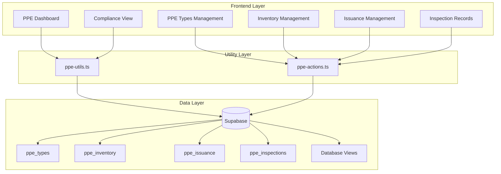

# Design Document: HSE PPE Management

## Overview

The HSE PPE Management module provides comprehensive tracking of Personal Protective Equipment throughout its lifecycle - from inventory management through issuance to employees, condition monitoring via inspections, and compliance tracking. The system integrates with the existing employee management module and follows the established patterns in the Gama ERP codebase.

The module consists of:
- PPE type configuration with categories, sizes, and replacement schedules
- Inventory tracking with reorder alerts
- Employee PPE issuance with automatic replacement date calculation
- Inspection records for condition monitoring
- Compliance views showing missing/overdue PPE
- Dashboard with alerts and metrics

## Architecture



## Components and Interfaces

### Page Structure

```
/app/(main)/hse/ppe/
├── page.tsx                    # PPE Dashboard
├── types/
│   └── page.tsx               # PPE Types management
├── inventory/
│   └── page.tsx               # Inventory management
├── issuance/
│   ├── page.tsx               # Issuance list
│   └── [id]/page.tsx          # Issuance detail with inspections
├── compliance/
│   └── page.tsx               # Employee compliance view
└── replacement/
    └── page.tsx               # Replacement due list
```

### Components

```
/components/ppe/
├── ppe-type-form.tsx          # Create/edit PPE type
├── ppe-type-table.tsx         # PPE types list
├── inventory-form.tsx         # Update inventory
├── inventory-table.tsx        # Inventory list with alerts
├── issuance-form.tsx          # Issue PPE to employee
├── issuance-table.tsx         # Issuance records list
├── issuance-detail.tsx        # Single issuance with history
├── return-form.tsx            # Return/replace PPE
├── inspection-form.tsx        # Record inspection
├── inspection-history.tsx     # Inspection records for issuance
├── compliance-table.tsx       # Employee compliance status
├── replacement-due-table.tsx  # PPE due for replacement
├── ppe-dashboard-cards.tsx    # Dashboard summary cards
├── ppe-alerts-list.tsx        # Alert notifications
└── employee-ppe-status.tsx    # PPE status for single employee
```

### Utility Functions (lib/ppe-utils.ts)

```typescript
// PPE Type utilities
function getPPECategories(): PPECategory[]
function getPPETypesByCategory(category: string): PPEType[]
function formatPPECategory(category: string): string

// Replacement date calculation
function calculateReplacementDate(issueDate: Date, intervalDays: number | null): Date | null
function getDaysUntilReplacement(replacementDate: Date | null): number | null
function isReplacementOverdue(replacementDate: Date | null): boolean
function isReplacementDueSoon(replacementDate: Date | null, thresholdDays?: number): boolean

// Inventory utilities
function isStockLow(quantity: number, reorderLevel: number): boolean
function getStockStatus(quantity: number, reorderLevel: number): 'adequate' | 'low' | 'critical'

// Compliance utilities
function getComplianceStatus(issuance: PPEIssuance | null, isMandatory: boolean, replacementDate: Date | null): PPEComplianceStatus
function countComplianceIssues(statuses: PPEComplianceStatus[]): ComplianceIssueCounts
function getEmployeeComplianceSummary(employeeStatuses: EmployeePPEStatus[]): EmployeeComplianceSummary

// Condition utilities
function getConditionSeverity(condition: string): 'good' | 'warning' | 'danger'
function shouldReplaceBasedOnCondition(condition: string): boolean

// Formatting
function formatIssuanceStatus(status: string): string
function formatCondition(condition: string): string
function formatInspectionAction(action: string): string
```

### Server Actions (lib/ppe-actions.ts)

```typescript
// PPE Types
async function createPPEType(data: CreatePPETypeInput): Promise<PPEType>
async function updatePPEType(id: string, data: UpdatePPETypeInput): Promise<PPEType>
async function deletePPEType(id: string): Promise<void>

// Inventory
async function updateInventory(id: string, data: UpdateInventoryInput): Promise<PPEInventory>
async function adjustStock(id: string, adjustment: number, reason: string): Promise<PPEInventory>
async function recordPurchase(data: RecordPurchaseInput): Promise<PPEInventory>

// Issuance
async function issuePPE(data: IssuePPEInput): Promise<PPEIssuance>
async function returnPPE(id: string, data: ReturnPPEInput): Promise<PPEIssuance>
async function replacePPE(id: string, data: ReplacePPEInput): Promise<PPEIssuance>
async function markPPELost(id: string, notes: string): Promise<PPEIssuance>
async function markPPEDamaged(id: string, notes: string): Promise<PPEIssuance>

// Inspections
async function recordInspection(data: RecordInspectionInput): Promise<PPEInspection>
async function updateInspectionAction(id: string, actionTaken: string): Promise<PPEInspection>
```

## Data Models

### TypeScript Types (types/ppe.ts)

```typescript
// PPE Categories
export type PPECategory = 
  | 'head' 
  | 'eye' 
  | 'ear' 
  | 'respiratory' 
  | 'hand' 
  | 'body' 
  | 'foot' 
  | 'fall_protection';

// Issuance Status
export type IssuanceStatus = 
  | 'active' 
  | 'returned' 
  | 'replaced' 
  | 'lost' 
  | 'damaged';

// Condition values
export type PPECondition = 
  | 'new' 
  | 'good' 
  | 'fair' 
  | 'poor' 
  | 'failed';

// Inspection actions
export type InspectionAction = 
  | 'none' 
  | 'clean' 
  | 'repair' 
  | 'replace';

// Compliance status
export type PPEComplianceStatus = 
  | 'issued' 
  | 'missing' 
  | 'overdue' 
  | 'due_soon' 
  | 'not_required';

// PPE Type
export interface PPEType {
  id: string;
  ppe_code: string;
  ppe_name: string;
  description: string | null;
  category: PPECategory;
  replacement_interval_days: number | null;
  is_mandatory: boolean;
  required_for_roles: string[];
  required_for_activities: string[];
  has_sizes: boolean;
  available_sizes: string[];
  unit_cost: number | null;
  is_active: boolean;
  display_order: number;
  created_at: string;
}

// PPE Inventory
export interface PPEInventory {
  id: string;
  ppe_type_id: string;
  size: string | null;
  quantity_in_stock: number;
  reorder_level: number;
  storage_location: string | null;
  last_purchase_date: string | null;
  last_purchase_qty: number | null;
  last_purchase_cost: number | null;
  updated_at: string;
  // Joined
  ppe_type?: PPEType;
}

// PPE Issuance
export interface PPEIssuance {
  id: string;
  employee_id: string;
  ppe_type_id: string;
  quantity: number;
  size: string | null;
  serial_number: string | null;
  issued_date: string;
  issued_by: string | null;
  condition_at_issue: string;
  expected_replacement_date: string | null;
  returned_date: string | null;
  returned_condition: string | null;
  replacement_reason: string | null;
  status: IssuanceStatus;
  notes: string | null;
  created_at: string;
  // Joined
  employee?: Employee;
  ppe_type?: PPEType;
  issued_by_user?: UserProfile;
  inspections?: PPEInspection[];
}

// PPE Inspection
export interface PPEInspection {
  id: string;
  issuance_id: string;
  inspection_date: string;
  condition: PPECondition;
  findings: string | null;
  action_required: InspectionAction | null;
  action_taken: string | null;
  inspected_by: string | null;
  created_at: string;
  // Joined
  inspected_by_user?: UserProfile;
}

// View types
export interface PPEReplacementDue {
  id: string;
  employee_code: string;
  full_name: string;
  ppe_name: string;
  size: string | null;
  issued_date: string;
  expected_replacement_date: string;
  days_overdue: number;
}

export interface EmployeePPEStatus {
  employee_id: string;
  employee_code: string;
  full_name: string;
  ppe_type_id: string;
  ppe_code: string;
  ppe_name: string;
  is_mandatory: boolean;
  issuance_id: string | null;
  issued_date: string | null;
  expected_replacement_date: string | null;
  ppe_status: PPEComplianceStatus;
}

// Dashboard metrics
export interface PPEDashboardMetrics {
  totalActiveIssuances: number;
  replacementsDueSoon: number;
  replacementsOverdue: number;
  employeesMissingPPE: number;
  lowStockItems: number;
  totalPPETypes: number;
}

// Compliance summary
export interface ComplianceIssueCounts {
  missing: number;
  overdue: number;
  dueSoon: number;
  issued: number;
}

export interface EmployeeComplianceSummary {
  employeeId: string;
  employeeName: string;
  totalMandatory: number;
  issued: number;
  missing: number;
  overdue: number;
  dueSoon: number;
  isCompliant: boolean;
}
```

### Input Types

```typescript
export interface CreatePPETypeInput {
  ppe_code: string;
  ppe_name: string;
  description?: string;
  category: PPECategory;
  replacement_interval_days?: number;
  is_mandatory?: boolean;
  has_sizes?: boolean;
  available_sizes?: string[];
  unit_cost?: number;
}

export interface IssuePPEInput {
  employee_id: string;
  ppe_type_id: string;
  quantity?: number;
  size?: string;
  serial_number?: string;
  issued_date: string;
  condition_at_issue?: string;
  notes?: string;
}

export interface ReturnPPEInput {
  returned_date: string;
  returned_condition: string;
  replacement_reason?: string;
  notes?: string;
}

export interface RecordInspectionInput {
  issuance_id: string;
  inspection_date: string;
  condition: PPECondition;
  findings?: string;
  action_required?: InspectionAction;
}

export interface RecordPurchaseInput {
  ppe_type_id: string;
  size?: string;
  quantity: number;
  purchase_date: string;
  unit_cost: number;
  storage_location?: string;
}
```

## Correctness Properties

*A property is a characteristic or behavior that should hold true across all valid executions of a system-essentially, a formal statement about what the system should do. Properties serve as the bridge between human-readable specifications and machine-verifiable correctness guarantees.*


### Property 1: PPE Type Data Round-Trip

*For any* valid PPE type with code, name, category, replacement interval, and available sizes, creating and then retrieving the PPE type SHALL return an equivalent object with all fields preserved.

**Validates: Requirements 1.1, 1.3, 1.5**

### Property 2: PPE Category Validation

*For any* string value provided as a PPE category, the system SHALL accept only values from the set {head, eye, ear, respiratory, hand, body, foot, fall_protection} and reject all others.

**Validates: Requirements 1.2**

### Property 3: Soft-Delete Filtering

*For any* PPE type marked as inactive (is_active = false), queries for active PPE types SHALL NOT include that type in results.

**Validates: Requirements 1.7**

### Property 4: Low Stock Detection

*For any* inventory item where quantity_in_stock < reorder_level, the isStockLow function SHALL return true; otherwise it SHALL return false.

**Validates: Requirements 2.3**

### Property 5: Stock Decrement on Issuance

*For any* PPE issuance of quantity N from inventory with initial stock S, after the issuance completes, the inventory stock SHALL equal S - N.

**Validates: Requirements 2.6**

### Property 6: Stock Increment on Return

*For any* PPE return in reusable condition (good or fair) of quantity N to inventory with current stock S, after the return completes, the inventory stock SHALL equal S + N.

**Validates: Requirements 2.7**

### Property 7: Replacement Date Calculation

*For any* PPE issuance with issue_date D and PPE type with replacement_interval_days I (where I is not null), the expected_replacement_date SHALL equal D + I days.

**Validates: Requirements 3.3**

### Property 8: Issuance Status Validation

*For any* string value provided as an issuance status, the system SHALL accept only values from the set {active, returned, replaced, lost, damaged} and reject all others.

**Validates: Requirements 3.6**

### Property 9: Inspection Enum Validation

*For any* inspection record, the condition field SHALL only accept values from {new, good, fair, poor, failed} and the action_required field SHALL only accept values from {none, clean, repair, replace}.

**Validates: Requirements 4.2, 4.4**

### Property 10: Replacement Due Filtering

*For any* set of PPE issuances, the replacement due view SHALL return only those where: (1) status is 'active', (2) expected_replacement_date is within 30 days of current date, and (3) the associated employee is active. The days_overdue calculation SHALL equal current_date - expected_replacement_date.

**Validates: Requirements 5.1, 5.2, 5.5**

### Property 11: Compliance Status Calculation

*For any* employee and mandatory PPE type combination:
- If no active issuance exists, status SHALL be 'missing'
- If active issuance exists and expected_replacement_date < current_date, status SHALL be 'overdue'
- If active issuance exists and expected_replacement_date is within 30 days, status SHALL be 'due_soon'
- If active issuance exists and not overdue or due_soon, status SHALL be 'issued'

**Validates: Requirements 6.2, 6.3, 6.4, 6.5**

### Property 12: Compliance Issue Counting

*For any* employee's PPE status records, the compliance issue count SHALL equal the sum of statuses that are 'missing', 'overdue', or 'due_soon'.

**Validates: Requirements 6.6**

## Error Handling

### Validation Errors

| Error Condition | Error Message | HTTP Status |
|----------------|---------------|-------------|
| Invalid PPE category | "Invalid PPE category. Must be one of: head, eye, ear, respiratory, hand, body, foot, fall_protection" | 400 |
| Invalid issuance status | "Invalid issuance status. Must be one of: active, returned, replaced, lost, damaged" | 400 |
| Invalid condition | "Invalid condition. Must be one of: new, good, fair, poor, failed" | 400 |
| Duplicate PPE code | "PPE code already exists" | 409 |
| Missing required field | "Field {field_name} is required" | 400 |
| Invalid employee | "Employee not found or inactive" | 404 |
| Invalid PPE type | "PPE type not found or inactive" | 404 |
| Insufficient stock | "Insufficient stock. Available: {available}, Requested: {requested}" | 400 |

### Business Logic Errors

| Error Condition | Error Message | HTTP Status |
|----------------|---------------|-------------|
| Issue to inactive employee | "Cannot issue PPE to inactive employee" | 400 |
| Return already returned PPE | "PPE has already been returned" | 400 |
| Inspect non-active issuance | "Cannot inspect PPE that is not actively issued" | 400 |
| Delete PPE type with active issuances | "Cannot delete PPE type with active issuances" | 400 |

### Database Errors

| Error Condition | Handling |
|----------------|----------|
| Foreign key violation | Return user-friendly message about related records |
| Unique constraint violation | Return message about duplicate value |
| Connection timeout | Retry once, then return service unavailable |

## Testing Strategy

### Testing Framework

- **Unit Tests**: Vitest with React Testing Library
- **Property-Based Tests**: fast-check library for property-based testing
- **Minimum iterations**: 100 per property test

### Unit Tests

Unit tests will cover:
- Component rendering and user interactions
- Form validation and submission
- Error state handling
- Edge cases for utility functions (null values, empty arrays, boundary dates)

### Property-Based Tests

Each correctness property will be implemented as a property-based test using fast-check:

```typescript
// Example structure for property tests
import { describe, it, expect } from 'vitest';
import * as fc from 'fast-check';

describe('PPE Utils Property Tests', () => {
  // Feature: hse-ppe-management, Property 4: Low Stock Detection
  it('should correctly detect low stock for any quantity/reorder combination', () => {
    fc.assert(
      fc.property(
        fc.nat(), // quantity
        fc.nat(), // reorderLevel
        (quantity, reorderLevel) => {
          const result = isStockLow(quantity, reorderLevel);
          return result === (quantity < reorderLevel);
        }
      ),
      { numRuns: 100 }
    );
  });
});
```

### Test File Structure

```
__tests__/
├── ppe-utils.test.ts              # Unit tests for utility functions
├── ppe-utils.property.test.ts     # Property-based tests
├── ppe-actions.test.ts            # Server action tests
└── ppe-components.test.tsx        # Component tests
```

### Test Coverage Requirements

- All utility functions must have unit tests
- All correctness properties must have property-based tests
- All form components must have validation tests
- All server actions must have success and error case tests
