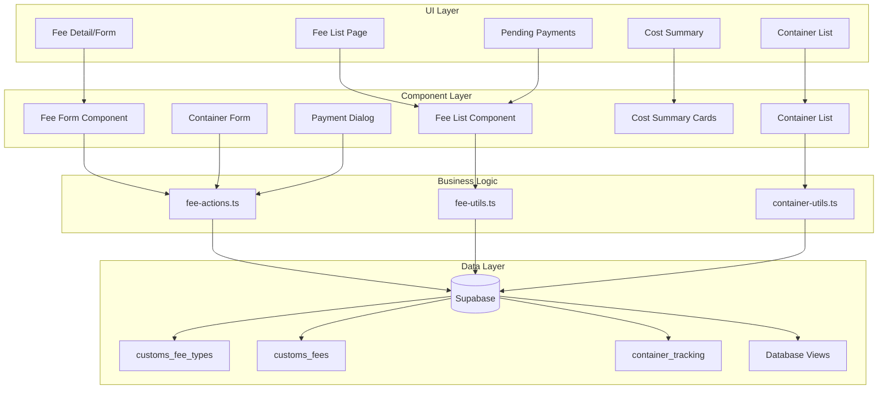

# Design Document

## Overview

The Customs Fee & Duty Tracking module provides comprehensive tracking of all customs-related costs including government duties, service provider fees, and penalties. The system integrates with existing PIB/PEB documents and job orders to enable cost allocation, payment tracking, and financial reporting.

The module consists of three main components:
1. **Fee Management** - Recording and tracking customs fees with payment status
2. **Container Tracking** - Monitoring container status and calculating storage/demurrage
3. **Cost Analytics** - Aggregating costs by job and providing reporting views

## Architecture



## Components and Interfaces

### TypeScript Types

```typescript
// types/customs-fees.ts

// Fee Categories
export type FeeCategory = 'duty' | 'tax' | 'service' | 'storage' | 'penalty' | 'other';

// Payment Status
export type PaymentStatus = 'pending' | 'paid' | 'waived' | 'cancelled';

// Document Type
export type CustomsDocumentType = 'pib' | 'peb';

// Container Status
export type ContainerStatus = 'at_port' | 'gate_out' | 'delivered' | 'returned_empty';

// Container Size
export type ContainerSize = '20' | '40' | '40HC' | '45';

// Container Type
export type ContainerType = 'dry' | 'reefer' | 'flat_rack' | 'open_top';

// Fee Type Master
export interface CustomsFeeType {
  id: string;
  fee_code: string;
  fee_name: string;
  description: string | null;
  fee_category: FeeCategory;
  is_government_fee: boolean;
  is_active: boolean;
  display_order: number;
  created_at: string;
}

// Customs Fee
export interface CustomsFee {
  id: string;
  document_type: CustomsDocumentType;
  pib_id: string | null;
  peb_id: string | null;
  job_order_id: string | null;
  fee_type_id: string;
  description: string | null;
  currency: string;
  amount: number;
  payment_status: PaymentStatus;
  payment_date: string | null;
  payment_reference: string | null;
  payment_method: string | null;
  ntpn: string | null;
  ntb: string | null;
  billing_code: string | null;
  vendor_id: string | null;
  vendor_invoice_number: string | null;
  receipt_url: string | null;
  notes: string | null;
  created_by: string | null;
  created_at: string;
  updated_at: string;
}

// Fee with relations
export interface CustomsFeeWithRelations extends CustomsFee {
  fee_type?: CustomsFeeType;
  pib?: { id: string; internal_ref: string };
  peb?: { id: string; internal_ref: string };
  job_order?: { id: string; jo_number: string };
  vendor?: { id: string; vendor_name: string };
}

// Container Tracking
export interface ContainerTracking {
  id: string;
  pib_id: string | null;
  peb_id: string | null;
  job_order_id: string | null;
  container_number: string;
  container_size: ContainerSize | null;
  container_type: ContainerType | null;
  seal_number: string | null;
  terminal: string | null;
  arrival_date: string | null;
  free_time_days: number;
  free_time_end: string | null;
  gate_out_date: string | null;
  storage_days: number | null;
  daily_rate: number | null;
  total_storage_fee: number | null;
  status: ContainerStatus;
  created_at: string;
}

// Container with relations
export interface ContainerTrackingWithRelations extends ContainerTracking {
  pib?: { id: string; internal_ref: string };
  peb?: { id: string; internal_ref: string };
  job_order?: { id: string; jo_number: string };
}

// Job Customs Cost Summary
export interface JobCustomsCostSummary {
  job_order_id: string;
  jo_number: string;
  customer_name: string;
  total_duties: number;
  total_taxes: number;
  total_services: number;
  total_storage: number;
  total_penalties: number;
  total_customs_cost: number;
  total_paid: number;
  total_pending: number;
}

// Form Data Types
export interface CustomsFeeFormData {
  document_type: CustomsDocumentType;
  pib_id?: string;
  peb_id?: string;
  job_order_id?: string;
  fee_type_id: string;
  description?: string;
  currency: string;
  amount: number;
  vendor_id?: string;
  vendor_invoice_number?: string;
  notes?: string;
}

export interface PaymentFormData {
  payment_date: string;
  payment_reference?: string;
  payment_method?: string;
  ntpn?: string;
  ntb?: string;
  billing_code?: string;
  receipt_url?: string;
}

export interface ContainerFormData {
  pib_id?: string;
  peb_id?: string;
  job_order_id?: string;
  container_number: string;
  container_size?: ContainerSize;
  container_type?: ContainerType;
  seal_number?: string;
  terminal?: string;
  arrival_date?: string;
  free_time_days: number;
  daily_rate?: number;
}

// Filter Types
export interface FeeFilters {
  document_type?: CustomsDocumentType;
  fee_category?: FeeCategory;
  payment_status?: PaymentStatus;
  date_from?: string;
  date_to?: string;
  search?: string;
}

export interface ContainerFilters {
  status?: ContainerStatus;
  search?: string;
}

// Statistics
export interface FeeStatistics {
  total_fees: number;
  total_pending: number;
  total_paid: number;
  pending_amount: number;
}

export interface ContainerStatistics {
  total_containers: number;
  at_port: number;
  past_free_time: number;
  total_demurrage: number;
}
```

### Utility Functions

```typescript
// lib/fee-utils.ts

/**
 * Calculate free time end date
 * @param arrivalDate - Container arrival date
 * @param freeTimeDays - Number of free days
 * @returns Free time end date
 */
export function calculateFreeTimeEnd(
  arrivalDate: string,
  freeTimeDays: number
): string;

/**
 * Calculate storage days
 * @param freeTimeEnd - Free time end date
 * @param gateOutDate - Gate out date
 * @returns Number of storage days (0 if within free time)
 */
export function calculateStorageDays(
  freeTimeEnd: string,
  gateOutDate: string
): number;

/**
 * Calculate total storage fee
 * @param storageDays - Number of storage days
 * @param dailyRate - Daily storage rate
 * @returns Total storage fee
 */
export function calculateStorageFee(
  storageDays: number,
  dailyRate: number
): number;

/**
 * Get free time status for a container
 * @param container - Container tracking record
 * @returns 'ok' | 'warning' | 'critical'
 */
export function getFreeTimeStatus(
  container: ContainerTracking
): 'ok' | 'warning' | 'critical';

/**
 * Calculate days until free time expires
 * @param freeTimeEnd - Free time end date
 * @returns Days remaining (negative if expired)
 */
export function getDaysUntilFreeTimeExpires(
  freeTimeEnd: string
): number;

/**
 * Format fee amount with currency
 * @param amount - Fee amount
 * @param currency - Currency code
 * @returns Formatted amount string
 */
export function formatFeeAmount(
  amount: number,
  currency: string
): string;

/**
 * Get payment status badge variant
 * @param status - Payment status
 * @returns Badge variant for UI
 */
export function getPaymentStatusVariant(
  status: PaymentStatus
): 'default' | 'secondary' | 'success' | 'destructive';

/**
 * Get container status badge variant
 * @param status - Container status
 * @returns Badge variant for UI
 */
export function getContainerStatusVariant(
  status: ContainerStatus
): 'default' | 'secondary' | 'success' | 'warning';

/**
 * Validate fee form data
 * @param data - Fee form data
 * @returns Validation result with errors
 */
export function validateFeeForm(
  data: CustomsFeeFormData
): { valid: boolean; errors: string[] };

/**
 * Validate container form data
 * @param data - Container form data
 * @returns Validation result with errors
 */
export function validateContainerForm(
  data: ContainerFormData
): { valid: boolean; errors: string[] };

/**
 * Aggregate fees by category
 * @param fees - Array of customs fees
 * @returns Object with totals by category
 */
export function aggregateFeesByCategory(
  fees: CustomsFeeWithRelations[]
): Record<FeeCategory, number>;

/**
 * Filter fees by criteria
 * @param fees - Array of fees
 * @param filters - Filter criteria
 * @returns Filtered fees array
 */
export function filterFees(
  fees: CustomsFeeWithRelations[],
  filters: FeeFilters
): CustomsFeeWithRelations[];

/**
 * Filter containers by criteria
 * @param containers - Array of containers
 * @param filters - Filter criteria
 * @returns Filtered containers array
 */
export function filterContainers(
  containers: ContainerTrackingWithRelations[],
  filters: ContainerFilters
): ContainerTrackingWithRelations[];
```

### Server Actions

```typescript
// lib/fee-actions.ts
'use server'

// Fee Type Actions
export async function getFeeTypes(): Promise<CustomsFeeType[]>;
export async function getFeeTypesByCategory(category: FeeCategory): Promise<CustomsFeeType[]>;

// Fee CRUD Actions
export async function createFee(data: CustomsFeeFormData): Promise<{ success: boolean; data?: CustomsFee; error?: string }>;
export async function updateFee(id: string, data: Partial<CustomsFeeFormData>): Promise<{ success: boolean; error?: string }>;
export async function deleteFee(id: string): Promise<{ success: boolean; error?: string }>;
export async function getFee(id: string): Promise<CustomsFeeWithRelations | null>;
export async function getFees(filters?: FeeFilters): Promise<CustomsFeeWithRelations[]>;
export async function getFeesByDocument(documentType: CustomsDocumentType, documentId: string): Promise<CustomsFeeWithRelations[]>;
export async function getFeesByJob(jobOrderId: string): Promise<CustomsFeeWithRelations[]>;

// Payment Actions
export async function markFeePaid(id: string, data: PaymentFormData): Promise<{ success: boolean; error?: string }>;
export async function markFeeWaived(id: string, notes?: string): Promise<{ success: boolean; error?: string }>;
export async function cancelFee(id: string, notes?: string): Promise<{ success: boolean; error?: string }>;

// Container CRUD Actions
export async function createContainer(data: ContainerFormData): Promise<{ success: boolean; data?: ContainerTracking; error?: string }>;
export async function updateContainer(id: string, data: Partial<ContainerFormData>): Promise<{ success: boolean; error?: string }>;
export async function deleteContainer(id: string): Promise<{ success: boolean; error?: string }>;
export async function getContainer(id: string): Promise<ContainerTrackingWithRelations | null>;
export async function getContainers(filters?: ContainerFilters): Promise<ContainerTrackingWithRelations[]>;
export async function getContainersByDocument(documentType: CustomsDocumentType, documentId: string): Promise<ContainerTrackingWithRelations[]>;

// Container Status Actions
export async function updateContainerStatus(id: string, status: ContainerStatus, gateOutDate?: string): Promise<{ success: boolean; error?: string }>;
export async function calculateContainerStorage(id: string): Promise<{ success: boolean; storageDays?: number; totalFee?: number; error?: string }>;

// Summary Actions
export async function getJobCustomsCosts(jobOrderId: string): Promise<JobCustomsCostSummary | null>;
export async function getAllJobCustomsCosts(): Promise<JobCustomsCostSummary[]>;
export async function getPendingPayments(): Promise<CustomsFeeWithRelations[]>;
export async function getFeeStatistics(): Promise<FeeStatistics>;
export async function getContainerStatistics(): Promise<ContainerStatistics>;
```

### React Components

```typescript
// Fee Components
components/customs-fees/
├── fee-type-select.tsx      // Dropdown for selecting fee type
├── fee-form.tsx             // Form for creating/editing fees
├── fee-list.tsx             // List of fees with filtering
├── fee-filters.tsx          // Filter controls for fee list
├── fee-summary-cards.tsx    // Statistics cards
├── payment-dialog.tsx       // Dialog for recording payment
├── fee-detail-view.tsx      // Detailed fee view

// Container Components
components/customs-fees/
├── container-form.tsx       // Form for creating/editing containers
├── container-list.tsx       // List of containers with status
├── container-filters.tsx    // Filter controls for containers
├── container-status-badge.tsx // Status indicator with color
├── free-time-indicator.tsx  // Visual indicator for free time remaining
├── storage-calculator.tsx   // Calculate and display storage fees

// Summary Components
components/customs-fees/
├── job-cost-summary.tsx     // Cost breakdown by job
├── pending-payments-list.tsx // List of pending payments
├── cost-breakdown-chart.tsx // Visual breakdown of costs
```

## Data Models

### Database Schema

```sql
-- Fee types master table
CREATE TABLE customs_fee_types (
  id UUID PRIMARY KEY DEFAULT gen_random_uuid(),
  fee_code VARCHAR(30) UNIQUE NOT NULL,
  fee_name VARCHAR(100) NOT NULL,
  description TEXT,
  fee_category VARCHAR(30) NOT NULL CHECK (fee_category IN ('duty', 'tax', 'service', 'storage', 'penalty', 'other')),
  is_government_fee BOOLEAN DEFAULT TRUE,
  is_active BOOLEAN DEFAULT TRUE,
  display_order INTEGER DEFAULT 0,
  created_at TIMESTAMPTZ DEFAULT NOW()
);

-- Customs fees table
CREATE TABLE customs_fees (
  id UUID PRIMARY KEY DEFAULT gen_random_uuid(),
  document_type VARCHAR(10) NOT NULL CHECK (document_type IN ('pib', 'peb')),
  pib_id UUID REFERENCES pib_documents(id),
  peb_id UUID REFERENCES peb_documents(id),
  job_order_id UUID REFERENCES job_orders(id),
  fee_type_id UUID NOT NULL REFERENCES customs_fee_types(id),
  description TEXT,
  currency VARCHAR(10) DEFAULT 'IDR',
  amount DECIMAL(18,2) NOT NULL,
  payment_status VARCHAR(20) DEFAULT 'pending' CHECK (payment_status IN ('pending', 'paid', 'waived', 'cancelled')),
  payment_date DATE,
  payment_reference VARCHAR(100),
  payment_method VARCHAR(30),
  ntpn VARCHAR(50),
  ntb VARCHAR(50),
  billing_code VARCHAR(50),
  vendor_id UUID REFERENCES vendors(id),
  vendor_invoice_number VARCHAR(100),
  receipt_url VARCHAR(500),
  notes TEXT,
  created_by UUID REFERENCES user_profiles(id),
  created_at TIMESTAMPTZ DEFAULT NOW(),
  updated_at TIMESTAMPTZ DEFAULT NOW(),
  CONSTRAINT valid_document_link CHECK (
    (document_type = 'pib' AND pib_id IS NOT NULL) OR
    (document_type = 'peb' AND peb_id IS NOT NULL)
  )
);

-- Container tracking table
CREATE TABLE container_tracking (
  id UUID PRIMARY KEY DEFAULT gen_random_uuid(),
  pib_id UUID REFERENCES pib_documents(id),
  peb_id UUID REFERENCES peb_documents(id),
  job_order_id UUID REFERENCES job_orders(id),
  container_number VARCHAR(20) NOT NULL,
  container_size VARCHAR(10) CHECK (container_size IN ('20', '40', '40HC', '45')),
  container_type VARCHAR(20) CHECK (container_type IN ('dry', 'reefer', 'flat_rack', 'open_top')),
  seal_number VARCHAR(50),
  terminal VARCHAR(200),
  arrival_date DATE,
  free_time_days INTEGER DEFAULT 7,
  free_time_end DATE GENERATED ALWAYS AS (arrival_date + free_time_days * INTERVAL '1 day') STORED,
  gate_out_date DATE,
  storage_days INTEGER,
  daily_rate DECIMAL(15,2),
  total_storage_fee DECIMAL(15,2),
  status VARCHAR(30) DEFAULT 'at_port' CHECK (status IN ('at_port', 'gate_out', 'delivered', 'returned_empty')),
  created_at TIMESTAMPTZ DEFAULT NOW()
);

-- Indexes
CREATE INDEX idx_customs_fees_pib ON customs_fees(pib_id);
CREATE INDEX idx_customs_fees_peb ON customs_fees(peb_id);
CREATE INDEX idx_customs_fees_job ON customs_fees(job_order_id);
CREATE INDEX idx_customs_fees_status ON customs_fees(payment_status);
CREATE INDEX idx_customs_fees_type ON customs_fees(fee_type_id);
CREATE INDEX idx_container_tracking_pib ON container_tracking(pib_id);
CREATE INDEX idx_container_tracking_peb ON container_tracking(peb_id);
CREATE INDEX idx_container_tracking_job ON container_tracking(job_order_id);
CREATE INDEX idx_container_tracking_status ON container_tracking(status);

-- View for job customs cost summary
CREATE OR REPLACE VIEW job_customs_costs AS
SELECT 
  jo.id as job_order_id,
  jo.jo_number,
  c.name as customer_name,
  COALESCE(SUM(cf.amount) FILTER (WHERE cft.fee_category = 'duty'), 0) as total_duties,
  COALESCE(SUM(cf.amount) FILTER (WHERE cft.fee_category = 'tax'), 0) as total_taxes,
  COALESCE(SUM(cf.amount) FILTER (WHERE cft.fee_category = 'service'), 0) as total_services,
  COALESCE(SUM(cf.amount) FILTER (WHERE cft.fee_category = 'storage'), 0) as total_storage,
  COALESCE(SUM(cf.amount) FILTER (WHERE cft.fee_category = 'penalty'), 0) as total_penalties,
  COALESCE(SUM(cf.amount), 0) as total_customs_cost,
  COALESCE(SUM(cf.amount) FILTER (WHERE cf.payment_status = 'paid'), 0) as total_paid,
  COALESCE(SUM(cf.amount) FILTER (WHERE cf.payment_status = 'pending'), 0) as total_pending
FROM job_orders jo
JOIN customers c ON jo.customer_id = c.id
LEFT JOIN customs_fees cf ON jo.id = cf.job_order_id
LEFT JOIN customs_fee_types cft ON cf.fee_type_id = cft.id
GROUP BY jo.id, jo.jo_number, c.name;

-- View for pending payments
CREATE OR REPLACE VIEW pending_customs_payments AS
SELECT 
  cf.*,
  cft.fee_name,
  cft.fee_category,
  p.internal_ref as pib_ref,
  pe.internal_ref as peb_ref,
  jo.jo_number
FROM customs_fees cf
JOIN customs_fee_types cft ON cf.fee_type_id = cft.id
LEFT JOIN pib_documents p ON cf.pib_id = p.id
LEFT JOIN peb_documents pe ON cf.peb_id = pe.id
LEFT JOIN job_orders jo ON cf.job_order_id = jo.id
WHERE cf.payment_status = 'pending'
ORDER BY cf.created_at;

-- Default fee types
INSERT INTO customs_fee_types (fee_code, fee_name, fee_category, is_government_fee, display_order) VALUES
('BM', 'Bea Masuk (Import Duty)', 'duty', TRUE, 1),
('PPN', 'PPN Import', 'tax', TRUE, 2),
('PPH', 'PPh Import', 'tax', TRUE, 3),
('PPNBM', 'PPnBM', 'tax', TRUE, 4),
('BK', 'Bea Keluar (Export Duty)', 'duty', TRUE, 5),
('STORAGE', 'Container Storage', 'storage', FALSE, 10),
('HANDLING', 'Terminal Handling', 'service', FALSE, 11),
('TRUCKING', 'Trucking from Port', 'service', FALSE, 12),
('FUMIGATION', 'Fumigation', 'service', FALSE, 13),
('SURVEYOR', 'Surveyor Fee', 'service', FALSE, 14),
('PPJK', 'PPJK Service Fee', 'service', FALSE, 15),
('PENALTY', 'Customs Penalty', 'penalty', TRUE, 20),
('DEMURRAGE', 'Container Demurrage', 'penalty', FALSE, 21);

-- RLS Policies
ALTER TABLE customs_fee_types ENABLE ROW LEVEL SECURITY;
ALTER TABLE customs_fees ENABLE ROW LEVEL SECURITY;
ALTER TABLE container_tracking ENABLE ROW LEVEL SECURITY;

CREATE POLICY "Allow read for authenticated users" ON customs_fee_types
  FOR SELECT TO authenticated USING (true);

CREATE POLICY "Allow read for authenticated users" ON customs_fees
  FOR SELECT TO authenticated USING (true);

CREATE POLICY "Allow insert for authenticated users" ON customs_fees
  FOR INSERT TO authenticated WITH CHECK (true);

CREATE POLICY "Allow update for authenticated users" ON customs_fees
  FOR UPDATE TO authenticated USING (true);

CREATE POLICY "Allow delete for authenticated users" ON customs_fees
  FOR DELETE TO authenticated USING (true);

CREATE POLICY "Allow read for authenticated users" ON container_tracking
  FOR SELECT TO authenticated USING (true);

CREATE POLICY "Allow insert for authenticated users" ON container_tracking
  FOR INSERT TO authenticated WITH CHECK (true);

CREATE POLICY "Allow update for authenticated users" ON container_tracking
  FOR UPDATE TO authenticated USING (true);

CREATE POLICY "Allow delete for authenticated users" ON container_tracking
  FOR DELETE TO authenticated USING (true);
```


## Correctness Properties

*A property is a characteristic or behavior that should hold true across all valid executions of a system—essentially, a formal statement about what the system should do. Properties serve as the bridge between human-readable specifications and machine-verifiable correctness guarantees.*

### Property 1: Fee Category Validation

*For any* customs fee, the fee_category field SHALL only contain one of the valid values: 'duty', 'tax', 'service', 'storage', 'penalty', or 'other'. Any fee with an invalid category SHALL be rejected.

**Validates: Requirements 1.2, 3.6**

### Property 2: Fee Document Link Validation

*For any* customs fee, if document_type is 'pib' then pib_id must be non-null, and if document_type is 'peb' then peb_id must be non-null. A fee without a valid document link SHALL be rejected.

**Validates: Requirements 2.1**

### Property 3: Fee Amount Validation

*For any* customs fee, the amount field must be a positive number and currency must be a non-empty string (defaulting to 'IDR'). A fee with invalid amount or missing currency SHALL be rejected.

**Validates: Requirements 2.4**

### Property 4: Free Time End Calculation

*For any* container with arrival_date and free_time_days set, the free_time_end date SHALL equal arrival_date plus free_time_days. This calculation must be deterministic and consistent.

**Validates: Requirements 5.5**

### Property 5: Storage Days Calculation

*For any* container where gate_out_date exceeds free_time_end, storage_days SHALL equal the number of days between free_time_end and gate_out_date. If gate_out_date is on or before free_time_end, storage_days SHALL be 0.

**Validates: Requirements 5.7**

### Property 6: Storage Fee Calculation

*For any* container with storage_days > 0 and daily_rate set, total_storage_fee SHALL equal storage_days multiplied by daily_rate. The calculation must be precise to 2 decimal places.

**Validates: Requirements 5.8**

### Property 7: Free Time Status Determination

*For any* container at port:
- If free_time_end is more than 2 days in the future, status SHALL be 'ok'
- If free_time_end is within 2 days (inclusive), status SHALL be 'warning'
- If free_time_end has passed, status SHALL be 'critical'

**Validates: Requirements 10.3, 10.4**

### Property 8: Job Cost Aggregation Consistency

*For any* job order, the sum of all linked customs fees grouped by category SHALL equal the total_customs_cost. Additionally, total_paid plus total_pending SHALL equal total_customs_cost for fees with status 'paid' or 'pending'.

**Validates: Requirements 7.1, 7.2, 7.4**

### Property 9: Fee Filtering Correctness

*For any* set of fees and filter criteria, the filtered result SHALL contain only fees that match ALL specified filter conditions (document_type, fee_category, payment_status, date range). No fee matching all criteria SHALL be excluded.

**Validates: Requirements 9.2, 9.3, 9.4, 9.5**

### Property 10: Pending Payments View Correctness

*For any* query to the pending payments view, all returned fees SHALL have payment_status = 'pending'. The results SHALL be ordered by created_at in ascending order.

**Validates: Requirements 8.1, 8.4**

### Property 11: Payment Status Transition

*For any* fee being marked as paid, the payment_date must be provided. After successful payment recording, the payment_status SHALL be 'paid' and payment_date SHALL be set.

**Validates: Requirements 6.1, 6.5**

### Property 12: Container Status Validation

*For any* container, the status field SHALL only contain one of the valid values: 'at_port', 'gate_out', 'delivered', or 'returned_empty'. Any container with an invalid status SHALL be rejected.

**Validates: Requirements 5.9**

## Error Handling

### Validation Errors

| Error Code | Condition | User Message |
|------------|-----------|--------------|
| `INVALID_FEE_CATEGORY` | Fee category not in allowed values | "Invalid fee category. Must be one of: duty, tax, service, storage, penalty, other" |
| `MISSING_DOCUMENT_LINK` | Fee created without valid document link | "Fee must be linked to a PIB or PEB document" |
| `INVALID_DOCUMENT_TYPE` | Document type not 'pib' or 'peb' | "Document type must be 'pib' or 'peb'" |
| `INVALID_AMOUNT` | Amount is zero, negative, or not a number | "Fee amount must be a positive number" |
| `MISSING_FEE_TYPE` | Fee type not selected | "Please select a fee type" |
| `INVALID_FEE_TYPE` | Fee type ID doesn't exist | "Selected fee type is invalid" |
| `MISSING_PAYMENT_DATE` | Marking paid without payment date | "Payment date is required when marking fee as paid" |
| `INVALID_CONTAINER_STATUS` | Container status not in allowed values | "Invalid container status" |
| `INVALID_CONTAINER_SIZE` | Container size not in allowed values | "Invalid container size. Must be 20, 40, 40HC, or 45" |
| `MISSING_CONTAINER_NUMBER` | Container created without number | "Container number is required" |
| `INVALID_DATE_RANGE` | End date before start date | "End date must be after start date" |

### Database Errors

| Error Code | Condition | User Message |
|------------|-----------|--------------|
| `FK_VIOLATION_PIB` | PIB ID doesn't exist | "Referenced PIB document not found" |
| `FK_VIOLATION_PEB` | PEB ID doesn't exist | "Referenced PEB document not found" |
| `FK_VIOLATION_JOB` | Job order ID doesn't exist | "Referenced job order not found" |
| `FK_VIOLATION_VENDOR` | Vendor ID doesn't exist | "Referenced vendor not found" |
| `FK_VIOLATION_FEE_TYPE` | Fee type ID doesn't exist | "Referenced fee type not found" |
| `UNIQUE_VIOLATION` | Duplicate fee code | "Fee code already exists" |

### Permission Errors

| Error Code | Condition | User Message |
|------------|-----------|--------------|
| `UNAUTHORIZED_VIEW` | User role cannot view fees | "You don't have permission to view customs fees" |
| `UNAUTHORIZED_CREATE` | User role cannot create fees | "You don't have permission to create customs fees" |
| `UNAUTHORIZED_UPDATE` | User role cannot update fees | "You don't have permission to update customs fees" |
| `UNAUTHORIZED_DELETE` | User role cannot delete fees | "You don't have permission to delete customs fees" |
| `UNAUTHORIZED_PAYMENT` | User role cannot process payments | "You don't have permission to process payments" |

## Testing Strategy

### Property-Based Testing

Property-based tests will be implemented using **fast-check** library for TypeScript. Each correctness property will have a corresponding property test with minimum 100 iterations.

```typescript
// __tests__/fee-utils.property.test.ts
import * as fc from 'fast-check';

// Property 4: Free Time End Calculation
describe('Property 4: Free Time End Calculation', () => {
  it('free_time_end equals arrival_date plus free_time_days', () => {
    fc.assert(
      fc.property(
        fc.date({ min: new Date('2020-01-01'), max: new Date('2030-12-31') }),
        fc.integer({ min: 1, max: 30 }),
        (arrivalDate, freeTimeDays) => {
          const result = calculateFreeTimeEnd(arrivalDate.toISOString(), freeTimeDays);
          const expected = addDays(arrivalDate, freeTimeDays);
          return isSameDay(new Date(result), expected);
        }
      ),
      { numRuns: 100 }
    );
  });
});

// Property 5: Storage Days Calculation
describe('Property 5: Storage Days Calculation', () => {
  it('storage_days is difference when gate_out exceeds free_time_end', () => {
    fc.assert(
      fc.property(
        fc.date({ min: new Date('2020-01-01'), max: new Date('2025-12-31') }),
        fc.integer({ min: 1, max: 30 }),
        (freeTimeEnd, extraDays) => {
          const gateOutDate = addDays(freeTimeEnd, extraDays);
          const storageDays = calculateStorageDays(
            freeTimeEnd.toISOString(),
            gateOutDate.toISOString()
          );
          return storageDays === extraDays;
        }
      ),
      { numRuns: 100 }
    );
  });
});

// Property 6: Storage Fee Calculation
describe('Property 6: Storage Fee Calculation', () => {
  it('total_storage_fee equals storage_days times daily_rate', () => {
    fc.assert(
      fc.property(
        fc.integer({ min: 0, max: 100 }),
        fc.float({ min: 0, max: 10000000, noNaN: true }),
        (storageDays, dailyRate) => {
          const fee = calculateStorageFee(storageDays, dailyRate);
          const expected = Math.round(storageDays * dailyRate * 100) / 100;
          return Math.abs(fee - expected) < 0.01;
        }
      ),
      { numRuns: 100 }
    );
  });
});
```

### Unit Tests

Unit tests will cover specific examples and edge cases:

1. **Fee Type Tests**
   - Default fee types are seeded correctly
   - Fee type filtering by category
   - Fee type ordering by display_order

2. **Fee CRUD Tests**
   - Create fee with valid data
   - Create fee with missing required fields (expect error)
   - Update fee payment status
   - Delete fee (permission check)

3. **Container Tests**
   - Create container with valid data
   - Free time calculation edge cases (leap years, month boundaries)
   - Storage calculation when gate_out equals free_time_end (0 days)
   - Status transitions

4. **Aggregation Tests**
   - Job cost summary with no fees
   - Job cost summary with mixed categories
   - Pending payments view accuracy

### Test Configuration

```typescript
// vitest.config.ts additions
export default defineConfig({
  test: {
    // ... existing config
    testTimeout: 30000, // Extended for property tests
  },
});
```

### Test Tagging Convention

All property tests must include a comment referencing the design property:

```typescript
/**
 * Feature: customs-fee-duty-tracking
 * Property 4: Free Time End Calculation
 * For any container with arrival_date and free_time_days set,
 * free_time_end SHALL equal arrival_date plus free_time_days.
 */
```
