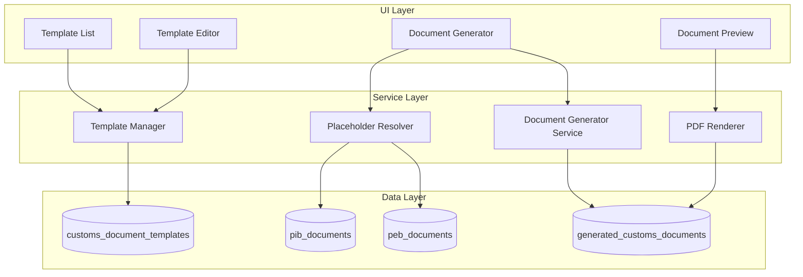

# Design Document: Customs Document Templates

## Overview

This feature implements a customizable document template system for generating customs-related documents such as packing lists, commercial invoices, and certificates. The system uses HTML templates with Mustache-style placeholders that can be automatically populated from PIB/PEB records or manually entered.

The architecture follows a template-driven approach where:
1. Templates define the document structure with placeholders
2. A placeholder resolver maps data sources to template variables
3. A document generator fills templates and produces output
4. A PDF renderer converts filled HTML to downloadable PDFs

## Architecture



## Components and Interfaces

### Types

```typescript
// Document type categories
export type DocumentType = 
  | 'packing_list'
  | 'commercial_invoice'
  | 'coo'
  | 'insurance_cert'
  | 'bill_of_lading'
  | 'shipping_instruction'
  | 'cargo_manifest';

// Paper settings
export type PaperSize = 'A4' | 'Letter';
export type Orientation = 'portrait' | 'landscape';

// Document status
export type GeneratedDocumentStatus = 'draft' | 'final' | 'sent' | 'archived';

// Placeholder source types
export type PlaceholderSource = 
  | 'pib.field_name'
  | 'peb.field_name'
  | 'pib_items'
  | 'peb_items'
  | 'manual'
  | 'current_date';

// Placeholder definition
export interface PlaceholderDefinition {
  key: string;
  label: string;
  source: PlaceholderSource;
  type?: 'text' | 'number' | 'date' | 'array';
  defaultValue?: string;
}

// Template entity
export interface CustomsDocumentTemplate {
  id: string;
  template_code: string;
  template_name: string;
  description: string | null;
  document_type: DocumentType;
  template_html: string;
  placeholders: PlaceholderDefinition[];
  paper_size: PaperSize;
  orientation: Orientation;
  include_company_header: boolean;
  is_active: boolean;
  created_by: string | null;
  created_at: string;
  updated_at: string;
}

// Generated document entity
export interface GeneratedCustomsDocument {
  id: string;
  document_number: string;
  template_id: string;
  pib_id: string | null;
  peb_id: string | null;
  job_order_id: string | null;
  document_data: Record<string, unknown>;
  pdf_url: string | null;
  status: GeneratedDocumentStatus;
  created_by: string | null;
  created_at: string;
}

// With relations
export interface GeneratedDocumentWithRelations extends GeneratedCustomsDocument {
  template?: CustomsDocumentTemplate;
  pib?: { id: string; internal_ref: string; importer_name: string };
  peb?: { id: string; internal_ref: string; exporter_name: string };
  job_order?: { id: string; jo_number: string };
}

// Form data for template creation/editing
export interface TemplateFormData {
  template_code: string;
  template_name: string;
  description?: string;
  document_type: DocumentType;
  template_html: string;
  placeholders: PlaceholderDefinition[];
  paper_size: PaperSize;
  orientation: Orientation;
  include_company_header: boolean;
}

// Form data for document generation
export interface GenerateDocumentFormData {
  template_id: string;
  pib_id?: string;
  peb_id?: string;
  job_order_id?: string;
  document_data: Record<string, unknown>;
}
```

### Utility Functions

```typescript
// template-utils.ts

/**
 * Extracts placeholder keys from HTML template
 * Finds all {{key}} patterns including array blocks {{#items}}...{{/items}}
 */
export function extractPlaceholders(html: string): string[];

/**
 * Validates that all placeholders in HTML have definitions
 */
export function validatePlaceholders(
  html: string, 
  definitions: PlaceholderDefinition[]
): { valid: boolean; missing: string[]; unused: string[] };

/**
 * Resolves placeholder values from source data
 */
export function resolvePlaceholders(
  definitions: PlaceholderDefinition[],
  pibData?: PIBDocument,
  pebData?: PEBDocument,
  pibItems?: PIBItem[],
  pebItems?: PEBItem[]
): Record<string, unknown>;

/**
 * Fills template HTML with resolved values
 * Supports simple {{key}} and array {{#items}}...{{/items}} syntax
 */
export function fillTemplate(
  html: string,
  data: Record<string, unknown>
): string;

/**
 * Generates document number in format TYPE-YYYYMMDD-NNNN
 */
export function generateDocumentNumber(
  documentType: DocumentType,
  sequence: number
): string;

/**
 * Validates template HTML syntax
 */
export function validateTemplateHtml(html: string): { 
  valid: boolean; 
  errors: string[] 
};

/**
 * Formats placeholder value based on type
 */
export function formatPlaceholderValue(
  value: unknown,
  type: PlaceholderDefinition['type']
): string;
```

### Server Actions

```typescript
// template-actions.ts

/**
 * Creates a new document template
 */
export async function createTemplate(
  data: TemplateFormData
): Promise<{ success: boolean; template?: CustomsDocumentTemplate; error?: string }>;

/**
 * Updates an existing template
 */
export async function updateTemplate(
  id: string,
  data: Partial<TemplateFormData>
): Promise<{ success: boolean; error?: string }>;

/**
 * Deactivates a template (soft delete)
 */
export async function deactivateTemplate(
  id: string
): Promise<{ success: boolean; error?: string }>;

/**
 * Generates a document from template
 */
export async function generateDocument(
  data: GenerateDocumentFormData
): Promise<{ success: boolean; document?: GeneratedCustomsDocument; error?: string }>;

/**
 * Updates document status
 */
export async function updateDocumentStatus(
  id: string,
  status: GeneratedDocumentStatus
): Promise<{ success: boolean; error?: string }>;

/**
 * Generates PDF from document
 */
export async function generatePdf(
  documentId: string
): Promise<{ success: boolean; pdfUrl?: string; error?: string }>;
```

### React Components

```typescript
// Template Management
TemplateList: Lists all templates with filters by document type
TemplateForm: Create/edit template with HTML editor
TemplateEditor: Advanced editor with live preview
PlaceholderEditor: Form to manage placeholder definitions

// Document Generation
DocumentGeneratorDialog: Modal to select template and source
DocumentPreview: Renders filled template for preview
DocumentDataForm: Form for manual placeholder values

// Document Management
GeneratedDocumentList: Lists generated documents with filters
DocumentDetailView: Shows document with download/status options
DocumentStatusBadge: Displays current status with color coding
```

## Data Models

### Database Schema

```sql
-- Document templates table
CREATE TABLE customs_document_templates (
  id UUID PRIMARY KEY DEFAULT gen_random_uuid(),
  template_code VARCHAR(30) UNIQUE NOT NULL,
  template_name VARCHAR(200) NOT NULL,
  description TEXT,
  document_type VARCHAR(50) NOT NULL,
  template_html TEXT NOT NULL,
  placeholders JSONB DEFAULT '[]',
  paper_size VARCHAR(10) DEFAULT 'A4',
  orientation VARCHAR(20) DEFAULT 'portrait',
  include_company_header BOOLEAN DEFAULT TRUE,
  is_active BOOLEAN DEFAULT TRUE,
  created_by UUID REFERENCES user_profiles(id),
  created_at TIMESTAMPTZ DEFAULT NOW(),
  updated_at TIMESTAMPTZ DEFAULT NOW()
);

-- Generated documents table
CREATE TABLE generated_customs_documents (
  id UUID PRIMARY KEY DEFAULT gen_random_uuid(),
  document_number VARCHAR(50) UNIQUE NOT NULL,
  template_id UUID NOT NULL REFERENCES customs_document_templates(id),
  pib_id UUID REFERENCES pib_documents(id),
  peb_id UUID REFERENCES peb_documents(id),
  job_order_id UUID REFERENCES job_orders(id),
  document_data JSONB NOT NULL,
  pdf_url VARCHAR(500),
  status VARCHAR(20) DEFAULT 'draft',
  created_by UUID REFERENCES user_profiles(id),
  created_at TIMESTAMPTZ DEFAULT NOW()
);

-- Auto-number sequence
CREATE SEQUENCE customs_doc_seq START 1;

-- Indexes
CREATE INDEX idx_customs_templates_type ON customs_document_templates(document_type);
CREATE INDEX idx_generated_docs_pib ON generated_customs_documents(pib_id);
CREATE INDEX idx_generated_docs_peb ON generated_customs_documents(peb_id);
CREATE INDEX idx_generated_docs_status ON generated_customs_documents(status);
```

### Placeholder Resolution Map

| Placeholder Source | Data Path | Example |
|-------------------|-----------|---------|
| `pib.importer_name` | PIBDocument.importer_name | "PT Gama Indonesia" |
| `pib.supplier_name` | PIBDocument.supplier_name | "ABC Corp" |
| `pib.fob_value` | PIBDocument.fob_value | 50000.00 |
| `pib.port_of_loading` | PIBDocument.port_of_loading | "Shanghai" |
| `pib.port_of_discharge` | PIBDocument.port_of_discharge | "Tanjung Priok" |
| `pib_items` | PIBItem[] | Array of line items |
| `peb.exporter_name` | PEBDocument.exporter_name | "PT Gama Indonesia" |
| `peb.consignee_name` | PEBDocument.consignee_name | "XYZ Ltd" |
| `peb_items` | PEBItem[] | Array of line items |
| `manual` | User input | Any value |
| `current_date` | new Date() | "2025-12-22" |


## Correctness Properties

*A property is a characteristic or behavior that should hold true across all valid executions of a system—essentially, a formal statement about what the system should do. Properties serve as the bridge between human-readable specifications and machine-verifiable correctness guarantees.*

### Property 1: Template Validation Requires All Mandatory Fields

*For any* template creation attempt, if any of the required fields (template_code, template_name, document_type, template_html) is missing or empty, the creation SHALL fail with a validation error.

**Validates: Requirements 1.2**

### Property 2: Placeholder Definition Validation

*For any* placeholder definition, if the key, label, or source field is missing or empty, the definition SHALL be rejected as invalid.

**Validates: Requirements 2.2**

### Property 3: Valid Enum Values Enforcement

*For any* document_type value, it must be one of: 'packing_list', 'commercial_invoice', 'coo', 'insurance_cert', 'bill_of_lading', 'shipping_instruction', 'cargo_manifest'. *For any* placeholder source, it must match a valid source pattern. *For any* document status, it must be one of: 'draft', 'final', 'sent', 'archived'.

**Validates: Requirements 1.4, 2.3, 5.1**

### Property 4: Unique Template Codes

*For any* two templates in the system, their template_code values must be different. Attempting to create a template with an existing code SHALL fail.

**Validates: Requirements 1.6**

### Property 5: Template Filling Correctness

*For any* valid template HTML and data object, filling the template SHALL:
- Replace all `{{key}}` placeholders with corresponding values from data
- Expand all `{{#array}}...{{/array}}` blocks for each item in the array
- Replace missing placeholder values with empty strings

**Validates: Requirements 2.1, 2.5, 2.6**

### Property 6: Placeholder Resolution from Source Data

*For any* PIB or PEB document and template with placeholders mapped to that source, resolving placeholders SHALL return values that match the corresponding fields in the source document.

**Validates: Requirements 3.1**

### Property 7: Document Number Format Compliance

*For any* generated document, the document_number SHALL match the pattern `^[A-Z]{3}-\d{8}-\d{4}$` (TYPE-YYYYMMDD-NNNN).

**Validates: Requirements 3.4**

### Property 8: Initial Document Status is Draft

*For any* newly created generated document, the status SHALL be 'draft'.

**Validates: Requirements 5.2**

### Property 9: Finalized Documents are Immutable

*For any* document with status 'final', attempts to modify document_data SHALL fail.

**Validates: Requirements 5.3**

### Property 10: Archived Documents Excluded from Active List

*For any* query for active documents, documents with status 'archived' SHALL NOT appear in the results.

**Validates: Requirements 5.5**

### Property 11: Placeholder-Definition Consistency

*For any* template, all placeholder keys found in template_html (matching `{{key}}` pattern, excluding array markers) SHALL have corresponding entries in the placeholders array.

**Validates: Requirements 7.4**

### Property 12: Deactivated Templates Hidden from Generation

*For any* template with is_active=false, it SHALL NOT appear in the list of available templates for document generation.

**Validates: Requirements 1.5**

## Error Handling

### Validation Errors

| Error Code | Condition | User Message |
|------------|-----------|--------------|
| `TEMPLATE_CODE_REQUIRED` | template_code is empty | "Template code is required" |
| `TEMPLATE_CODE_EXISTS` | template_code already exists | "Template code already exists" |
| `TEMPLATE_NAME_REQUIRED` | template_name is empty | "Template name is required" |
| `DOCUMENT_TYPE_INVALID` | document_type not in allowed list | "Invalid document type" |
| `TEMPLATE_HTML_REQUIRED` | template_html is empty | "Template HTML content is required" |
| `TEMPLATE_HTML_INVALID` | HTML syntax error | "Invalid HTML syntax: {details}" |
| `PLACEHOLDER_KEY_REQUIRED` | placeholder key is empty | "Placeholder key is required" |
| `PLACEHOLDER_UNDEFINED` | placeholder in HTML not defined | "Undefined placeholder: {key}" |
| `SOURCE_INVALID` | placeholder source not valid | "Invalid placeholder source: {source}" |

### Generation Errors

| Error Code | Condition | User Message |
|------------|-----------|--------------|
| `TEMPLATE_NOT_FOUND` | template_id doesn't exist | "Template not found" |
| `TEMPLATE_INACTIVE` | template is_active=false | "Template is not active" |
| `SOURCE_REQUIRED` | no PIB/PEB/JO provided | "Please select a source document" |
| `SOURCE_NOT_FOUND` | PIB/PEB/JO doesn't exist | "Source document not found" |
| `DOCUMENT_FINALIZED` | trying to edit final document | "Cannot modify finalized document" |

### PDF Generation Errors

| Error Code | Condition | User Message |
|------------|-----------|--------------|
| `PDF_GENERATION_FAILED` | PDF rendering error | "Failed to generate PDF. Please try again." |
| `PDF_STORAGE_FAILED` | Failed to upload PDF | "Failed to save PDF. Please try again." |

## Testing Strategy

### Property-Based Testing

The following properties will be tested using fast-check library with minimum 100 iterations per test:

1. **Template Validation** - Generate random template data with missing fields, verify rejection
2. **Placeholder Definition Validation** - Generate random placeholder definitions, verify validation
3. **Enum Validation** - Generate random strings, verify only valid enums accepted
4. **Unique Codes** - Generate multiple templates, verify code uniqueness enforced
5. **Template Filling** - Generate random templates and data, verify correct filling
6. **Placeholder Resolution** - Generate PIB/PEB data, verify correct resolution
7. **Document Number Format** - Generate documents, verify number format
8. **Initial Status** - Generate documents, verify draft status
9. **Immutability** - Generate finalized documents, verify edit rejection
10. **Archive Filtering** - Generate mixed status documents, verify filtering
11. **Placeholder Consistency** - Generate templates, verify all placeholders defined
12. **Inactive Filtering** - Generate mixed active templates, verify filtering

### Unit Tests

- `extractPlaceholders()` - Test extraction of various placeholder patterns
- `validatePlaceholders()` - Test validation with missing/extra placeholders
- `fillTemplate()` - Test simple and array placeholder filling
- `resolvePlaceholders()` - Test resolution from PIB/PEB data
- `generateDocumentNumber()` - Test number format generation
- `validateTemplateHtml()` - Test HTML validation
- `formatPlaceholderValue()` - Test value formatting by type

### Integration Tests

- Template CRUD operations via server actions
- Document generation with PIB/PEB source
- Status transitions (draft → final → sent → archived)
- PDF generation and storage

### Test Configuration

```typescript
// vitest.config.ts additions
{
  test: {
    include: ['__tests__/template-utils.test.ts', '__tests__/template-utils.property.test.ts'],
  }
}
```

Each property test will be annotated with:
```typescript
// Feature: customs-document-templates, Property N: {property_text}
// Validates: Requirements X.Y
```
