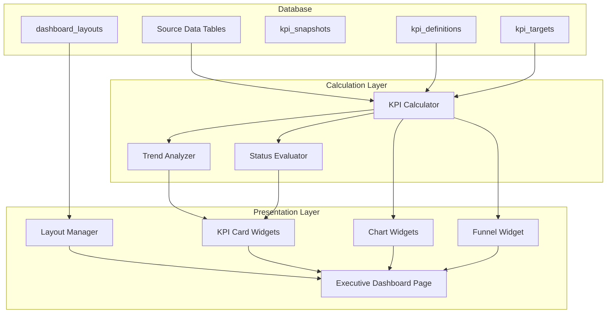

# Design Document: Executive Dashboard - KPI Overview

## Overview

The Executive Dashboard - KPI Overview feature provides a comprehensive real-time dashboard for executives to monitor key performance indicators across all business functions. The system calculates KPIs from source data, compares against targets, analyzes trends, and presents information through customizable widgets.

The architecture follows a layered approach:
1. **Data Layer**: Database tables for KPI definitions, targets, snapshots, and layouts
2. **Calculation Layer**: Functions to compute KPI values from source tables
3. **Presentation Layer**: React components for dashboard visualization

## Architecture



## Components and Interfaces

### 1. KPI Calculator Service

Responsible for computing KPI values from source data.

```typescript
interface KPICalculatorService {
  calculateKPIValue(
    kpiCode: string,
    startDate: Date,
    endDate: Date
  ): Promise<number>;
  
  getKPIWithComparison(
    kpiCode: string,
    period: 'mtd' | 'qtd' | 'ytd' | 'custom',
    customRange?: DateRange
  ): Promise<KPIValue>;
  
  getAllKPIsForDashboard(
    category?: KPICategory,
    period: Period
  ): Promise<KPIValue[]>;
}
```

### 2. Trend Analyzer Service

Calculates period-over-period changes and determines trend direction.

```typescript
interface TrendAnalyzerService {
  calculateChange(
    currentValue: number,
    previousValue: number
  ): { changeValue: number; changePercentage: number };
  
  determineTrend(changePercentage: number): 'up' | 'down' | 'stable';
  
  getHistoricalTrend(
    kpiCode: string,
    months: number
  ): Promise<TrendDataPoint[]>;
}
```

### 3. Status Evaluator Service

Determines KPI status based on actual vs target values.

```typescript
interface StatusEvaluatorService {
  evaluateStatus(
    actualValue: number,
    targetValue: number,
    targetType: 'higher_better' | 'lower_better' | 'target_range'
  ): KPIStatus;
  
  getStatusThresholds(targetType: TargetType): StatusThresholds;
}
```

### 4. Dashboard Layout Manager

Manages widget positioning and user customization.

```typescript
interface DashboardLayoutManager {
  getLayout(userId: string, dashboardType: string): Promise<DashboardLayout>;
  saveLayout(userId: string, dashboardType: string, widgets: Widget[]): Promise<void>;
  getDefaultLayout(role: string, dashboardType: string): DashboardLayout;
  resetToDefault(userId: string, dashboardType: string): Promise<void>;
}
```

### 5. React Components

```typescript
// Main dashboard page
interface ExecutiveDashboardProps {
  initialPeriod?: Period;
}

// KPI Card widget
interface KPICardProps {
  kpiValue: KPIValue;
  showTarget?: boolean;
  showTrend?: boolean;
  size?: 'sm' | 'md' | 'lg';
}

// Trend chart widget
interface TrendChartProps {
  kpiCodes: string[];
  months?: number;
  chartType?: 'line' | 'bar' | 'area';
}

// Sales funnel widget
interface SalesFunnelProps {
  data: FunnelStage[];
  showValues?: boolean;
}

// Period selector
interface PeriodSelectorProps {
  value: Period;
  onChange: (period: Period) => void;
  allowCustom?: boolean;
}
```

## Data Models

### Database Schema

```sql
-- KPI definitions
CREATE TABLE kpi_definitions (
  id UUID PRIMARY KEY DEFAULT gen_random_uuid(),
  kpi_code VARCHAR(30) UNIQUE NOT NULL,
  kpi_name VARCHAR(100) NOT NULL,
  description TEXT,
  category VARCHAR(50) NOT NULL,
  calculation_type VARCHAR(30) NOT NULL,
  data_source VARCHAR(100),
  value_field VARCHAR(100),
  filter_conditions JSONB,
  numerator_query TEXT,
  denominator_query TEXT,
  custom_query TEXT,
  unit VARCHAR(20),
  decimal_places INTEGER DEFAULT 0,
  target_type VARCHAR(20),
  default_target DECIMAL(18,2),
  warning_threshold DECIMAL(18,2),
  critical_threshold DECIMAL(18,2),
  show_trend BOOLEAN DEFAULT TRUE,
  comparison_period VARCHAR(20) DEFAULT 'previous_month',
  visible_to_roles JSONB DEFAULT '["owner", "admin", "manager"]',
  display_order INTEGER DEFAULT 0,
  is_active BOOLEAN DEFAULT TRUE,
  created_at TIMESTAMPTZ DEFAULT NOW()
);

-- KPI targets by period
CREATE TABLE kpi_targets (
  id UUID PRIMARY KEY DEFAULT gen_random_uuid(),
  kpi_id UUID NOT NULL REFERENCES kpi_definitions(id),
  period_type VARCHAR(20) NOT NULL,
  period_year INTEGER NOT NULL,
  period_month INTEGER,
  period_quarter INTEGER,
  target_value DECIMAL(18,2) NOT NULL,
  stretch_target DECIMAL(18,2),
  notes TEXT,
  created_by UUID REFERENCES user_profiles(id),
  created_at TIMESTAMPTZ DEFAULT NOW(),
  UNIQUE(kpi_id, period_type, period_year, period_month, period_quarter)
);

-- KPI snapshots for historical tracking
CREATE TABLE kpi_snapshots (
  id UUID PRIMARY KEY DEFAULT gen_random_uuid(),
  kpi_id UUID NOT NULL REFERENCES kpi_definitions(id),
  snapshot_date DATE NOT NULL,
  period_type VARCHAR(20) NOT NULL,
  actual_value DECIMAL(18,2),
  target_value DECIMAL(18,2),
  previous_value DECIMAL(18,2),
  change_value DECIMAL(18,2),
  change_percentage DECIMAL(8,2),
  status VARCHAR(20),
  created_at TIMESTAMPTZ DEFAULT NOW(),
  UNIQUE(kpi_id, snapshot_date, period_type)
);

-- Dashboard layouts
CREATE TABLE dashboard_layouts (
  id UUID PRIMARY KEY DEFAULT gen_random_uuid(),
  user_id UUID REFERENCES user_profiles(id),
  role VARCHAR(50),
  dashboard_type VARCHAR(50) NOT NULL,
  layout_name VARCHAR(100),
  widgets JSONB NOT NULL,
  is_default BOOLEAN DEFAULT FALSE,
  created_at TIMESTAMPTZ DEFAULT NOW(),
  updated_at TIMESTAMPTZ DEFAULT NOW()
);
```

### TypeScript Types

```typescript
// KPI Category
type KPICategory = 'financial' | 'operational' | 'sales' | 'hr' | 'hse' | 'customer';

// Calculation types
type CalculationType = 'sum' | 'average' | 'count' | 'ratio' | 'percentage' | 'custom';

// Unit types
type KPIUnit = 'currency' | 'percent' | 'number' | 'days' | 'hours';

// Target types
type TargetType = 'higher_better' | 'lower_better' | 'target_range';

// KPI Status
type KPIStatus = 'exceeded' | 'on_track' | 'warning' | 'critical';

// Trend direction
type TrendDirection = 'up' | 'down' | 'stable';

// Period types
type PeriodType = 'mtd' | 'qtd' | 'ytd' | 'custom';

// KPI Definition
interface KPIDefinition {
  id: string;
  kpiCode: string;
  kpiName: string;
  description?: string;
  category: KPICategory;
  calculationType: CalculationType;
  dataSource?: string;
  valueField?: string;
  filterConditions?: Record<string, unknown>;
  numeratorQuery?: string;
  denominatorQuery?: string;
  customQuery?: string;
  unit: KPIUnit;
  decimalPlaces: number;
  targetType: TargetType;
  defaultTarget?: number;
  warningThreshold?: number;
  criticalThreshold?: number;
  showTrend: boolean;
  comparisonPeriod: string;
  visibleToRoles: string[];
  displayOrder: number;
  isActive: boolean;
}

// KPI Target
interface KPITarget {
  id: string;
  kpiId: string;
  periodType: 'monthly' | 'quarterly' | 'yearly';
  periodYear: number;
  periodMonth?: number;
  periodQuarter?: number;
  targetValue: number;
  stretchTarget?: number;
  notes?: string;
  createdBy?: string;
}

// KPI Value (computed)
interface KPIValue {
  kpiCode: string;
  kpiName: string;
  category: KPICategory;
  currentValue: number;
  previousValue: number;
  targetValue: number;
  changeValue: number;
  changePercentage: number;
  status: KPIStatus;
  trend: TrendDirection;
  unit: KPIUnit;
  decimalPlaces: number;
}

// KPI Snapshot
interface KPISnapshot {
  id: string;
  kpiId: string;
  snapshotDate: Date;
  periodType: string;
  actualValue: number;
  targetValue: number;
  previousValue: number;
  changeValue: number;
  changePercentage: number;
  status: KPIStatus;
}

// Dashboard Widget
interface DashboardWidget {
  widgetId: string;
  type: 'kpi_card' | 'chart' | 'table' | 'funnel' | 'gauge' | 'list';
  kpiId?: string;
  kpiCodes?: string[];
  position: {
    x: number;
    y: number;
    w: number;
    h: number;
  };
  config: Record<string, unknown>;
}

// Dashboard Layout
interface DashboardLayout {
  id: string;
  userId?: string;
  role?: string;
  dashboardType: string;
  layoutName?: string;
  widgets: DashboardWidget[];
  isDefault: boolean;
}

// Trend Data Point
interface TrendDataPoint {
  month: string;
  value: number;
}

// Sales Funnel Stage
interface FunnelStage {
  stage: string;
  count: number;
  value: number;
}

// Date Range
interface DateRange {
  start: Date;
  end: Date;
}

// Status Thresholds
interface StatusThresholds {
  exceeded: number;
  onTrack: number;
  warning: number;
  critical: number;
}
```

### Key Algorithms

#### Status Evaluation Algorithm

```typescript
function evaluateStatus(
  actualValue: number,
  targetValue: number,
  targetType: TargetType
): KPIStatus {
  if (targetValue === 0) return 'on_track';
  
  const ratio = actualValue / targetValue;
  
  if (targetType === 'higher_better') {
    if (ratio >= 1.0) return 'exceeded';
    if (ratio >= 0.9) return 'on_track';
    if (ratio >= 0.7) return 'warning';
    return 'critical';
  }
  
  if (targetType === 'lower_better') {
    if (ratio <= 1.0) return 'exceeded';
    if (ratio <= 1.1) return 'on_track';
    if (ratio <= 1.3) return 'warning';
    return 'critical';
  }
  
  // target_range - within 10% of target
  if (ratio >= 0.9 && ratio <= 1.1) return 'on_track';
  if (ratio >= 0.8 && ratio <= 1.2) return 'warning';
  return 'critical';
}
```

#### Trend Calculation Algorithm

```typescript
function calculateTrend(
  currentValue: number,
  previousValue: number
): { changeValue: number; changePercentage: number; trend: TrendDirection } {
  const changeValue = currentValue - previousValue;
  const changePercentage = previousValue !== 0 
    ? (changeValue / previousValue) * 100 
    : 0;
  
  let trend: TrendDirection;
  if (Math.abs(changePercentage) < 2) {
    trend = 'stable';
  } else if (changePercentage > 0) {
    trend = 'up';
  } else {
    trend = 'down';
  }
  
  return { changeValue, changePercentage, trend };
}
```

#### Period Date Range Calculation

```typescript
function getDateRangeForPeriod(
  period: PeriodType,
  customRange?: DateRange
): { current: DateRange; previous: DateRange } {
  const now = new Date();
  
  switch (period) {
    case 'mtd': {
      const currentStart = new Date(now.getFullYear(), now.getMonth(), 1);
      const previousStart = new Date(now.getFullYear(), now.getMonth() - 1, 1);
      const previousEnd = new Date(now.getFullYear(), now.getMonth(), 0);
      return {
        current: { start: currentStart, end: now },
        previous: { start: previousStart, end: previousEnd }
      };
    }
    case 'qtd': {
      const quarter = Math.floor(now.getMonth() / 3);
      const currentStart = new Date(now.getFullYear(), quarter * 3, 1);
      const previousStart = new Date(now.getFullYear(), (quarter - 1) * 3, 1);
      const previousEnd = new Date(now.getFullYear(), quarter * 3, 0);
      return {
        current: { start: currentStart, end: now },
        previous: { start: previousStart, end: previousEnd }
      };
    }
    case 'ytd': {
      const currentStart = new Date(now.getFullYear(), 0, 1);
      const previousStart = new Date(now.getFullYear() - 1, 0, 1);
      const previousEnd = new Date(now.getFullYear() - 1, now.getMonth(), now.getDate());
      return {
        current: { start: currentStart, end: now },
        previous: { start: previousStart, end: previousEnd }
      };
    }
    case 'custom': {
      if (!customRange) throw new Error('Custom range required');
      const daysDiff = (customRange.end.getTime() - customRange.start.getTime()) / (1000 * 60 * 60 * 24);
      const previousEnd = new Date(customRange.start.getTime() - 1);
      const previousStart = new Date(previousEnd.getTime() - daysDiff * 24 * 60 * 60 * 1000);
      return {
        current: customRange,
        previous: { start: previousStart, end: previousEnd }
      };
    }
  }
}
```


## Correctness Properties

*A property is a characteristic or behavior that should hold true across all valid executions of a system—essentially, a formal statement about what the system should do. Properties serve as the bridge between human-readable specifications and machine-verifiable correctness guarantees.*

### Property 1: Status Evaluation for Higher-Better KPIs

*For any* KPI with target_type 'higher_better' and any positive target value:
- When actual >= target, status SHALL be 'exceeded'
- When actual >= 0.9 * target AND actual < target, status SHALL be 'on_track'
- When actual >= 0.7 * target AND actual < 0.9 * target, status SHALL be 'warning'
- When actual < 0.7 * target, status SHALL be 'critical'

**Validates: Requirements 1.4, 4.1, 4.2, 4.3, 4.4**

### Property 2: Status Evaluation for Lower-Better KPIs

*For any* KPI with target_type 'lower_better' and any positive target value:
- When actual <= target, status SHALL be 'exceeded'
- When actual > target AND actual <= 1.1 * target, status SHALL be 'on_track'
- When actual > 1.1 * target AND actual <= 1.3 * target, status SHALL be 'warning'
- When actual > 1.3 * target, status SHALL be 'critical'

**Validates: Requirements 1.5, 4.5, 4.6, 4.7, 4.8**

### Property 3: Trend Direction Determination

*For any* change percentage value:
- When change_percentage > 2, trend SHALL be 'up'
- When change_percentage < -2, trend SHALL be 'down'
- When change_percentage >= -2 AND change_percentage <= 2, trend SHALL be 'stable'

**Validates: Requirements 5.4, 5.5, 5.6**

### Property 4: Change Percentage Calculation

*For any* current value and non-zero previous value, the change_percentage SHALL equal ((current - previous) / previous) * 100, and change_value SHALL equal (current - previous).

**Validates: Requirements 5.1, 5.2**

### Property 5: Period Date Range Calculation

*For any* period type (MTD, QTD, YTD), the calculated date range SHALL have:
- start_date <= end_date
- current period start_date at the beginning of the period (month/quarter/year)
- previous period covering the equivalent prior period

**Validates: Requirements 2.2**

### Property 6: Date Range Validation

*For any* custom date range, if start_date > end_date, the validation SHALL reject the range.

**Validates: Requirements 11.3**

### Property 7: Role-Based KPI Filtering

*For any* user role and set of KPI definitions, the filtered KPIs SHALL only include those where the user's role is contained in the visible_to_roles array.

**Validates: Requirements 13.1**

### Property 8: Layout Widget Management

*For any* dashboard layout:
- Adding a widget SHALL increase widget count by 1
- Removing a widget SHALL decrease widget count by 1
- Each widget SHALL have valid position (x, y, w, h) with non-negative values
- Widget type SHALL be one of: 'kpi_card', 'chart', 'table', 'funnel', 'gauge', 'list'

**Validates: Requirements 10.1, 10.4, 10.5**

### Property 9: Layout Persistence Round-Trip

*For any* valid dashboard layout saved for a user, retrieving the layout SHALL return an equivalent configuration with the same widgets and positions.

**Validates: Requirements 10.2**

### Property 10: Default Layout Fallback

*For any* user without a saved layout, the system SHALL return the default layout for their role.

**Validates: Requirements 10.3**

### Property 11: Target Validation

*For any* KPI target, the target_value SHALL be a positive number (> 0). Negative or zero values SHALL be rejected.

**Validates: Requirements 3.2**

### Property 12: Target Fallback to Default

*For any* KPI without a period-specific target, the system SHALL use the default_target from the KPI definition.

**Validates: Requirements 3.4**

### Property 13: Snapshot Uniqueness

*For any* KPI, date, and period_type combination, there SHALL be at most one snapshot. Attempting to create a duplicate SHALL be rejected or update the existing record.

**Validates: Requirements 14.4**

### Property 14: KPI Definition Validation

*For any* KPI definition:
- calculation_type SHALL be one of: 'sum', 'average', 'count', 'ratio', 'percentage', 'custom'
- unit SHALL be one of: 'currency', 'percent', 'number', 'days', 'hours'

**Validates: Requirements 1.2, 1.3**

## Error Handling

### Calculation Errors

| Error Condition | Handling Strategy |
|-----------------|-------------------|
| Division by zero in ratio calculation | Return 0 |
| Division by zero in change percentage | Return 0 |
| Missing data source | Return 0 with warning log |
| Invalid KPI code | Throw KPINotFoundError |
| Database connection failure | Throw DatabaseError, show user-friendly message |

### Validation Errors

| Error Condition | Handling Strategy |
|-----------------|-------------------|
| Invalid calculation type | Reject with validation error |
| Invalid unit type | Reject with validation error |
| Invalid target type | Reject with validation error |
| Negative target value | Reject with validation error |
| Invalid date range (start > end) | Reject with validation error |
| Invalid widget type | Reject with validation error |

### Layout Errors

| Error Condition | Handling Strategy |
|-----------------|-------------------|
| User layout not found | Fall back to role default layout |
| Role default not found | Fall back to system default layout |
| Invalid widget position | Normalize to valid grid position |
| Widget overlap | Allow overlap, let UI handle z-index |

## Testing Strategy

### Property-Based Testing

Property-based tests will use `fast-check` library to generate random inputs and verify properties hold across all cases.

**Configuration:**
- Minimum 100 iterations per property test
- Each test tagged with: `Feature: executive-dashboard-kpi, Property {number}: {property_text}`

**Properties to Test:**
1. Status evaluation for higher_better (Property 1)
2. Status evaluation for lower_better (Property 2)
3. Trend direction determination (Property 3)
4. Change percentage calculation (Property 4)
5. Period date range calculation (Property 5)
6. Date range validation (Property 6)
7. Role-based KPI filtering (Property 7)
8. Layout widget management (Property 8)
9. Layout persistence round-trip (Property 9)
10. Default layout fallback (Property 10)
11. Target validation (Property 11)
12. Target fallback to default (Property 12)
13. Snapshot uniqueness (Property 13)
14. KPI definition validation (Property 14)

### Unit Tests

Unit tests complement property tests by covering:
- Specific edge cases (zero values, empty arrays)
- Error conditions and exception handling
- Integration points between components
- Specific KPI calculation formulas

**Key Unit Test Areas:**
- `evaluateStatus()` with boundary values (exactly 70%, 90%, 100%, 110%, 130%)
- `calculateTrend()` with zero previous value
- `getDateRangeForPeriod()` for each period type
- `filterKPIsByRole()` with various role combinations
- Widget position validation edge cases

### Integration Tests

Integration tests verify end-to-end flows:
- KPI calculation from actual database data
- Dashboard layout save and retrieve
- Snapshot creation and retrieval
- Role-based access control enforcement

### Test File Structure

```
__tests__/
  executive-dashboard-utils.test.ts       # Unit tests
  executive-dashboard-utils.property.test.ts  # Property-based tests
```
