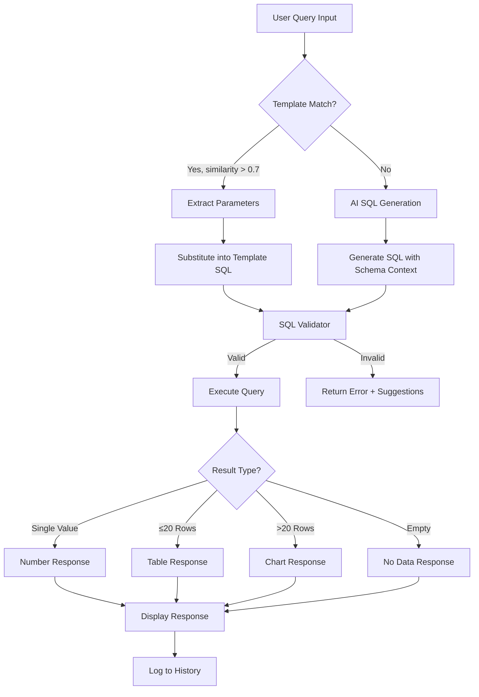

# Design Document: AI Insights - Natural Language Queries

## Overview

The AI Insights feature provides executives with a natural language interface to query business data. The system combines template-based pattern matching for common queries with AI-powered SQL generation for complex questions, all protected by strict safety validation.

The architecture follows a layered approach:
1. **Input Layer**: Query input with validation and quick question buttons
2. **Processing Layer**: Template matching → AI generation → SQL validation
3. **Execution Layer**: Safe query execution with timeout protection
4. **Presentation Layer**: Response formatting based on data type

## Architecture



## Components and Interfaces

### 1. AIQueryInput Component

```typescript
interface AIQueryInputProps {
  onSubmit: (query: string) => Promise<void>;
  isLoading: boolean;
  placeholder?: string;
}

// Handles user input with validation
// Displays quick question buttons
// Shows loading state during query processing
```

### 2. AIQueryResponse Component

```typescript
interface AIQueryResponseProps {
  response: AIQueryResponse;
  onFeedback: (helpful: boolean, notes?: string) => void;
  onExport: () => void;
  onEmailReport: () => void;
}

interface AIQueryResponse {
  responseType: 'text' | 'table' | 'chart' | 'number' | 'error';
  responseText: string;
  data?: any;
  chartConfig?: ChartConfig;
  suggestions?: string[];
  executionTimeMs?: number;
}
```

### 3. QueryProcessor Service

```typescript
interface QueryProcessor {
  processQuery(query: string, userId: string): Promise<AIQueryResponse>;
  matchTemplate(query: string): Promise<TemplateMatch | null>;
  generateSQL(query: string): Promise<string | null>;
  validateSQL(sql: string): ValidationResult;
  executeQuery(sql: string): Promise<QueryResult>;
}

interface TemplateMatch {
  template: QueryTemplate;
  parameters: Record<string, any>;
  sql: string;
  similarity: number;
}

interface ValidationResult {
  isValid: boolean;
  error?: string;
  sanitizedSQL?: string;
}
```

### 4. SQLValidator Service

```typescript
interface SQLValidator {
  validate(sql: string): ValidationResult;
  sanitize(sql: string): string | null;
  checkBlockedKeywords(sql: string): string[];
  checkBlockedTables(sql: string): string[];
}

const BLOCKED_KEYWORDS = [
  'insert', 'update', 'delete', 'drop', 'truncate', 
  'alter', 'create', 'grant', 'revoke', 'execute', 'exec'
];

const BLOCKED_TABLES = [
  'user_profiles', 'auth', 'passwords', 'tokens'
];
```

### 5. ResponseFormatter Service

```typescript
interface ResponseFormatter {
  format(query: string, data: any[]): AIQueryResponse;
  formatNumber(key: string, value: number): string;
  formatCurrency(value: number): string;
  formatPercentage(value: number): string;
  inferChartConfig(data: any[]): ChartConfig;
}
```

## Data Models

### Database Tables

```sql
-- Query history for audit and improvement
CREATE TABLE ai_query_history (
  id UUID PRIMARY KEY DEFAULT gen_random_uuid(),
  user_id UUID NOT NULL REFERENCES user_profiles(id),
  natural_query TEXT NOT NULL,
  generated_sql TEXT,
  response_type VARCHAR(30),
  response_data JSONB,
  response_text TEXT,
  was_helpful BOOLEAN,
  feedback_notes TEXT,
  execution_time_ms INTEGER,
  created_at TIMESTAMPTZ DEFAULT NOW()
);

-- Predefined query templates
CREATE TABLE ai_query_templates (
  id UUID PRIMARY KEY DEFAULT gen_random_uuid(),
  template_name VARCHAR(200) NOT NULL,
  template_category VARCHAR(50) NOT NULL,
  sample_questions JSONB DEFAULT '[]',
  sql_template TEXT NOT NULL,
  parameters JSONB DEFAULT '[]',
  response_format VARCHAR(30) DEFAULT 'text',
  response_template TEXT,
  is_active BOOLEAN DEFAULT TRUE,
  created_at TIMESTAMPTZ DEFAULT NOW()
);
```

### TypeScript Types

```typescript
interface AIQueryHistory {
  id: string;
  userId: string;
  naturalQuery: string;
  generatedSql: string | null;
  responseType: ResponseType;
  responseData: any;
  responseText: string;
  wasHelpful: boolean | null;
  feedbackNotes: string | null;
  executionTimeMs: number;
  createdAt: string;
}

interface AIQueryTemplate {
  id: string;
  templateName: string;
  templateCategory: TemplateCategory;
  sampleQuestions: string[];
  sqlTemplate: string;
  parameters: TemplateParameter[];
  responseFormat: ResponseType;
  responseTemplate: string;
  isActive: boolean;
  createdAt: string;
}

type ResponseType = 'text' | 'table' | 'chart' | 'number' | 'error';
type TemplateCategory = 'financial' | 'sales' | 'operations' | 'hse';

interface TemplateParameter {
  name: string;
  type: 'date' | 'string' | 'number';
  extractPattern: string;
}

interface ChartConfig {
  type: 'bar' | 'line' | 'pie' | 'area';
  data: any[];
  xKey: string;
  yKey: string;
  title?: string;
}
```


## Correctness Properties

*A property is a characteristic or behavior that should hold true across all valid executions of a system—essentially, a formal statement about what the system should do. Properties serve as the bridge between human-readable specifications and machine-verifiable correctness guarantees.*

### Property 1: Empty Query Validation

*For any* string that is empty or contains only whitespace characters, the query validation function SHALL return false and prevent submission.

**Validates: Requirements 1.2**

### Property 2: Template Matching Threshold

*For any* user query and template with calculated similarity score, IF the similarity score is greater than 0.7 THEN the template SHALL be selected for use, AND IF the similarity score is 0.7 or below THEN the template SHALL NOT be selected.

**Validates: Requirements 2.1**

### Property 3: Parameter Extraction and Substitution

*For any* template with defined parameters and a matching query containing those parameter values, the parameter extraction function SHALL correctly identify all parameter values AND the substitution function SHALL replace all parameter placeholders with the extracted values.

**Validates: Requirements 2.2**

### Property 4: Template Response Format Consistency

*For any* template with a defined response format, when the template query is executed, the resulting response SHALL have a responseType matching the template's response_format.

**Validates: Requirements 2.4**

### Property 5: Error Responses Include Suggestions

*For any* query that results in an error response, the response SHALL include a non-empty array of suggested questions.

**Validates: Requirements 3.4**

### Property 6: SQL Validation Blocks Unsafe Queries

*For any* SQL string, the SQL validator SHALL:
- Return invalid for any SQL containing blocked keywords (INSERT, UPDATE, DELETE, DROP, TRUNCATE, ALTER, CREATE, GRANT, REVOKE, EXECUTE)
- Return invalid for any SQL referencing blocked tables (user_profiles, auth, passwords, tokens)
- Return invalid for any SQL that does not start with SELECT (case-insensitive)
- Return valid only for SELECT statements that do not reference blocked tables

**Validates: Requirements 4.1, 4.2, 4.3**

### Property 7: Response Type Determination

*For any* query result data:
- IF the result is empty, THEN responseType SHALL be 'text' with a "no data" message
- IF the result has exactly 1 row with exactly 1 column, THEN responseType SHALL be 'number'
- IF the result has 2-20 rows, THEN responseType SHALL be 'table'
- IF the result has more than 20 rows, THEN responseType SHALL be 'chart'

**Validates: Requirements 5.1, 5.2, 5.3, 5.4**

### Property 8: Value Formatting

*For any* numeric value:
- The currency formatter SHALL produce a string starting with "Rp " followed by the number with thousand separators
- The percentage formatter SHALL produce a string with exactly one decimal place followed by "%"

**Validates: Requirements 5.5, 5.6**

### Property 9: Query History Completeness

*For any* query execution, the created history record SHALL contain:
- A valid user_id
- The original natural_query text
- The generated_sql (if applicable)
- The response_type
- The response_text
- A valid created_at timestamp

AND when feedback is provided, the was_helpful field SHALL be updated to the provided boolean value.

**Validates: Requirements 7.1, 8.2**

### Property 10: History Limit

*For any* call to get user query history, the function SHALL return at most 10 records, ordered by created_at descending.

**Validates: Requirements 7.2**

### Property 11: Relative Timestamp Formatting

*For any* timestamp, the relative time formatter SHALL produce a human-readable string that:
- Shows "just now" for timestamps within the last minute
- Shows "X minutes ago" for timestamps within the last hour
- Shows "X hours ago" for timestamps within the last 24 hours
- Shows "Yesterday" for timestamps from the previous day
- Shows "X days ago" for timestamps within the last 7 days
- Shows the formatted date for older timestamps

**Validates: Requirements 7.4**

### Property 12: CSV Export Format

*For any* array of data objects, the CSV export function SHALL produce a string where:
- The first line contains comma-separated column headers
- Each subsequent line contains comma-separated values corresponding to the headers
- Values containing commas or quotes are properly escaped
- The number of lines equals the number of data objects plus one (for headers)

**Validates: Requirements 9.2**

### Property 13: Role-Based Access Control

*For any* user role, the access check function SHALL return true ONLY for roles in the set {'owner', 'manager', 'finance'} and SHALL return false for all other roles.

**Validates: Requirements 10.1**

## Error Handling

### Query Processing Errors

| Error Type | Handling | User Message |
|------------|----------|--------------|
| Empty query | Prevent submission | "Please enter a question" |
| No template match + AI failure | Return error with suggestions | "I couldn't understand that question. Try one of these..." |
| SQL validation failure | Block execution | "I couldn't generate a safe query for that question" |
| Query execution error | Log and return error | "Sorry, I encountered an error processing your question" |
| Query timeout | Cancel and return error | "The query took too long. Try a more specific question" |
| No results | Return informative message | "No data found for your query" |

### Database Errors

| Error Type | Handling |
|------------|----------|
| Connection failure | Retry once, then return error |
| Permission denied | Log and return generic error |
| Invalid SQL syntax | Log for debugging, return user-friendly error |

## Testing Strategy

### Unit Tests

Unit tests will cover:
- Query input validation (empty, whitespace)
- SQL validation logic (blocked keywords, blocked tables, SELECT-only)
- Response type determination logic
- Value formatting functions (currency, percentage)
- Relative timestamp formatting
- CSV export generation
- Role-based access checks

### Property-Based Tests

Property-based tests will use `fast-check` library with minimum 100 iterations per property:

1. **SQL Validation Property Test**: Generate random SQL strings with/without blocked keywords and tables, verify validation results
2. **Response Type Property Test**: Generate random result sets of varying sizes, verify correct response type assignment
3. **Formatting Property Tests**: Generate random numbers, verify currency and percentage formatting
4. **History Limit Property Test**: Generate random history records, verify limit enforcement
5. **Access Control Property Test**: Generate random role strings, verify access decisions

### Integration Tests

- Template matching with real templates
- Query execution flow (template → validation → execution → formatting)
- History logging and retrieval
- Feedback recording

### Test Configuration

```typescript
// Property test configuration
const PBT_CONFIG = {
  numRuns: 100,
  seed: Date.now(),
  verbose: true
};

// Test tags for traceability
// Format: Feature: ai-insights-natural-language, Property N: [property text]
```
