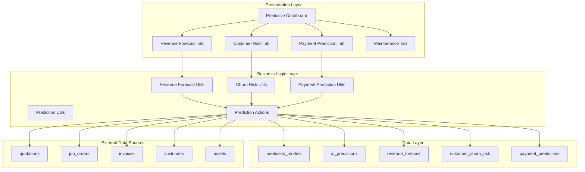

# Design Document

## Overview

This design document describes the implementation of AI-powered predictive analytics for the Gama ERP system. The feature provides revenue forecasting, customer churn risk assessment, payment prediction, and maintenance prediction capabilities through a unified dashboard interface.

The system uses statistical models and historical data analysis to generate predictions with confidence levels, enabling executives and managers to make data-driven decisions about business strategy, customer retention, and cash flow management.

## Architecture



## Components and Interfaces

### Type Definitions

```typescript
// types/predictive-analytics.ts

// Model types
export type ModelType = 
  | 'revenue_forecast' 
  | 'churn_risk' 
  | 'payment_prediction' 
  | 'maintenance_prediction';

export type RiskLevel = 'low' | 'medium' | 'high' | 'critical' | 'very_high';
export type RevenueTrend = 'increasing' | 'stable' | 'decreasing';

// Prediction Model
export interface PredictionModel {
  id: string;
  model_code: string;
  model_name: string;
  description: string | null;
  model_type: ModelType;
  parameters: Record<string, unknown>;
  last_trained_at: string | null;
  training_data_range: {
    start_date: string;
    end_date: string;
  } | null;
  accuracy_metrics: {
    mean_absolute_error: number;
    accuracy_percentage: number;
    sample_size: number;
  } | null;
  is_active: boolean;
  created_at: string;
}

// Contributing Factor
export interface ContributingFactor {
  factor: string;
  impact: number; // -100 to 100
  direction: 'positive' | 'negative' | 'neutral';
  description?: string;
}

// AI Prediction
export interface AIPrediction {
  id: string;
  model_id: string;
  prediction_type: string;
  prediction_date: string;
  target_date: string | null;
  entity_type: 'company' | 'customer' | 'job' | 'asset' | 'employee' | null;
  entity_id: string | null;
  predicted_value: number | null;
  confidence_level: number; // 0-100
  prediction_range_low: number | null;
  prediction_range_high: number | null;
  risk_level: RiskLevel | null;
  risk_score: number | null; // 0-100
  contributing_factors: ContributingFactor[];
  actual_value: number | null;
  prediction_error: number | null;
  created_at: string;
}

// Revenue Forecast
export interface RevenueForecast {
  id: string;
  forecast_date: string;
  target_month: string;
  predicted_revenue: number;
  confidence_low: number | null;
  confidence_high: number | null;
  confidence_level: number | null;
  pipeline_revenue: number | null;
  recurring_revenue: number | null;
  new_business_revenue: number | null;
  actual_revenue: number | null;
  notes: string | null;
  created_at: string;
}

// Customer Churn Risk
export interface CustomerChurnRisk {
  id: string;
  customer_id: string;
  assessment_date: string;
  churn_risk_score: number; // 0-100
  risk_level: RiskLevel;
  days_since_last_job: number | null;
  revenue_trend: RevenueTrend | null;
  engagement_score: number | null;
  payment_behavior_score: number | null;
  contributing_factors: ContributingFactor[];
  recommended_actions: RecommendedAction[];
  action_taken: string | null;
  action_date: string | null;
  created_at: string;
  // Joined data
  customer?: {
    id: string;
    name: string;
    email: string | null;
  };
}

export interface RecommendedAction {
  action: string;
  priority: 'high' | 'medium' | 'low';
  due_date?: string;
}

// Payment Prediction
export interface PaymentPrediction {
  id: string;
  invoice_id: string;
  prediction_date: string;
  predicted_payment_date: string | null;
  confidence_level: number | null;
  days_to_payment_predicted: number | null;
  late_payment_risk: RiskLevel | null;
  risk_factors: ContributingFactor[];
  actual_payment_date: string | null;
  prediction_accuracy_days: number | null;
  created_at: string;
  // Joined data
  invoice?: {
    id: string;
    invoice_number: string;
    total_amount: number;
    due_date: string;
    customer_name: string;
  };
}

// Dashboard Summary Types
export interface RevenueForecastSummary {
  monthly: {
    target_month: string;
    predicted: number;
    range_low: number;
    range_high: number;
    confidence: number;
  };
  quarterly: {
    quarter: string;
    predicted: number;
    range_low: number;
    range_high: number;
    confidence: number;
  };
  annual: {
    year: number;
    predicted: number;
    range_low: number;
    range_high: number;
    confidence: number;
  };
  breakdown: {
    pipeline_confirmed: number;
    pipeline_probable: number;
    recurring_estimate: number;
    new_business_estimate: number;
  };
}

export interface ChurnRiskSummary {
  total_customers: number;
  at_risk_count: number;
  critical_count: number;
  high_count: number;
  medium_count: number;
  low_count: number;
  total_revenue_at_risk: number;
}

export interface ForecastChartData {
  month: string;
  predicted: number;
  confidence_low: number;
  confidence_high: number;
  actual?: number;
}
```

### Utility Functions

```typescript
// lib/predictive-analytics-utils.ts

/**
 * Calculate churn risk score based on customer metrics
 * Score ranges from 0 (no risk) to 100 (certain churn)
 */
export function calculateChurnRiskScore(params: {
  daysSinceLastJob: number;
  revenueTrend: RevenueTrend;
  engagementScore: number;
  paymentBehaviorScore: number;
}): { score: number; level: RiskLevel; factors: ContributingFactor[] }

/**
 * Classify risk level based on score
 */
export function classifyRiskLevel(score: number): RiskLevel

/**
 * Calculate revenue forecast with confidence intervals
 */
export function calculateRevenueForecast(params: {
  pipelineData: PipelineItem[];
  historicalRevenue: MonthlyRevenue[];
  targetMonth: Date;
}): RevenueForecast

/**
 * Calculate confidence level based on data quality
 */
export function calculateConfidenceLevel(params: {
  dataPoints: number;
  dataRecency: number; // days since last data point
  historicalAccuracy: number;
}): number

/**
 * Predict payment date based on customer history
 */
export function predictPaymentDate(params: {
  invoiceAmount: number;
  invoiceDueDate: Date;
  customerPaymentHistory: PaymentHistoryItem[];
}): { predictedDate: Date; confidence: number; daysToPayment: number }

/**
 * Calculate late payment risk
 */
export function calculateLatePaymentRisk(params: {
  predictedDate: Date;
  dueDate: Date;
  customerPaymentHistory: PaymentHistoryItem[];
}): { risk: RiskLevel; factors: ContributingFactor[] }

/**
 * Generate recommended actions for at-risk customers
 */
export function generateChurnRecommendations(
  riskScore: number,
  factors: ContributingFactor[]
): RecommendedAction[]

/**
 * Calculate prediction error
 */
export function calculatePredictionError(
  predicted: number,
  actual: number
): number

/**
 * Format currency for display
 */
export function formatPredictionCurrency(value: number): string

/**
 * Format confidence level for display
 */
export function formatConfidence(level: number): string

/**
 * Get risk level color for UI
 */
export function getRiskLevelColor(level: RiskLevel): string

/**
 * Validate prediction model parameters
 */
export function validateModelParameters(
  modelType: ModelType,
  parameters: Record<string, unknown>
): { valid: boolean; errors: string[] }
```

### Server Actions

```typescript
// lib/predictive-analytics-actions.ts

/**
 * Generate revenue forecast for target month
 */
export async function generateRevenueForecast(
  targetMonth: Date
): Promise<{ success: boolean; data?: RevenueForecast; error?: string }>

/**
 * Assess churn risk for all active customers
 */
export async function assessCustomerChurnRisk(): Promise<{
  success: boolean;
  assessments?: CustomerChurnRisk[];
  error?: string;
}>

/**
 * Generate payment prediction for invoice
 */
export async function generatePaymentPrediction(
  invoiceId: string
): Promise<{ success: boolean; data?: PaymentPrediction; error?: string }>

/**
 * Get revenue forecast summary
 */
export async function getRevenueForecastSummary(): Promise<{
  success: boolean;
  data?: RevenueForecastSummary;
  error?: string;
}>

/**
 * Get customers at churn risk
 */
export async function getCustomersAtRisk(params?: {
  minRiskScore?: number;
  limit?: number;
}): Promise<{ success: boolean; data?: CustomerChurnRisk[]; error?: string }>

/**
 * Get payment predictions for invoices
 */
export async function getPaymentPredictions(params?: {
  status?: 'pending' | 'all';
  limit?: number;
}): Promise<{ success: boolean; data?: PaymentPrediction[]; error?: string }>

/**
 * Update prediction with actual value
 */
export async function updatePredictionActual(
  predictionId: string,
  actualValue: number
): Promise<{ success: boolean; error?: string }>

/**
 * Record action taken for churn risk
 */
export async function recordChurnAction(
  riskId: string,
  action: string
): Promise<{ success: boolean; error?: string }>

/**
 * Get forecast chart data
 */
export async function getForecastChartData(
  months: number
): Promise<{ success: boolean; data?: ForecastChartData[]; error?: string }>

/**
 * Get churn risk summary
 */
export async function getChurnRiskSummary(): Promise<{
  success: boolean;
  data?: ChurnRiskSummary;
  error?: string;
}>
```

### UI Components

```typescript
// components/predictive-analytics/predictive-dashboard.tsx
// Main dashboard with tabbed navigation

// components/predictive-analytics/revenue-forecast-tab.tsx
// Revenue forecast visualization and summary cards

// components/predictive-analytics/forecast-chart.tsx
// Line chart with confidence bands

// components/predictive-analytics/forecast-summary-cards.tsx
// Monthly, quarterly, annual forecast cards

// components/predictive-analytics/customer-risk-tab.tsx
// Customer churn risk table and actions

// components/predictive-analytics/churn-risk-table.tsx
// Sortable table of at-risk customers

// components/predictive-analytics/payment-prediction-tab.tsx
// Payment predictions for invoices

// components/predictive-analytics/payment-prediction-table.tsx
// Table of invoices with predicted payment dates

// components/predictive-analytics/risk-badge.tsx
// Colored badge for risk level display
```

## Data Models

### Database Schema

```sql
-- Prediction models
CREATE TABLE prediction_models (
  id UUID PRIMARY KEY DEFAULT gen_random_uuid(),
  model_code VARCHAR(30) UNIQUE NOT NULL,
  model_name VARCHAR(100) NOT NULL,
  description TEXT,
  model_type VARCHAR(50) NOT NULL,
  parameters JSONB DEFAULT '{}',
  last_trained_at TIMESTAMPTZ,
  training_data_range JSONB,
  accuracy_metrics JSONB,
  is_active BOOLEAN DEFAULT TRUE,
  created_at TIMESTAMPTZ DEFAULT NOW()
);

-- AI Predictions
CREATE TABLE ai_predictions (
  id UUID PRIMARY KEY DEFAULT gen_random_uuid(),
  model_id UUID NOT NULL REFERENCES prediction_models(id),
  prediction_type VARCHAR(50) NOT NULL,
  prediction_date DATE NOT NULL,
  target_date DATE,
  entity_type VARCHAR(50),
  entity_id UUID,
  predicted_value DECIMAL(18,2),
  confidence_level DECIMAL(5,2),
  prediction_range_low DECIMAL(18,2),
  prediction_range_high DECIMAL(18,2),
  risk_level VARCHAR(20),
  risk_score DECIMAL(5,2),
  contributing_factors JSONB DEFAULT '[]',
  actual_value DECIMAL(18,2),
  prediction_error DECIMAL(10,2),
  created_at TIMESTAMPTZ DEFAULT NOW()
);

-- Revenue forecast
CREATE TABLE revenue_forecast (
  id UUID PRIMARY KEY DEFAULT gen_random_uuid(),
  forecast_date DATE NOT NULL,
  target_month DATE NOT NULL,
  predicted_revenue DECIMAL(18,2) NOT NULL,
  confidence_low DECIMAL(18,2),
  confidence_high DECIMAL(18,2),
  confidence_level DECIMAL(5,2),
  pipeline_revenue DECIMAL(18,2),
  recurring_revenue DECIMAL(18,2),
  new_business_revenue DECIMAL(18,2),
  actual_revenue DECIMAL(18,2),
  notes TEXT,
  created_at TIMESTAMPTZ DEFAULT NOW(),
  UNIQUE(forecast_date, target_month)
);

-- Customer churn risk
CREATE TABLE customer_churn_risk (
  id UUID PRIMARY KEY DEFAULT gen_random_uuid(),
  customer_id UUID NOT NULL REFERENCES customers(id),
  assessment_date DATE NOT NULL,
  churn_risk_score DECIMAL(5,2),
  risk_level VARCHAR(20),
  days_since_last_job INTEGER,
  revenue_trend VARCHAR(20),
  engagement_score DECIMAL(5,2),
  payment_behavior_score DECIMAL(5,2),
  contributing_factors JSONB DEFAULT '[]',
  recommended_actions JSONB DEFAULT '[]',
  action_taken TEXT,
  action_date DATE,
  created_at TIMESTAMPTZ DEFAULT NOW(),
  UNIQUE(customer_id, assessment_date)
);

-- Payment predictions
CREATE TABLE payment_predictions (
  id UUID PRIMARY KEY DEFAULT gen_random_uuid(),
  invoice_id UUID NOT NULL REFERENCES invoices(id),
  prediction_date DATE NOT NULL,
  predicted_payment_date DATE,
  confidence_level DECIMAL(5,2),
  days_to_payment_predicted INTEGER,
  late_payment_risk VARCHAR(20),
  risk_factors JSONB DEFAULT '[]',
  actual_payment_date DATE,
  prediction_accuracy_days INTEGER,
  created_at TIMESTAMPTZ DEFAULT NOW()
);

-- Indexes
CREATE INDEX idx_ai_predictions_model ON ai_predictions(model_id);
CREATE INDEX idx_ai_predictions_date ON ai_predictions(prediction_date);
CREATE INDEX idx_ai_predictions_entity ON ai_predictions(entity_type, entity_id);
CREATE INDEX idx_revenue_forecast_month ON revenue_forecast(target_month);
CREATE INDEX idx_churn_risk_customer ON customer_churn_risk(customer_id);
CREATE INDEX idx_churn_risk_level ON customer_churn_risk(risk_level);
CREATE INDEX idx_payment_predictions_invoice ON payment_predictions(invoice_id);
```

### Default Data

```sql
-- Insert default prediction models
INSERT INTO prediction_models (model_code, model_name, model_type, description) VALUES
  ('REV_FORECAST', 'Revenue Forecasting', 'revenue_forecast', 
   'Predicts monthly revenue based on pipeline, historical patterns, and seasonality'),
  ('CHURN_RISK', 'Customer Churn Risk', 'churn_risk',
   'Identifies customers at risk of churning based on engagement and transaction patterns'),
  ('PAYMENT_PRED', 'Payment Prediction', 'payment_prediction',
   'Predicts when invoices will be paid based on customer payment history'),
  ('MAINT_PRED', 'Maintenance Prediction', 'maintenance_prediction',
   'Predicts equipment maintenance needs based on usage patterns and history');
```


## Correctness Properties

*A property is a characteristic or behavior that should hold true across all valid executions of a system—essentially, a formal statement about what the system should do. Properties serve as the bridge between human-readable specifications and machine-verifiable correctness guarantees.*

### Property 1: Churn Risk Score Bounds

*For any* customer metrics input (days since last job, revenue trend, engagement score, payment behavior score), the calculated churn_risk_score SHALL be between 0 and 100 inclusive.

**Validates: Requirements 3.1**

### Property 2: Churn Risk Level Classification

*For any* churn risk score, the classifyRiskLevel function SHALL return:
- 'low' for scores 0-25
- 'medium' for scores 26-50
- 'high' for scores 51-75
- 'critical' for scores 76-100

**Validates: Requirements 3.2**

### Property 3: Prediction Range Consistency

*For any* prediction with confidence bounds, the relationship prediction_range_low <= predicted_value <= prediction_range_high SHALL always hold.

**Validates: Requirements 2.1, 5.3**

### Property 4: Confidence Level Bounds

*For any* confidence level calculation, the result SHALL be between 0 and 100 inclusive.

**Validates: Requirements 2.4**

### Property 5: Revenue Forecast Component Sum

*For any* revenue forecast, the sum of pipeline_revenue + recurring_revenue + new_business_revenue SHALL approximately equal predicted_revenue (within rounding tolerance).

**Validates: Requirements 2.2**

### Property 6: High Risk Generates Recommendations

*For any* churn risk assessment with risk_level 'high' or 'critical', the recommended_actions array SHALL be non-empty.

**Validates: Requirements 3.4**

### Property 7: Payment Risk Level Validity

*For any* payment prediction, the late_payment_risk SHALL be one of: 'low', 'medium', 'high', or 'very_high'.

**Validates: Requirements 4.3**

### Property 8: Prediction Error Calculation

*For any* prediction where both predicted_value and actual_value are set, the prediction_error SHALL equal the absolute difference |predicted_value - actual_value|.

**Validates: Requirements 5.6, 7.1**

### Property 9: Payment Accuracy Days Calculation

*For any* payment prediction where both predicted_payment_date and actual_payment_date are set, the prediction_accuracy_days SHALL equal the difference in days between the two dates.

**Validates: Requirements 4.5**

### Property 10: Model Type Validation

*For any* prediction model, the model_type SHALL be one of: 'revenue_forecast', 'churn_risk', 'payment_prediction', or 'maintenance_prediction'.

**Validates: Requirements 1.3**

### Property 11: Contributing Factor Structure

*For any* contributing factor in a prediction, it SHALL have a factor name (string), impact value (number between -100 and 100), and direction ('positive', 'negative', or 'neutral').

**Validates: Requirements 5.5**

### Property 12: Churn Risk Data Sorted by Score

*For any* list of churn risk assessments returned by getCustomersAtRisk, the list SHALL be sorted in descending order by churn_risk_score.

**Validates: Requirements 3.6**

## Error Handling

### Validation Errors

| Error Code | Condition | Response |
|------------|-----------|----------|
| `INVALID_MODEL_TYPE` | Model type not in allowed list | Return error with valid types |
| `INVALID_SCORE_RANGE` | Score outside 0-100 range | Clamp to valid range and log warning |
| `INVALID_CONFIDENCE` | Confidence outside 0-100 | Clamp to valid range |
| `MISSING_REQUIRED_FIELD` | Required field is null/undefined | Return validation error |
| `INVALID_DATE_RANGE` | Target date before prediction date | Return error |

### Data Errors

| Error Code | Condition | Response |
|------------|-----------|----------|
| `INSUFFICIENT_DATA` | Not enough historical data for prediction | Return prediction with low confidence and warning |
| `MODEL_NOT_FOUND` | Referenced model doesn't exist | Return error |
| `ENTITY_NOT_FOUND` | Referenced entity doesn't exist | Return error |
| `DUPLICATE_PREDICTION` | Prediction already exists for date/entity | Update existing or return conflict error |

### System Errors

| Error Code | Condition | Response |
|------------|-----------|----------|
| `DATABASE_ERROR` | Database operation failed | Log error, return generic error to user |
| `CALCULATION_ERROR` | Unexpected error in calculation | Log error, return fallback prediction with low confidence |

## Testing Strategy

### Unit Tests

Unit tests will verify specific examples and edge cases:

1. **Risk Classification Edge Cases**
   - Score exactly at boundaries (0, 25, 26, 50, 51, 75, 76, 100)
   - Invalid scores (negative, > 100)

2. **Confidence Calculation**
   - Zero data points
   - Maximum data quality
   - Stale data (high recency value)

3. **Forecast Component Breakdown**
   - All components zero
   - Single component non-zero
   - Rounding edge cases

4. **Error Calculation**
   - Exact prediction (error = 0)
   - Large prediction errors
   - Negative values

### Property-Based Tests

Property-based tests will use fast-check to verify universal properties:

1. **Score Bounds Property** - Generate random customer metrics, verify score is 0-100
2. **Risk Classification Property** - Generate random scores, verify correct level mapping
3. **Range Consistency Property** - Generate random predictions, verify low <= value <= high
4. **Confidence Bounds Property** - Generate random inputs, verify confidence is 0-100
5. **Component Sum Property** - Generate random forecasts, verify sum matches total
6. **Recommendations Property** - Generate high-risk assessments, verify non-empty actions
7. **Risk Level Validity Property** - Generate random predictions, verify valid risk levels
8. **Error Calculation Property** - Generate predicted/actual pairs, verify error formula
9. **Accuracy Days Property** - Generate date pairs, verify day difference calculation
10. **Model Type Property** - Generate random models, verify type validation
11. **Factor Structure Property** - Generate random factors, verify structure
12. **Sort Order Property** - Generate random risk lists, verify descending order

### Test Configuration

- Property-based testing library: fast-check
- Minimum iterations per property: 100
- Test file location: `__tests__/predictive-analytics-utils.property.test.ts`
- Tag format: **Feature: ai-predictive-analytics, Property N: [property_text]**
