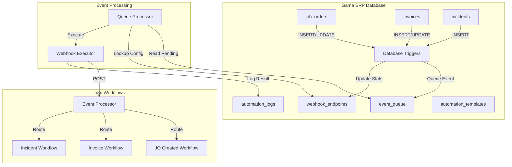

# Design Document: n8n Automation - Workflow Foundation

## Overview

This design establishes the foundational n8n integration for Gama ERP automation. The system provides webhook endpoints that respond to database events, an event queue for reliable async processing, and comprehensive logging for monitoring and debugging.

The architecture follows an event-driven pattern where database triggers capture changes, queue them for processing, and trigger n8n workflows via webhooks. This decoupled approach ensures the main application remains responsive while automation runs asynchronously.

## Architecture



### Data Flow

1. **Event Capture**: Database triggers fire on INSERT/UPDATE operations
2. **Event Queuing**: Trigger function inserts event into event_queue
3. **Queue Processing**: Background process reads pending events
4. **Webhook Execution**: HTTP POST sent to n8n webhook URL
5. **Workflow Routing**: n8n routes event to appropriate sub-workflow
6. **Result Logging**: Execution result logged to automation_logs

## Components and Interfaces

### Database Tables

#### webhook_endpoints
Stores registered webhook configurations.

```typescript
interface WebhookEndpoint {
  id: string;
  endpoint_code: string;        // Unique identifier (e.g., 'JO_CREATED')
  endpoint_name: string;        // Human-readable name
  description: string | null;
  webhook_url: string | null;   // Generated URL
  webhook_secret: string | null; // Auth token
  n8n_workflow_id: string | null;
  n8n_workflow_name: string | null;
  trigger_type: 'database_event' | 'scheduled' | 'manual' | 'external';
  trigger_table: string | null;
  trigger_event: 'INSERT' | 'UPDATE' | 'DELETE' | null;
  trigger_conditions: Record<string, any> | null;
  cron_expression: string | null;
  requires_auth: boolean;
  allowed_ips: string[];
  is_active: boolean;
  last_triggered_at: string | null;
  trigger_count: number;
  created_at: string;
}
```

#### automation_logs
Records all webhook executions.

```typescript
interface AutomationLog {
  id: string;
  endpoint_id: string | null;
  execution_id: string | null;
  n8n_execution_id: string | null;
  triggered_at: string;
  completed_at: string | null;
  trigger_type: string | null;
  trigger_data: Record<string, any> | null;
  status: 'running' | 'success' | 'failed' | 'timeout';
  result_data: Record<string, any> | null;
  error_message: string | null;
  execution_time_ms: number | null;
  created_at: string;
}
```

#### automation_templates
Stores reusable workflow templates.

```typescript
interface AutomationTemplate {
  id: string;
  template_code: string;
  template_name: string;
  description: string | null;
  category: 'notification' | 'document' | 'integration' | 'data_sync' | 'reporting';
  workflow_json: Record<string, any> | null;
  required_credentials: string[];
  config_schema: Record<string, any> | null;
  is_active: boolean;
  created_at: string;
}
```

#### event_queue
Stores events for async processing.

```typescript
interface EventQueueItem {
  id: string;
  event_type: string;
  event_source: string;
  payload: Record<string, any>;
  status: 'pending' | 'processing' | 'completed' | 'failed' | 'retry';
  retry_count: number;
  max_retries: number;
  scheduled_for: string;
  processed_at: string | null;
  error_message: string | null;
  created_at: string;
}
```

### Core Functions

#### Webhook Management

```typescript
// Register a new webhook endpoint
async function registerWebhookEndpoint(config: {
  endpointCode: string;
  endpointName: string;
  triggerType: string;
  triggerTable?: string;
  triggerEvent?: string;
  cronExpression?: string;
  n8nWorkflowId?: string;
}): Promise<WebhookEndpoint>

// Get webhook endpoint by code
async function getWebhookEndpoint(
  endpointCode: string
): Promise<WebhookEndpoint | null>

// List all webhook endpoints
async function listWebhookEndpoints(filters?: {
  triggerType?: string;
  isActive?: boolean;
}): Promise<WebhookEndpoint[]>

// Update webhook endpoint
async function updateWebhookEndpoint(
  id: string,
  updates: Partial<WebhookEndpoint>
): Promise<WebhookEndpoint>

// Toggle endpoint active status
async function toggleWebhookEndpoint(
  id: string,
  isActive: boolean
): Promise<WebhookEndpoint>
```

#### Webhook Execution

```typescript
// Trigger webhook manually
async function triggerWebhook(
  endpointCode: string,
  payload: Record<string, any>
): Promise<{ success: boolean; executionId: string }>

// Generate unique execution ID
function generateExecutionId(): string

// Generate secure webhook secret
function generateWebhookSecret(): string

// Build webhook URL from endpoint code
function buildWebhookUrl(endpointCode: string): string
```

#### Event Queue Processing

```typescript
// Process pending events from queue
async function processEventQueue(): Promise<number>

// Queue a new event
async function queueEvent(
  eventType: string,
  eventSource: string,
  payload: Record<string, any>,
  scheduledFor?: Date
): Promise<EventQueueItem>

// Get queue statistics
async function getQueueStats(): Promise<{
  pending: number;
  processing: number;
  failed: number;
  completed: number;
}>

// Retry failed events
async function retryFailedEvents(
  eventIds: string[]
): Promise<number>

// Calculate retry delay with exponential backoff
function calculateRetryDelay(retryCount: number): number
```

#### Automation Logging

```typescript
// Create automation log entry
async function createAutomationLog(
  endpointId: string,
  executionId: string,
  triggerType: string,
  triggerData: Record<string, any>
): Promise<AutomationLog>

// Update automation log with result
async function updateAutomationLog(
  logId: string,
  updates: {
    status: string;
    resultData?: Record<string, any>;
    errorMessage?: string;
    completedAt?: string;
    executionTimeMs?: number;
  }
): Promise<AutomationLog>

// Get automation logs with filters
async function getAutomationLogs(filters?: {
  endpointId?: string;
  status?: string;
  startDate?: string;
  endDate?: string;
  limit?: number;
}): Promise<AutomationLog[]>
```

#### Statistics

```typescript
// Get automation statistics
async function getAutomationStats(days?: number): Promise<{
  totalExecutions: number;
  successRate: number;
  avgExecutionTimeMs: number;
  byEndpoint: Array<{
    endpoint: string;
    count: number;
    successRate: number;
  }>;
}>

// Get endpoint performance metrics
async function getEndpointMetrics(
  endpointId: string,
  days?: number
): Promise<{
  totalTriggers: number;
  successCount: number;
  failureCount: number;
  avgExecutionTime: number;
}>
```

#### Template Management

```typescript
// List automation templates
async function listAutomationTemplates(filters?: {
  category?: string;
  isActive?: boolean;
}): Promise<AutomationTemplate[]>

// Get template by code
async function getAutomationTemplate(
  templateCode: string
): Promise<AutomationTemplate | null>

// Create automation template
async function createAutomationTemplate(
  template: Omit<AutomationTemplate, 'id' | 'created_at'>
): Promise<AutomationTemplate>
```

## Data Models

### Event Payload Structure

```typescript
interface WebhookPayload {
  event_type: string;
  execution_id: string;
  timestamp: string;
  data: {
    table_name: string;
    operation: 'INSERT' | 'UPDATE' | 'DELETE';
    new_data: Record<string, any> | null;
    old_data: Record<string, any> | null;
  };
}
```

### Trigger Configuration

```typescript
interface TriggerConfig {
  type: 'database_event' | 'scheduled' | 'manual' | 'external';
  // For database_event
  table?: string;
  event?: 'INSERT' | 'UPDATE' | 'DELETE';
  conditions?: Record<string, any>;
  // For scheduled
  cronExpression?: string;
}
```

### Statistics Response

```typescript
interface AutomationStatsResponse {
  totalExecutions: number;
  successRate: number;
  avgExecutionTimeMs: number;
  byEndpoint: Array<{
    endpoint: string;
    count: number;
    successRate: number;
  }>;
  period: {
    days: number;
    startDate: string;
    endDate: string;
  };
}
```


## Correctness Properties

*A property is a characteristic or behavior that should hold true across all valid executions of a system—essentially, a formal statement about what the system should do. Properties serve as the bridge between human-readable specifications and machine-verifiable correctness guarantees.*

### Property 1: Webhook Endpoint Data Integrity

*For any* webhook endpoint created with a database_event trigger type, the endpoint SHALL have trigger_table and trigger_event fields populated. *For any* endpoint with scheduled trigger type, the endpoint SHALL have cron_expression populated. All endpoints SHALL have is_active, last_triggered_at (nullable), and trigger_count fields.

**Validates: Requirements 1.1, 1.4, 1.5, 1.6**

### Property 2: Webhook URL and Secret Uniqueness

*For any* two webhook endpoints registered in the system, their webhook_url values SHALL be distinct. *For any* webhook endpoint, the webhook_secret SHALL have sufficient entropy (minimum 32 characters).

**Validates: Requirements 1.2**

### Property 3: Trigger Type Validation

*For any* webhook endpoint, the trigger_type SHALL be one of: 'database_event', 'scheduled', 'manual', or 'external'. Creating an endpoint with any other trigger_type SHALL be rejected.

**Validates: Requirements 1.3**

### Property 4: Database Trigger Event Queuing

*For any* INSERT operation on job_orders, invoices, or incidents tables, an event SHALL be queued with the correct event_type (JO_CREATED, INVOICE_CREATED, INCIDENT_REPORTED respectively). *For any* UPDATE operation on job_orders, a JO_STATUS_CHANGE event SHALL be queued. The payload SHALL contain event_type, table_name, timestamp, and new_data. For UPDATE operations, old_data SHALL also be included.

**Validates: Requirements 2.1, 2.2, 2.3, 2.4, 2.5, 2.6**

### Property 5: Event Queue Initial State

*For any* event added to the queue, the status SHALL be 'pending' and scheduled_for SHALL be set to the current timestamp (or a specified future time). The event SHALL contain event_type, event_source, and payload fields.

**Validates: Requirements 3.1, 3.2**

### Property 6: Queue Processing Selection

*For any* call to processEventQueue, only events with status='pending' AND scheduled_for <= current_time SHALL be selected for processing. Events being processed SHALL have their status updated to 'processing'.

**Validates: Requirements 3.3, 3.4**

### Property 7: Queue Success Handling

*For any* event that completes successfully, the status SHALL be updated to 'completed' and processed_at SHALL be set to the completion timestamp.

**Validates: Requirements 3.5**

### Property 8: Exponential Backoff Retry

*For any* event that fails processing, if retry_count < max_retries, the retry_count SHALL be incremented and scheduled_for SHALL be set to current_time + (2^retry_count) minutes. *For any* event where retry_count >= max_retries after failure, the status SHALL be 'failed' and error_message SHALL be populated.

**Validates: Requirements 3.6, 3.7**

### Property 9: Execution ID Uniqueness

*For any* two webhook executions, their execution_id values SHALL be distinct.

**Validates: Requirements 4.2**

### Property 10: Endpoint Validation on Trigger

*For any* attempt to trigger a webhook with an endpoint_code that does not exist or is not active, the trigger SHALL fail with an appropriate error.

**Validates: Requirements 4.1**

### Property 11: Execution Logging with Status

*For any* webhook execution that returns HTTP 2xx, the automation_log status SHALL be 'success' and result_data SHALL be populated. *For any* execution that returns non-2xx or throws an error, the status SHALL be 'failed' and error_message SHALL be populated.

**Validates: Requirements 4.5, 4.6, 5.3, 5.4**

### Property 12: Execution Time Tracking

*For any* completed automation_log entry, execution_time_ms SHALL be calculated as the difference between completed_at and triggered_at in milliseconds.

**Validates: Requirements 4.7, 5.5**

### Property 13: Template Data Integrity

*For any* automation template, the template SHALL have template_code, template_name, and category fields populated. The workflow_json, required_credentials, and config_schema fields SHALL be stored when provided.

**Validates: Requirements 6.1, 6.3, 6.4, 6.5**

### Property 14: Template Category Validation

*For any* automation template, the category SHALL be one of: 'notification', 'document', 'integration', 'data_sync', or 'reporting'. Creating a template with any other category SHALL be rejected.

**Validates: Requirements 6.2**

### Property 15: Filtering Correctness

*For any* filter applied to webhook endpoints, automation logs, or templates, the returned results SHALL contain only items matching all specified filter criteria. *For any* item not matching the filter criteria, it SHALL NOT appear in the results.

**Validates: Requirements 1.7, 5.6, 6.6**

### Property 16: Statistics Calculation Accuracy

*For any* statistics request over a period, totalExecutions SHALL equal the count of automation_logs in that period. successRate SHALL equal (success_count / total_count) * 100. avgExecutionTimeMs SHALL equal the arithmetic mean of all execution_time_ms values. Per-endpoint statistics SHALL be calculated using only logs for that endpoint.

**Validates: Requirements 7.1, 7.2, 7.3, 7.4**

## Error Handling

### Webhook Execution Errors

| Error Scenario | Handling Strategy |
|----------------|-------------------|
| Endpoint not found | Return error immediately, do not log |
| Endpoint inactive | Return error immediately, do not log |
| Network timeout | Log as 'timeout', queue for retry |
| HTTP 4xx response | Log as 'failed', do not retry |
| HTTP 5xx response | Log as 'failed', queue for retry |
| Invalid payload | Log as 'failed' with validation error |

### Queue Processing Errors

| Error Scenario | Handling Strategy |
|----------------|-------------------|
| Database connection lost | Retry with backoff, alert if persistent |
| Event payload invalid | Mark as 'failed', log error details |
| Max retries exceeded | Mark as 'failed', notify admin |
| Concurrent processing conflict | Use row-level locking |

### Validation Errors

- Invalid trigger_type: Reject with descriptive error
- Invalid category: Reject with descriptive error
- Missing required fields: Reject with field-specific errors
- Duplicate endpoint_code: Reject with conflict error

## Testing Strategy

### Unit Tests

Unit tests verify specific examples and edge cases:

- Webhook endpoint CRUD operations
- Event queue state transitions
- Execution ID generation uniqueness
- Retry delay calculation
- Statistics aggregation with edge cases (empty data, single item)
- Filter combinations

### Property-Based Tests

Property-based tests verify universal properties across all inputs using fast-check:

- **Property 1-3**: Webhook endpoint data integrity and validation
- **Property 4-8**: Event queue behavior and retry logic
- **Property 9-12**: Execution tracking and logging
- **Property 13-14**: Template data integrity and validation
- **Property 15**: Filtering correctness
- **Property 16**: Statistics calculation accuracy

Each property test will run minimum 100 iterations with randomly generated inputs.

### Test Configuration

```typescript
// vitest.config.ts additions
export default defineConfig({
  test: {
    // ... existing config
  }
});

// Property test annotation format:
// **Feature: n8n-automation-foundation, Property N: [property_text]**
// **Validates: Requirements X.Y**
```

### Integration Tests

- Database trigger firing on table operations
- End-to-end event flow from trigger to log
- Queue processor batch processing
- Concurrent execution handling
