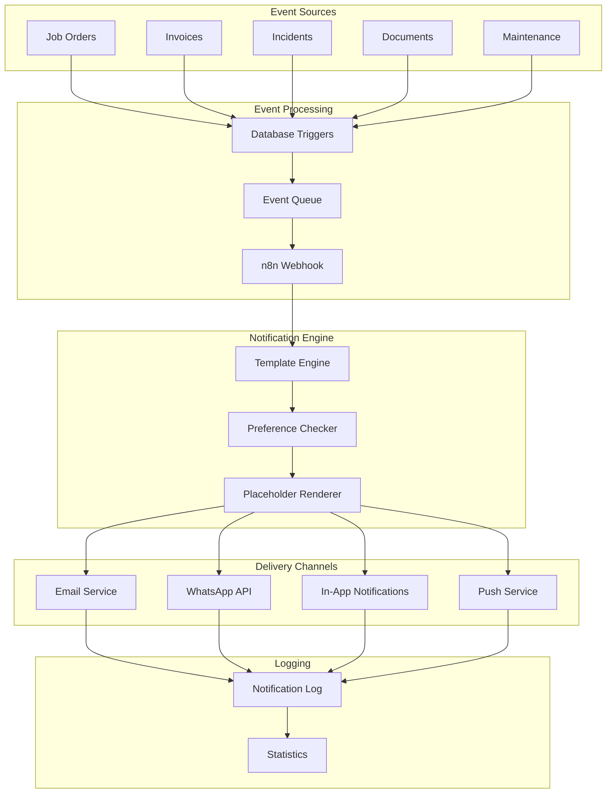

# Design Document: n8n Notification Workflows

## Overview

This design implements a comprehensive notification workflow system for Gama ERP, enabling automated multi-channel notifications triggered by business events. The system integrates with n8n for workflow orchestration and supports email, WhatsApp, in-app, and push notification channels.

The architecture follows an event-driven pattern where business events trigger notification workflows through webhooks. Templates define notification content with placeholder support, and user preferences control delivery channels and timing.

## Architecture



## Components and Interfaces

### 1. Notification Template Types

```typescript
// types/notification-workflows.ts

export type NotificationChannel = 'email' | 'whatsapp' | 'in_app' | 'push';

export type EventType =
  | 'job_order.assigned'
  | 'job_order.status_changed'
  | 'invoice.sent'
  | 'invoice.overdue'
  | 'incident.created'
  | 'document.expiring'
  | 'maintenance.due'
  | 'approval.required';

export type DigestFrequency = 'immediate' | 'hourly' | 'daily';

export type NotificationStatus = 'pending' | 'sent' | 'delivered' | 'failed' | 'bounced';

export interface PlaceholderDefinition {
  key: string;
  description: string;
  default_value?: string;
}

export interface NotificationTemplate {
  id: string;
  template_code: string;
  template_name: string;
  event_type: EventType;
  // Email template
  email_subject: string | null;
  email_body_html: string | null;
  email_body_text: string | null;
  // WhatsApp template
  whatsapp_template_id: string | null;
  whatsapp_body: string | null;
  // In-app notification
  in_app_title: string | null;
  in_app_body: string | null;
  in_app_action_url: string | null;
  // Push notification
  push_title: string | null;
  push_body: string | null;
  // Metadata
  placeholders: PlaceholderDefinition[];
  is_active: boolean;
  created_at: string;
}

export interface NotificationPreference {
  id: string;
  user_id: string;
  event_type: EventType;
  email_enabled: boolean;
  whatsapp_enabled: boolean;
  in_app_enabled: boolean;
  push_enabled: boolean;
  quiet_hours_start: string | null; // TIME format HH:MM
  quiet_hours_end: string | null;
  digest_frequency: DigestFrequency;
}

export interface NotificationLogEntry {
  id: string;
  template_id: string | null;
  recipient_user_id: string | null;
  recipient_email: string | null;
  recipient_phone: string | null;
  channel: NotificationChannel;
  subject: string | null;
  body: string | null;
  status: NotificationStatus;
  external_id: string | null;
  sent_at: string | null;
  delivered_at: string | null;
  error_message: string | null;
  entity_type: string | null;
  entity_id: string | null;
  created_at: string;
}
```

### 2. Template Rendering Interface

```typescript
export interface RenderTemplateInput {
  template: NotificationTemplate;
  data: Record<string, string>;
  channel: NotificationChannel;
}

export interface RenderedNotification {
  channel: NotificationChannel;
  subject?: string;
  body: string;
  title?: string;
  action_url?: string;
  template_id?: string; // For WhatsApp
}
```

### 3. Notification Sending Interface

```typescript
export interface SendNotificationInput {
  template_code: string;
  recipient_user_id: string;
  recipient_email?: string;
  recipient_phone?: string;
  data: Record<string, string>;
  entity_type?: string;
  entity_id?: string;
}

export interface SendNotificationResult {
  success: boolean;
  channels_sent: NotificationChannel[];
  channels_skipped: NotificationChannel[];
  log_ids: string[];
  errors: Array<{ channel: NotificationChannel; error: string }>;
}
```

### 4. Phone Validation Interface

```typescript
export interface PhoneValidationResult {
  valid: boolean;
  normalized: string | null;
  error?: string;
}
```

### 5. Statistics Interface

```typescript
export interface NotificationStats {
  total_sent: number;
  by_channel: Record<NotificationChannel, number>;
  by_status: Record<NotificationStatus, number>;
  success_rate: number;
  failure_rate: number;
  common_errors: Array<{ error: string; count: number }>;
}

export interface StatsFilter {
  start_date?: string;
  end_date?: string;
  event_type?: EventType;
  channel?: NotificationChannel;
}
```

## Data Models

### Database Schema

```sql
-- Notification templates
CREATE TABLE notification_templates (
  id UUID PRIMARY KEY DEFAULT gen_random_uuid(),
  template_code VARCHAR(50) UNIQUE NOT NULL,
  template_name VARCHAR(100) NOT NULL,
  event_type VARCHAR(50) NOT NULL,
  -- Email template
  email_subject VARCHAR(200),
  email_body_html TEXT,
  email_body_text TEXT,
  -- WhatsApp template
  whatsapp_template_id VARCHAR(100),
  whatsapp_body TEXT,
  -- In-app notification
  in_app_title VARCHAR(200),
  in_app_body TEXT,
  in_app_action_url VARCHAR(500),
  -- Push notification
  push_title VARCHAR(100),
  push_body VARCHAR(200),
  -- Placeholders
  placeholders JSONB DEFAULT '[]',
  is_active BOOLEAN DEFAULT TRUE,
  created_at TIMESTAMPTZ DEFAULT NOW()
);

-- Notification workflow preferences per user (separate from existing notification_preferences)
CREATE TABLE notification_workflow_preferences (
  id UUID PRIMARY KEY DEFAULT gen_random_uuid(),
  user_id UUID NOT NULL REFERENCES user_profiles(id),
  event_type VARCHAR(50) NOT NULL,
  email_enabled BOOLEAN DEFAULT TRUE,
  whatsapp_enabled BOOLEAN DEFAULT FALSE,
  in_app_enabled BOOLEAN DEFAULT TRUE,
  push_enabled BOOLEAN DEFAULT FALSE,
  quiet_hours_start TIME,
  quiet_hours_end TIME,
  digest_frequency VARCHAR(20) DEFAULT 'immediate',
  created_at TIMESTAMPTZ DEFAULT NOW(),
  updated_at TIMESTAMPTZ DEFAULT NOW(),
  UNIQUE(user_id, event_type)
);

-- Notification log
CREATE TABLE notification_log (
  id UUID PRIMARY KEY DEFAULT gen_random_uuid(),
  template_id UUID REFERENCES notification_templates(id),
  recipient_user_id UUID REFERENCES user_profiles(id),
  recipient_email VARCHAR(200),
  recipient_phone VARCHAR(50),
  channel VARCHAR(20) NOT NULL,
  subject VARCHAR(200),
  body TEXT,
  status VARCHAR(20) DEFAULT 'pending',
  external_id VARCHAR(100),
  sent_at TIMESTAMPTZ,
  delivered_at TIMESTAMPTZ,
  error_message TEXT,
  entity_type VARCHAR(50),
  entity_id UUID,
  created_at TIMESTAMPTZ DEFAULT NOW()
);

-- Indexes
CREATE INDEX idx_notification_templates_event ON notification_templates(event_type);
CREATE INDEX idx_notification_templates_code ON notification_templates(template_code);
CREATE INDEX idx_notification_workflow_prefs_user ON notification_workflow_preferences(user_id);
CREATE INDEX idx_notification_workflow_prefs_event ON notification_workflow_preferences(event_type);
CREATE INDEX idx_notification_log_recipient ON notification_log(recipient_user_id);
CREATE INDEX idx_notification_log_status ON notification_log(status);
CREATE INDEX idx_notification_log_entity ON notification_log(entity_type, entity_id);
CREATE INDEX idx_notification_log_created ON notification_log(created_at);
```

### Default Templates

The system includes 8 default notification templates:

| Template Code | Event Type | Purpose |
|--------------|------------|---------|
| JO_ASSIGNED | job_order.assigned | Notify user of new job assignment |
| JO_STATUS_UPDATE | job_order.status_changed | Notify stakeholders of status change |
| INVOICE_SENT | invoice.sent | Notify customer of invoice |
| INVOICE_OVERDUE | invoice.overdue | Remind customer of overdue payment |
| INCIDENT_REPORTED | incident.created | Alert HSE managers of incident |
| DOCUMENT_EXPIRING | document.expiring | Warn of expiring documents |
| MAINTENANCE_DUE | maintenance.due | Remind of scheduled maintenance |
| APPROVAL_REQUIRED | approval.required | Request approval from approvers |


## Correctness Properties

*A property is a characteristic or behavior that should hold true across all valid executions of a system—essentially, a formal statement about what the system should do. Properties serve as the bridge between human-readable specifications and machine-verifiable correctness guarantees.*

### Property 1: Template Storage Integrity

*For any* valid notification template with a unique template_code, storing and then retrieving the template SHALL return an equivalent template with all channel fields (email, WhatsApp, in-app, push) and placeholder definitions preserved.

**Validates: Requirements 1.1, 1.2, 1.3, 1.4**

### Property 2: Placeholder Replacement Completeness

*For any* template string containing placeholders and any data object, the placeholder engine SHALL replace all {{key}} patterns where the key exists in data, use default_value for missing keys with defaults, and leave unchanged any placeholders without data or defaults.

**Validates: Requirements 2.1, 2.2, 2.3, 2.4**

### Property 3: Template Rendering Round-Trip

*For any* valid template and data combination, extracting placeholder keys from the original template and then checking if all keys are either present in data or have defaults SHALL return true (all placeholders are accounted for).

**Validates: Requirements 2.5**

### Property 4: Preference Storage and Defaults

*For any* user and event_type combination, the preference system SHALL either return stored preferences with all channel flags and settings, or return default preferences (email and in_app enabled, immediate delivery) when no preference exists.

**Validates: Requirements 3.1, 3.2, 3.3, 3.4, 3.5**

### Property 5: Channel Filtering by Preferences

*For any* notification request and user preferences, the notification sender SHALL only attempt delivery through channels that are enabled in the user's preferences for that event type.

**Validates: Requirements 4.1, 4.2, 4.4**

### Property 6: Quiet Hours and Digest Batching

*For any* notification during a user's quiet hours, the system SHALL queue the notification for later delivery. *For any* notification with non-immediate digest frequency, the system SHALL batch the notification according to the specified frequency.

**Validates: Requirements 4.5, 4.6**

### Property 7: Log Entry Completeness

*For any* sent notification, the log entry SHALL contain template_id, recipient information, channel, rendered content, timestamp, and entity association (if provided).

**Validates: Requirements 5.1, 5.4, 5.5**

### Property 8: Status Transition Validity

*For any* notification log entry, status transitions SHALL follow the valid workflow: pending → sent → delivered OR pending → sent → failed/bounced. Failed entries SHALL have error_message populated.

**Validates: Requirements 5.2, 5.3**

### Property 9: Phone Validation and Normalization

*For any* Indonesian phone number (starting with +62 or 08), the validator SHALL return valid=true and normalize to +62 format. *For any* invalid phone number, the validator SHALL return valid=false with an error message.

**Validates: Requirements 7.1, 7.2, 7.3, 7.4**

### Property 10: Statistics Calculation Invariant

*For any* set of notification log entries, the sum of counts by status (pending + sent + delivered + failed + bounced) SHALL equal the total count, and success_rate + failure_rate SHALL equal 100% (excluding pending).

**Validates: Requirements 8.1, 8.2, 8.3, 8.4, 8.5**

## Error Handling

### Template Errors

| Error | Handling |
|-------|----------|
| Template not found | Return error with template_code, skip notification |
| Invalid placeholder format | Log warning, leave placeholder unchanged |
| Missing required data | Use default_value or leave placeholder |

### Delivery Errors

| Error | Handling |
|-------|----------|
| Email delivery failure | Log error, update status to 'failed', store error_message |
| WhatsApp API error | Log error, update status to 'failed', store API response |
| Invalid phone number | Skip WhatsApp channel, log validation error |
| Rate limit exceeded | Queue for retry with exponential backoff |

### Preference Errors

| Error | Handling |
|-------|----------|
| User not found | Use default preferences |
| Invalid event_type | Return error, reject preference update |
| Duplicate preference | Return conflict error |

## Testing Strategy

### Unit Tests

Unit tests will cover specific examples and edge cases:

- Template CRUD operations with various field combinations
- Placeholder replacement with special characters
- Phone number validation edge cases (empty, too short, wrong prefix)
- Quiet hours boundary conditions
- Statistics calculation with empty data sets

### Property-Based Tests

Property-based tests will use fast-check to verify universal properties:

```typescript
// Test configuration
import * as fc from 'fast-check';

// Minimum 100 iterations per property test
const testConfig = { numRuns: 100 };
```

Each correctness property will be implemented as a property-based test:

1. **Property 1**: Generate random templates, store and retrieve, verify equality
2. **Property 2**: Generate random templates and data, verify placeholder replacement
3. **Property 3**: Generate templates, extract placeholders, verify all accounted for
4. **Property 4**: Generate user/event combinations, verify preference retrieval
5. **Property 5**: Generate notifications and preferences, verify channel filtering
6. **Property 6**: Generate notifications with quiet hours/digest settings, verify batching
7. **Property 7**: Generate sent notifications, verify log completeness
8. **Property 8**: Generate status transitions, verify validity
9. **Property 9**: Generate phone numbers, verify validation and normalization
10. **Property 10**: Generate log entries, verify statistics invariant

### Test File Structure

```
__tests__/
  notification-template-utils.property.test.ts
  notification-preference-utils.property.test.ts
  notification-sender-utils.property.test.ts
  notification-log-utils.property.test.ts
  phone-validation-utils.property.test.ts
  notification-stats-utils.property.test.ts
```

### Integration Tests

Integration tests will verify event-triggered notifications:

- Job order assignment triggers JO_ASSIGNED notification
- Invoice status change triggers appropriate notification
- Incident creation triggers INCIDENT_REPORTED to HSE managers
