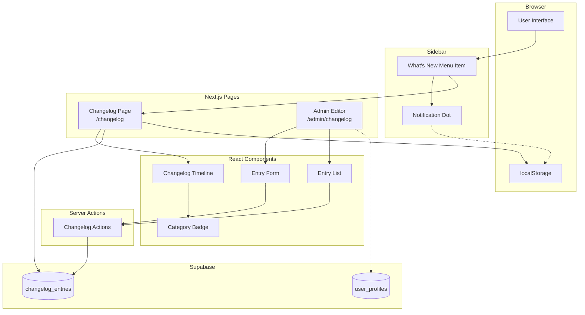

# Design Document: Changelog Feature (v0.82)

## Overview

This feature adds a changelog system to GAMA ERP, enabling users to stay informed about system updates and new features. The system consists of:

1. **Changelog Page** (`/changelog`): Public-facing timeline view of all updates
2. **Admin Editor** (`/admin/changelog`): Administrative interface for managing entries
3. **Sidebar Integration**: "What's New" menu item with notification dot for unread updates

The architecture follows existing GAMA ERP patterns with Server Components for optimal performance, Supabase for data storage with RLS policies, and localStorage for tracking user's last viewed timestamp.

## Architecture



### Key Design Decisions

1. **Server Components**: Changelog page uses Server Components for fast initial load and SEO
2. **localStorage for Last Viewed**: Avoids database writes on every changelog visit
3. **RLS for Access Control**: Leverages Supabase RLS to enforce read/write permissions
4. **Markdown Support**: Description field supports markdown for rich formatting
5. **Month/Year Grouping**: Entries grouped by month for easy navigation

## Components and Interfaces

### 1. Changelog Types (`types/changelog.ts`)

```typescript
export type ChangelogCategory = 'feature' | 'improvement' | 'bugfix' | 'security';

export interface ChangelogEntry {
  id: string;
  version: string | null;
  title: string;
  description: string | null;
  category: ChangelogCategory;
  is_major: boolean;
  published_at: string;
  created_by: string | null;
  created_at: string;
  updated_at: string;
}

export interface ChangelogEntryInput {
  version?: string;
  title: string;
  description?: string;
  category: ChangelogCategory;
  is_major?: boolean;
  published_at?: string;
}

export interface GroupedChangelogEntries {
  monthYear: string; // e.g., "January 2026"
  entries: ChangelogEntry[];
}
```

### 2. Changelog Utilities (`lib/changelog-utils.ts`)

```typescript
// Group entries by month/year
function groupEntriesByMonth(entries: ChangelogEntry[]): GroupedChangelogEntries[];

// Get category badge color
function getCategoryBadgeColor(category: ChangelogCategory): string;

// Format published date
function formatPublishedDate(date: string): string;

// Check if there are new entries since last view
function hasNewEntries(entries: ChangelogEntry[], lastViewed: string | null): boolean;

// Get localStorage key for last viewed timestamp
const CHANGELOG_LAST_VIEWED_KEY = 'gama_changelog_last_viewed';
```

### 3. Changelog Page (`app/(main)/changelog/page.tsx`)

```typescript
// Server Component
export default async function ChangelogPage() {
  const supabase = await createClient();
  
  const { data: entries } = await supabase
    .from('changelog_entries')
    .select('*')
    .order('published_at', { ascending: false });
  
  const groupedEntries = groupEntriesByMonth(entries || []);
  
  return (
    <div>
      <ChangelogHeader />
      <ChangelogTimeline entries={groupedEntries} />
      <LastViewedUpdater /> {/* Client component to update localStorage */}
    </div>
  );
}
```

### 4. Changelog Timeline Component (`components/changelog/changelog-timeline.tsx`)

```typescript
interface ChangelogTimelineProps {
  entries: GroupedChangelogEntries[];
}

// Displays entries grouped by month with:
// - Month/year section headers
// - Entry cards with version, title, description, category badge
// - Visual highlight for major updates
// - Markdown rendering for descriptions
```

### 5. Category Badge Component (`components/changelog/category-badge.tsx`)

```typescript
interface CategoryBadgeProps {
  category: ChangelogCategory;
}

// Badge colors:
// - feature: blue (bg-blue-100 text-blue-800)
// - bugfix: red (bg-red-100 text-red-800)
// - improvement: green (bg-green-100 text-green-800)
// - security: yellow (bg-yellow-100 text-yellow-800)
```

### 6. Notification Dot Hook (`hooks/use-changelog-notification.ts`)

```typescript
interface UseChangelogNotificationResult {
  hasNewUpdates: boolean;
  markAsViewed: () => void;
}

function useChangelogNotification(): UseChangelogNotificationResult;

// Client-side hook that:
// 1. Reads last viewed timestamp from localStorage
// 2. Fetches latest entry's published_at from API
// 3. Compares to determine if notification dot should show
```

### 7. Admin Editor Page (`app/(main)/admin/changelog/page.tsx`)

```typescript
// Server Component with client form
export default async function AdminChangelogPage() {
  // Check admin access
  const profile = await getUserProfile();
  if (!['owner', 'director', 'sysadmin'].includes(profile?.role || '')) {
    redirect(getDashboardPath(profile?.role || 'ops'));
  }
  
  // Fetch existing entries
  const entries = await getChangelogEntries();
  
  return (
    <div>
      <ChangelogEntryForm />
      <ChangelogEntryList entries={entries} />
    </div>
  );
}
```

### 8. Changelog Server Actions (`app/(main)/admin/changelog/actions.ts`)

```typescript
'use server'

async function createChangelogEntry(data: ChangelogEntryInput): Promise<{ success: boolean; error?: string }>;

async function updateChangelogEntry(id: string, data: ChangelogEntryInput): Promise<{ success: boolean; error?: string }>;

async function deleteChangelogEntry(id: string): Promise<{ success: boolean; error?: string }>;
```

### 9. Navigation Update (`lib/navigation.ts`)

```typescript
// Add to NAV_ITEMS array in Help section
{
  title: "What's New",
  href: '/changelog',
  icon: Sparkles,
  roles: ['owner', 'director', 'marketing_manager', 'finance_manager', 'operations_manager', 'sysadmin', 'administration', 'finance', 'marketing', 'ops', 'engineer', 'hr', 'hse', 'agency', 'customs'],
}
```

## Data Models

### changelog_entries Table

```sql
CREATE TABLE IF NOT EXISTS changelog_entries (
  id UUID PRIMARY KEY DEFAULT gen_random_uuid(),
  version TEXT,
  title TEXT NOT NULL,
  description TEXT,
  category TEXT DEFAULT 'feature' CHECK (category IN ('feature', 'improvement', 'bugfix', 'security')),
  is_major BOOLEAN DEFAULT false,
  published_at TIMESTAMPTZ DEFAULT NOW(),
  created_by UUID REFERENCES auth.users(id),
  created_at TIMESTAMPTZ DEFAULT NOW(),
  updated_at TIMESTAMPTZ DEFAULT NOW()
);

-- Index for efficient ordering
CREATE INDEX idx_changelog_published_at ON changelog_entries(published_at DESC);

-- Trigger for updated_at
CREATE TRIGGER update_changelog_entries_updated_at
  BEFORE UPDATE ON changelog_entries
  FOR EACH ROW
  EXECUTE FUNCTION update_updated_at_column();
```

### RLS Policies

```sql
-- Enable RLS
ALTER TABLE changelog_entries ENABLE ROW LEVEL SECURITY;

-- All authenticated users can read
CREATE POLICY "Authenticated users can read changelog"
ON changelog_entries FOR SELECT
TO authenticated
USING (true);

-- Only admins can insert
CREATE POLICY "Admins can insert changelog"
ON changelog_entries FOR INSERT
TO authenticated
WITH CHECK (
  EXISTS (
    SELECT 1 FROM user_profiles
    WHERE user_profiles.user_id = auth.uid()
    AND user_profiles.role IN ('owner', 'director', 'sysadmin')
  )
);

-- Only admins can update
CREATE POLICY "Admins can update changelog"
ON changelog_entries FOR UPDATE
TO authenticated
USING (
  EXISTS (
    SELECT 1 FROM user_profiles
    WHERE user_profiles.user_id = auth.uid()
    AND user_profiles.role IN ('owner', 'director', 'sysadmin')
  )
);

-- Only admins can delete
CREATE POLICY "Admins can delete changelog"
ON changelog_entries FOR DELETE
TO authenticated
USING (
  EXISTS (
    SELECT 1 FROM user_profiles
    WHERE user_profiles.user_id = auth.uid()
    AND user_profiles.role IN ('owner', 'director', 'sysadmin')
  )
);
```

### Initial Data Migration

```sql
-- Insert initial changelog entries
INSERT INTO changelog_entries (version, title, description, category, is_major, published_at) VALUES
  ('v0.33', 'GAMA ERP Launch', 'Initial release with Operations, Finance, HR modules', 'feature', true, '2025-12-01T00:00:00Z'),
  ('v0.34', 'Disbursement Module (BKK)', 'Complete cash-out tracking with approval workflow', 'feature', false, '2025-12-15T00:00:00Z'),
  ('v0.35', 'Agency & Customs Roles', 'Added support for Agency and Customs departments', 'feature', false, '2026-01-09T00:00:00Z'),
  ('v0.36', 'User Onboarding Fix', 'Fixed issue where new users could not sign up via Google OAuth', 'bugfix', false, '2026-01-10T00:00:00Z');
```

## Correctness Properties

*A property is a characteristic or behavior that should hold true across all valid executions of a system—essentially, a formal statement about what the system should do. Properties serve as the bridge between human-readable specifications and machine-verifiable correctness guarantees.*

Based on the prework analysis, the following properties have been identified:

### Property 1: Category Validation

*For any* changelog entry being inserted or updated, if the category value is not one of 'feature', 'improvement', 'bugfix', or 'security', then the database SHALL reject the operation with a constraint violation error.

**Validates: Requirements 1.3**

### Property 2: RLS Read Access

*For any* authenticated user querying the changelog_entries table, regardless of their role, the query SHALL return all entries in the table.

**Validates: Requirements 2.1**

### Property 3: RLS Write Access

*For any* user attempting to INSERT, UPDATE, or DELETE on changelog_entries, if the user's role is NOT owner, director, or sysadmin, then the operation SHALL be rejected by RLS policy.

**Validates: Requirements 2.2, 2.3, 2.4**

### Property 4: Entry Ordering

*For any* query to the changelog page, the returned entries SHALL be ordered by published_at in descending order (newest first).

**Validates: Requirements 3.1**

### Property 5: Entry Grouping

*For any* list of changelog entries, the groupEntriesByMonth function SHALL return entries grouped such that all entries within a group have the same month and year in their published_at timestamp.

**Validates: Requirements 3.2**

### Property 6: Display Completeness

*For any* changelog entry displayed on the page, the rendered output SHALL include: version (if present), title, description (if present), category badge with correct color, published date, and visual highlight if is_major is true.

**Validates: Requirements 3.3, 3.5**

### Property 7: Navigation Visibility

*For any* authenticated user with any role in the system, the "What's New" menu item SHALL be visible in the navigation sidebar.

**Validates: Requirements 5.2**

### Property 8: Notification Dot Logic

*For any* user with a last_viewed timestamp, if there exists at least one changelog entry with published_at greater than last_viewed, then hasNewEntries SHALL return true; otherwise it SHALL return false.

**Validates: Requirements 6.2**

### Property 9: Admin Access Control

*For any* user attempting to access /admin/changelog, if the user's role is NOT owner, director, or sysadmin, then the system SHALL redirect them to their role-specific dashboard.

**Validates: Requirements 7.1, 7.5**

### Property 10: Entry Creation Integrity

*For any* valid changelog entry submitted through the admin form, after successful submission, querying the changelog_entries table SHALL return an entry with matching version, title, description, category, and is_major values.

**Validates: Requirements 7.3**

## Error Handling

### Database Errors

| Error Scenario | Handling Strategy |
|----------------|-------------------|
| Category constraint violation | Show validation error message |
| RLS policy rejection | Show "Permission denied" toast |
| Database connection failure | Show error state with retry button |
| Entry not found (update/delete) | Show "Entry not found" error |

### Page Errors

| Error Scenario | Handling Strategy |
|----------------|-------------------|
| Changelog page load failure | Show error boundary with retry |
| Admin page unauthorized | Redirect to dashboard |
| Form submission failure | Show error toast, preserve form data |

### Client-Side Errors

| Error Scenario | Handling Strategy |
|----------------|-------------------|
| localStorage unavailable | Disable notification dot feature |
| API fetch for notification check fails | Hide notification dot |

## Testing Strategy

### Dual Testing Approach

This feature requires both unit tests and property-based tests for comprehensive coverage:

- **Unit tests**: Verify specific examples, edge cases, and error conditions
- **Property tests**: Verify universal properties across all inputs using randomized testing

### Property-Based Testing Configuration

- **Library**: fast-check (TypeScript property-based testing library)
- **Minimum iterations**: 100 per property test
- **Tag format**: `Feature: v0.82-changelog-feature, Property {number}: {property_text}`

### Test Categories

#### Unit Tests

1. **Changelog Utils Unit Tests**
   - Test groupEntriesByMonth with various date combinations
   - Test getCategoryBadgeColor for all categories
   - Test formatPublishedDate formatting
   - Test hasNewEntries with various timestamp combinations

2. **Category Badge Unit Tests**
   - Test blue badge for feature
   - Test red badge for bugfix
   - Test green badge for improvement
   - Test yellow badge for security

3. **Server Actions Unit Tests**
   - Test createChangelogEntry with valid data
   - Test updateChangelogEntry with valid data
   - Test deleteChangelogEntry
   - Test error handling for invalid data

4. **Navigation Unit Tests**
   - Test "What's New" menu item visibility for all roles
   - Test correct href value

#### Property-Based Tests

Each correctness property MUST be implemented as a single property-based test:

1. **Property 1 Test**: Generate random category values, verify only valid ones are accepted
2. **Property 2 Test**: Generate random users with random roles, verify all can read entries
3. **Property 3 Test**: Generate random users with random roles, verify only admins can write
4. **Property 4 Test**: Generate random entries with random dates, verify ordering
5. **Property 5 Test**: Generate random entries, verify grouping correctness
6. **Property 6 Test**: Generate random entries, verify display completeness
7. **Property 7 Test**: Generate random users with random roles, verify menu visibility
8. **Property 8 Test**: Generate random entries and timestamps, verify notification logic
9. **Property 9 Test**: Generate random users with random roles, verify access control
10. **Property 10 Test**: Generate random valid entries, verify creation integrity

### Integration Tests

1. **End-to-End Changelog Flow**
   - Admin creates entry, verify it appears on changelog page
   - Admin updates entry, verify changes reflected
   - Admin deletes entry, verify removal

2. **Notification Dot Flow**
   - User visits changelog, verify last viewed updated
   - New entry added, verify notification dot appears
   - User visits changelog again, verify dot disappears
