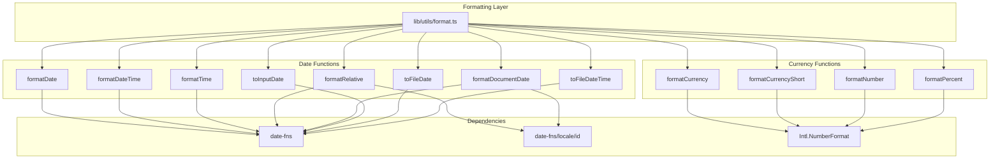

# Design Document: Date & Currency Formatting Standardization

## Overview

This design establishes a centralized formatting utility module that provides consistent date and currency formatting across the GAMA ERP application. The solution consolidates multiple existing formatting functions into a single source of truth at `lib/utils/format.ts`.

The design leverages:
- **date-fns** (already installed v4.1.0) for reliable date manipulation and formatting
- **date-fns/locale/id** for Indonesian locale support
- **Intl.NumberFormat** for performant, native currency/number formatting

## Architecture



## Components and Interfaces

### Format Utility Module (`lib/utils/format.ts`)

```typescript
// Type definitions
type DateInput = string | Date | null | undefined

// Date formatting functions
export function formatDate(date: DateInput): string
export function formatDateTime(date: DateInput): string
export function formatTime(date: DateInput): string
export function formatRelative(date: DateInput): string
export function formatDocumentDate(date: DateInput): string
export function toInputDate(date: DateInput): string
export function toFileDate(date?: Date): string
export function toFileDateTime(date?: Date): string

// Currency formatting functions
export function formatCurrency(amount: number | null | undefined): string
export function formatCurrencyShort(amount: number | null | undefined): string

// Number formatting functions
export function formatNumber(num: number | null | undefined): string
export function formatPercent(decimal: number | null | undefined): string

// Helper function (internal)
function isValidDate(date: unknown): date is Date
function parseDate(date: DateInput): Date | null
```

### Function Specifications

#### Date Functions

| Function | Input | Output | Example |
|----------|-------|--------|---------|
| `formatDate` | `DateInput` | `string` | "15 Jan 2026" |
| `formatDateTime` | `DateInput` | `string` | "15 Jan 2026, 14:30" |
| `formatTime` | `DateInput` | `string` | "14:30" |
| `formatRelative` | `DateInput` | `string` | "2 hari yang lalu" |
| `formatDocumentDate` | `DateInput` | `string` | "15 Januari 2026" |
| `toInputDate` | `DateInput` | `string` | "2026-01-15" |
| `toFileDate` | `Date?` | `string` | "20260115" |
| `toFileDateTime` | `Date?` | `string` | "20260115_143022" |

#### Currency/Number Functions

| Function | Input | Output | Example |
|----------|-------|--------|---------|
| `formatCurrency` | `number \| null` | `string` | "Rp 1.500.000" |
| `formatCurrencyShort` | `number \| null` | `string` | "Rp 1,5 jt" |
| `formatNumber` | `number \| null` | `string` | "1.500.000" |
| `formatPercent` | `number \| null` | `string` | "75,5%" |

## Data Models

### DateInput Type

```typescript
type DateInput = string | Date | null | undefined
```

This union type allows flexible input handling:
- `string`: ISO date strings from database (e.g., "2026-01-15T14:30:00Z")
- `Date`: JavaScript Date objects
- `null | undefined`: Missing values, returns fallback "-"

### Formatting Constants

```typescript
const FALLBACK_DATE = '-'
const FALLBACK_CURRENCY = 'Rp 0'
const FALLBACK_NUMBER = '0'

const CURRENCY_THRESHOLDS = {
  BILLION: 1_000_000_000,
  MILLION: 1_000_000,
  THOUSAND: 1_000,
}

const CURRENCY_SUFFIXES = {
  BILLION: 'M',    // Miliar
  MILLION: 'jt',   // Juta
  THOUSAND: 'rb',  // Ribu
}
```

## Correctness Properties

*A property is a characteristic or behavior that should hold true across all valid executions of a system—essentially, a formal statement about what the system should do. Properties serve as the bridge between human-readable specifications and machine-verifiable correctness guarantees.*

### Property 1: Date Formatting Pattern Validity

*For any* valid Date object or ISO date string, `formatDate` SHALL return a string matching the pattern "DD MMM YYYY" where DD is 01-31, MMM is a valid 3-letter month abbreviation, and YYYY is a 4-digit year.

**Validates: Requirements 1.1**

### Property 2: DateTime Formatting Pattern Validity

*For any* valid Date object or ISO date string, `formatDateTime` SHALL return a string matching the pattern "DD MMM YYYY, HH:mm" where the date portion follows Property 1 and time is in 24-hour format.

**Validates: Requirements 1.2**

### Property 3: Time Formatting Pattern Validity

*For any* valid Date object or ISO date string, `formatTime` SHALL return a string matching the pattern "HH:mm" where HH is 00-23 and mm is 00-59.

**Validates: Requirements 1.3**

### Property 4: Invalid Date Fallback

*For any* invalid date input (malformed strings, invalid dates like "2026-13-45", random gibberish), all date formatting functions SHALL return "-" as the fallback value.

**Validates: Requirements 1.5**

### Property 5: Relative Date Indonesian Formatting

*For any* valid date within the past, `formatRelative` SHALL return a string containing Indonesian relative time indicators: "yang lalu" for past dates, with appropriate time units ("detik", "menit", "jam", "hari") based on the time difference.

**Validates: Requirements 2.1, 2.2, 2.3**

### Property 6: Document Date Indonesian Month Names

*For any* valid Date object or ISO date string, `formatDocumentDate` SHALL return a string containing a full Indonesian month name (Januari, Februari, Maret, April, Mei, Juni, Juli, Agustus, September, Oktober, November, Desember).

**Validates: Requirements 3.1**

### Property 7: Input Date ISO Format

*For any* valid Date object or ISO date string, `toInputDate` SHALL return a string matching the ISO date format "YYYY-MM-DD" that is valid for HTML date input elements.

**Validates: Requirements 4.1**

### Property 8: File Date Sortable Format

*For any* Date object, `toFileDate` SHALL return an 8-character string in "YYYYMMDD" format, and `toFileDateTime` SHALL return a 15-character string in "YYYYMMDD_HHmmss" format. Both formats SHALL be lexicographically sortable (earlier dates sort before later dates).

**Validates: Requirements 4.2, 4.3**

### Property 9: Currency Formatting Correctness

*For any* number (positive, negative, or zero), `formatCurrency` SHALL return a string starting with "Rp " (or "-Rp " for negatives) followed by the absolute value formatted with Indonesian thousand separators (dots).

**Validates: Requirements 5.1, 5.2**

### Property 10: Compact Currency Abbreviation

*For any* number >= 1,000,000,000, `formatCurrencyShort` SHALL return a string with "M" suffix. *For any* number >= 1,000,000 and < 1,000,000,000, it SHALL return a string with "jt" suffix. The numeric portion SHALL be rounded to 1 decimal place.

**Validates: Requirements 5.4**

### Property 11: Number Formatting Indonesian Separators

*For any* number, `formatNumber` SHALL return a string using dots as thousand separators (Indonesian locale), and the formatted string parsed back SHALL equal the original number.

**Validates: Requirements 6.1**

### Property 12: Percentage Formatting

*For any* decimal number, `formatPercent` SHALL return a string ending with "%" and using comma as the decimal separator (Indonesian locale).

**Validates: Requirements 6.2**

### Property 13: Date Formatting Round-Trip Consistency

*For any* valid Date object, formatting with `toInputDate` and then parsing the result back to a Date SHALL produce a date with the same year, month, and day as the original.

**Validates: Requirements 4.1 (round-trip validation)**

## Error Handling

### Invalid Input Handling

All formatting functions implement defensive programming:

```typescript
function parseDate(date: DateInput): Date | null {
  if (date === null || date === undefined) return null
  
  try {
    const parsed = typeof date === 'string' ? new Date(date) : date
    return isNaN(parsed.getTime()) ? null : parsed
  } catch {
    return null
  }
}
```

### Fallback Values

| Function Type | Fallback Value |
|---------------|----------------|
| Date functions | `"-"` |
| `toInputDate` | `""` (empty string for form compatibility) |
| Currency functions | `"Rp 0"` |
| Number functions | `"0"` |

### Edge Cases

1. **Future dates in formatRelative**: Display as full date format
2. **Very large numbers**: formatCurrencyShort handles up to trillions
3. **Negative percentages**: Display with minus sign before number
4. **Timezone handling**: All functions work with local timezone

## Testing Strategy

### Dual Testing Approach

This feature requires both unit tests and property-based tests:

- **Unit tests**: Verify specific examples, edge cases (null, undefined, invalid dates), and error conditions
- **Property tests**: Verify universal properties across randomly generated inputs

### Property-Based Testing Configuration

- **Library**: fast-check (recommended for TypeScript)
- **Minimum iterations**: 100 per property test
- **Tag format**: `Feature: date-currency-formatting-standardization, Property {number}: {property_text}`

### Test File Structure

```
__tests__/
├── format-utils.unit.test.ts      # Unit tests for edge cases
└── format-utils.property.test.ts  # Property-based tests
```

### Unit Test Coverage

Focus on specific examples and edge cases:
- Null/undefined inputs for all functions
- Invalid date strings ("not-a-date", "2026-13-45")
- Zero and negative numbers for currency
- Boundary values (midnight, end of month, leap years)
- Very large numbers for compact currency

### Property Test Coverage

Each correctness property (1-13) maps to a property-based test that generates random valid inputs and verifies the property holds.

