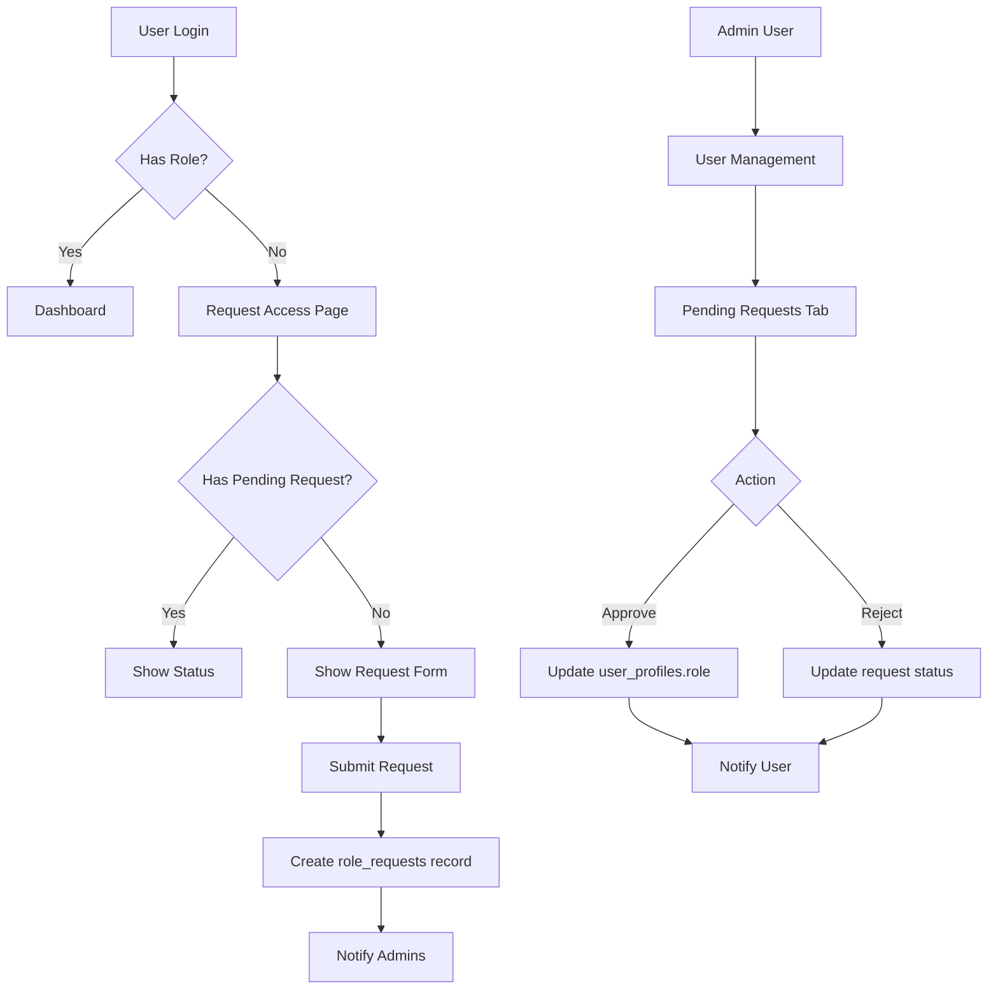

# Design Document: Role Request System

## Overview

The Role Request System enables self-service onboarding for new GAMA ERP users. When users log in with their @gama-group.co Google account and don't have an assigned role, they are redirected to a Request Access page where they can submit a role request. Administrators can then approve or reject these requests through the existing User Management interface.

This design integrates with the existing RBAC system (`lib/permissions.ts`), middleware routing (`middleware.ts`), and user management (`app/(main)/settings/users/`).

## Architecture



### Request Flow

1. **Login**: User authenticates via Google OAuth (@gama-group.co)
2. **Profile Check**: `ensureUserProfile()` creates profile with no role (or default role)
3. **Middleware Redirect**: Users without valid role redirected to `/request-access`
4. **Request Submission**: User selects department and role, submits request
5. **Admin Review**: Admin sees pending requests in User Management
6. **Approval/Rejection**: Admin processes request, user notified

## Components and Interfaces

### Database Table: role_requests

```sql
CREATE TABLE role_requests (
  id UUID PRIMARY KEY DEFAULT gen_random_uuid(),
  user_id UUID REFERENCES auth.users(id) NOT NULL,
  user_email TEXT NOT NULL,
  user_name TEXT,
  requested_role TEXT NOT NULL,
  requested_department TEXT,
  reason TEXT,
  status TEXT NOT NULL DEFAULT 'pending' CHECK (status IN ('pending', 'approved', 'rejected')),
  reviewed_by UUID REFERENCES auth.users(id),
  reviewed_at TIMESTAMPTZ,
  admin_notes TEXT,
  created_at TIMESTAMPTZ DEFAULT NOW(),
  updated_at TIMESTAMPTZ DEFAULT NOW()
);

-- Index for quick lookups
CREATE INDEX idx_role_requests_user_id ON role_requests(user_id);
CREATE INDEX idx_role_requests_status ON role_requests(status);
```

### RLS Policies

```sql
-- Users can view their own requests
CREATE POLICY "Users can view own requests" ON role_requests
  FOR SELECT USING (auth.uid() = user_id);

-- Users can create requests for themselves
CREATE POLICY "Users can create own requests" ON role_requests
  FOR INSERT WITH CHECK (auth.uid() = user_id);

-- Admins can view all requests
CREATE POLICY "Admins can view all requests" ON role_requests
  FOR SELECT USING (
    EXISTS (
      SELECT 1 FROM user_profiles 
      WHERE user_id = auth.uid() 
      AND role IN ('owner', 'director', 'sysadmin')
    )
  );

-- Admins can update requests
CREATE POLICY "Admins can update requests" ON role_requests
  FOR UPDATE USING (
    EXISTS (
      SELECT 1 FROM user_profiles 
      WHERE user_id = auth.uid() 
      AND role IN ('owner', 'director', 'sysadmin')
    )
  );
```

### Component: Request Access Page

**File**: `app/(main)/request-access/page.tsx`

```typescript
interface RequestAccessPageProps {
  // Server component - no props needed
}

// Server component that:
// 1. Checks if user is authenticated
// 2. Checks if user already has a valid role (redirect to dashboard)
// 3. Fetches existing pending request if any
// 4. Renders RequestAccessClient with initial data
```

**File**: `app/(main)/request-access/request-access-client.tsx`

```typescript
interface RequestAccessClientProps {
  userEmail: string
  userName: string | null
  existingRequest: RoleRequest | null
}

interface RoleRequest {
  id: string
  requested_role: string
  requested_department: string | null
  reason: string | null
  status: 'pending' | 'approved' | 'rejected'
  admin_notes: string | null
  created_at: string
  reviewed_at: string | null
}
```

### Component: Admin Pending Requests

**File**: `app/(main)/settings/users/pending-requests.tsx`

```typescript
interface PendingRequestsProps {
  requests: RoleRequestWithUser[]
}

interface RoleRequestWithUser {
  id: string
  user_id: string
  user_email: string
  user_name: string | null
  requested_role: string
  requested_department: string | null
  reason: string | null
  status: string
  created_at: string
}
```

### Server Actions

**File**: `app/(main)/request-access/actions.ts`

```typescript
// Submit a new role request
async function submitRoleRequest(data: {
  requestedRole: string
  requestedDepartment: string
  reason?: string
}): Promise<{ success: boolean; error?: string }>

// Get user's existing request
async function getUserRoleRequest(): Promise<RoleRequest | null>
```

**File**: `app/(main)/settings/users/actions.ts` (additions)

```typescript
// Approve a role request
async function approveRoleRequest(
  requestId: string,
  assignedRole?: string // Optional override
): Promise<{ success: boolean; error?: string }>

// Reject a role request
async function rejectRoleRequest(
  requestId: string,
  reason: string
): Promise<{ success: boolean; error?: string }>

// Get all pending role requests
async function getPendingRoleRequests(): Promise<RoleRequestWithUser[]>
```

### Department to Role Mapping

```typescript
const DEPARTMENT_ROLES: Record<string, UserRole[]> = {
  'Operations': ['ops', 'operations_manager'],
  'Finance': ['finance', 'finance_manager', 'administration'],
  'Marketing': ['marketing', 'marketing_manager'],
  'HR': ['hr'],
  'HSE': ['hse'],
  'Engineering': ['engineer'],
  'Agency': ['agency'],
  'Customs': ['customs'],
  'Administration': ['administration'],
}
```

### Middleware Updates

**File**: `middleware.ts`

```typescript
// Add to PUBLIC_ROUTES or create new NO_ROLE_REQUIRED_ROUTES
const NO_ROLE_REQUIRED_ROUTES = ['/request-access']

// In middleware logic:
// 1. Check if user has no role or role is 'pending'
// 2. If on protected route, redirect to /request-access
// 3. If on /request-access with valid role, redirect to dashboard
```

## Data Models

### RoleRequest Type

```typescript
interface RoleRequest {
  id: string
  user_id: string
  user_email: string
  user_name: string | null
  requested_role: UserRole
  requested_department: string | null
  reason: string | null
  status: 'pending' | 'approved' | 'rejected'
  reviewed_by: string | null
  reviewed_at: string | null
  admin_notes: string | null
  created_at: string
  updated_at: string
}
```

### Form State

```typescript
interface RequestFormState {
  department: string
  role: string
  reason: string
  isSubmitting: boolean
  error: string | null
}
```

## Correctness Properties

*A property is a characteristic or behavior that should hold true across all valid executions of a system—essentially, a formal statement about what the system should do. Properties serve as the bridge between human-readable specifications and machine-verifiable correctness guarantees.*

### Property 1: Middleware Redirect for Roleless Users

*For any* authenticated user without a valid role accessing any protected route (excluding /request-access, /auth/*, /api/*, /login), the middleware SHALL redirect them to /request-access.

**Validates: Requirements 1.1, 4.1**

### Property 2: Department-Role Filtering

*For any* department selection, the filtered role list SHALL contain only roles that are mapped to that department in the DEPARTMENT_ROLES configuration, and SHALL not contain any roles from other departments.

**Validates: Requirements 1.3**

### Property 3: Request Creation Data Integrity

*For any* valid role request submission, the created role_request record SHALL contain the user_id matching the authenticated user, user_email, requested_role, requested_department, status='pending', and created_at timestamp.

**Validates: Requirements 1.4, 1.5**

### Property 4: Duplicate Request Prevention

*For any* user with an existing pending role request, attempting to submit a new request SHALL fail and return an error indicating the existing pending request.

**Validates: Requirements 1.6**

### Property 5: Approved User Redirect

*For any* user with a valid assigned role who accesses /request-access, the system SHALL redirect them to their role-appropriate dashboard.

**Validates: Requirements 2.3, 4.3**

### Property 6: Route Exclusion from Redirect

*For any* path matching /request-access, /auth/*, /api/*, or /login, the middleware SHALL NOT apply the role-required redirect, regardless of user role status.

**Validates: Requirements 4.2**

### Property 7: Approval State Transition

*For any* role request approval action by an admin, the request status SHALL change to 'approved', the user's profile role SHALL be updated to the requested_role, and reviewed_by and reviewed_at SHALL be set.

**Validates: Requirements 3.3, 3.5**

### Property 8: Rejection State Transition

*For any* role request rejection action by an admin with a reason, the request status SHALL change to 'rejected', admin_notes SHALL contain the reason, and reviewed_by and reviewed_at SHALL be set.

**Validates: Requirements 3.4, 3.5**

### Property 9: Status Constraint Enforcement

*For any* role_request record, the status field SHALL only contain one of: 'pending', 'approved', 'rejected'. Any other value SHALL be rejected by the database.

**Validates: Requirements 5.2**

### Property 10: User RLS - Own Requests Only

*For any* non-admin user querying role_requests, the result set SHALL only contain records where user_id matches the authenticated user's ID.

**Validates: Requirements 5.3**

### Property 11: Admin RLS - All Requests Visible

*For any* admin user (owner, director, sysadmin) querying role_requests, the result set SHALL contain all records regardless of user_id.

**Validates: Requirements 5.4**

### Property 12: Admin Notification on New Request

*For any* new role request submission, a notification SHALL be created for users with admin roles (owner, director, sysadmin).

**Validates: Requirements 6.1**

### Property 13: User Notification on Request Processing

*For any* role request that is approved or rejected, a notification SHALL be created for the requesting user.

**Validates: Requirements 6.2**

## Error Handling

### User-Facing Errors

| Error Condition | User Message | Action |
|----------------|--------------|--------|
| Already has pending request | "You already have a pending request. Please wait for admin review." | Show existing request status |
| Invalid department/role combination | "Please select a valid department and role." | Highlight invalid fields |
| Network error on submission | "Failed to submit request. Please try again." | Enable retry |
| Session expired | "Your session has expired. Please log in again." | Redirect to login |

### Admin-Facing Errors

| Error Condition | Admin Message | Action |
|----------------|---------------|--------|
| Request already processed | "This request has already been processed." | Refresh list |
| User profile not found | "User profile not found. Cannot assign role." | Log error, show message |
| Role assignment failed | "Failed to assign role. Please try again." | Enable retry |

### Database Errors

- Constraint violations logged to error tracking
- RLS policy violations return empty results (not errors)
- Foreign key violations handled gracefully with user-friendly messages

## Testing Strategy

### Unit Tests

Unit tests will cover specific examples and edge cases:

1. **Request Form Validation**
   - Empty department selection
   - Empty role selection
   - Valid submission data structure

2. **Department-Role Mapping**
   - Each department returns correct roles
   - Unknown department returns empty array

3. **Status Display Logic**
   - Pending request shows waiting message
   - Rejected request shows reason and retry option
   - Approved request triggers redirect

4. **Admin Actions**
   - Approve button calls correct action
   - Reject requires reason input
   - Processed requests removed from pending list

### Property-Based Tests

Property tests will validate universal properties using a property-based testing library (e.g., fast-check for TypeScript):

**Configuration**: Minimum 100 iterations per property test

**Test Tags**: Each test tagged with `Feature: role-request-system, Property N: [property_text]`

1. **Property 2 Test**: Generate random department selections, verify filtered roles match DEPARTMENT_ROLES mapping
2. **Property 3 Test**: Generate random valid request data, verify all required fields present in created record
3. **Property 4 Test**: Generate user with pending request, verify new submission fails
4. **Property 7 Test**: Generate approval actions, verify status='approved' and role assigned
5. **Property 8 Test**: Generate rejection actions with reasons, verify status='rejected' and notes stored
6. **Property 9 Test**: Generate random status values, verify only valid statuses accepted

### Integration Tests

1. **Full Request Flow**: Submit request → Admin approves → User gets role
2. **Rejection Flow**: Submit request → Admin rejects → User sees reason → User resubmits
3. **Middleware Routing**: Verify redirects work correctly for all user states

