# GAMA ERP RBAC Diagrams

Copy and paste these into [mermaid.live](https://mermaid.live) to view.

---

## 1. Organization Hierarchy

---

## 2. Business Workflow (Quotation to Invoice)

---

## 3. Maker-Checker-Approver Workflow

---

## 4. Data Visibility Matrix

```mermaid
flowchart TB
    subgraph DATA["📊 DATA TYPES"]
        REV["Revenue & Pricing"]
        ACTUAL["Actual Costs"]
        EST["Cost Estimates"]
        PROFIT["Profit Margins"]
    end
    
    subgraph FULL["✅ FULL ACCESS"]
        R1["owner"]
        R2["director"]
        R3["manager"]
        R4["finance"]
    end
    
    subgraph PARTIAL["⚠️ PARTIAL ACCESS"]
        R5["marketing<br/>(Revenue + Estimates ONLY)"]
        R6["administration<br/>(Revenue + Costs, NO profit)"]
    end
    
    subgraph RESTRICTED["🚫 RESTRICTED"]
        R7["ops<br/>(Costs ONLY, NO revenue)"]
    end
    
    REV --> FULL
    REV --> R5
    REV --> R6
    ACTUAL --> FULL
    ACTUAL --> R6
    EST --> FULL
    EST --> R5
    EST --> R7
    PROFIT --> R1
    PROFIT --> R2
    PROFIT --> R3
    PROFIT --> R4
```

---

## 5. Manager Department Scope

---

## 6. Complete Role Summary

```mermaid
flowchart TB
    subgraph ROLES["🎭 11 ROLES"]
        direction TB
        R1["1. owner - Full access, final approver"]
        R2["2. director - Executive, can approve"]
        R3["3. manager - Dept head, can check only"]
        R4["4. sysadmin - IT admin, users"]
        R5["5. administration - PJO, invoices, docs"]
        R6["6. finance - Payments, AR/AP, BKK"]
        R7["7. marketing - Quotations, customers"]
        R8["8. ops - Job execution, NO revenue"]
        R9["9. engineer - Surveys, JMP, drawings"]
        R10["10. hr - Employees, payroll"]
        R11["11. hse - Safety, incidents"]
    end
    
    subgraph APPROVAL["✅ CAN APPROVE"]
        A1["owner ✓"]
        A2["director ✓"]
    end
    
    subgraph CHECK["👁️ CAN CHECK ONLY"]
        C1["manager ✓"]
    end
    
    subgraph PREPARE["📝 CAN PREPARE"]
        P1["administration - PJO, Invoice"]
        P2["finance - BKK"]
    end
```

---

## 7. Manager Permission Inheritance

```mermaid
flowchart TB
    subgraph HUTAMI["👩 HUTAMI (Manager)"]
        H_SCOPE["department_scope:<br/>['marketing', 'engineering']"]
        H_INHERIT["Inherits permissions from:"]
        H_MKT["✅ marketing role"]
        H_ENG["✅ engineer role"]
        H_CAN["CAN DO:<br/>• Create quotations<br/>• Create surveys<br/>• Create JMP<br/>• Create drawings<br/>• Check documents"]
        H_CANT["CANNOT DO:<br/>• Create PJO ❌<br/>• Approve anything ❌"]
    end
    
    subgraph FERI["👨 FERI (Manager)"]
        F_SCOPE["department_scope:<br/>['administration', 'finance']"]
        F_INHERIT["Inherits permissions from:"]
        F_ADM["✅ administration role"]
        F_FIN["✅ finance role"]
        F_CAN["CAN DO:<br/>• Create PJO<br/>• Create invoices<br/>• Create BKK<br/>• Process payments<br/>• Check documents"]
        F_CANT["CANNOT DO:<br/>• Create quotations ❌<br/>• Approve anything ❌"]
    end
    
    subgraph REZA["👨 REZA (Manager)"]
        R_SCOPE["department_scope:<br/>['operations', 'assets']"]
        R_INHERIT["Inherits permissions from:"]
        R_OPS["✅ ops role"]
        R_CAN["CAN DO:<br/>• Execute jobs<br/>• Add expenses<br/>• Manage equipment<br/>• Create delivery docs<br/>• Check documents"]
        R_CANT["CANNOT DO:<br/>• Create PJO ❌<br/>• Create invoices ❌<br/>• Approve anything ❌"]
    end
    
    H_SCOPE --> H_INHERIT
    H_INHERIT --> H_MKT
    H_INHERIT --> H_ENG
    H_MKT --> H_CAN
    H_ENG --> H_CAN
    
    F_SCOPE --> F_INHERIT
    F_INHERIT --> F_ADM
    F_INHERIT --> F_FIN
    F_ADM --> F_CAN
    F_FIN --> F_CAN
    
    R_SCOPE --> R_INHERIT
    R_INHERIT --> R_OPS
    R_OPS --> R_CAN
```

---

## 8. Audit Trail Flow

---

## 9. Complete System Flow

```mermaid
flowchart TB
    subgraph CLIENT["🖥️ CLIENT REQUEST"]
        REQ["User requests action"]
    end
    
    subgraph AUTH["🔐 AUTHENTICATION"]
        A1["Get user profile"]
        A2["Get user role"]
        A3["Get department_scope<br/>(if manager)"]
    end
    
    subgraph RBAC["🛡️ RBAC CHECK"]
        R1{"Direct role<br/>has permission?"}
        R2{"Manager with<br/>inherited permission?"}
        R3["DENIED"]
        R4["ALLOWED"]
    end
    
    subgraph EXECUTE["⚡ EXECUTE"]
        E1["Perform action"]
        E2["Log to audit_logs"]
    end
    
    subgraph RESPONSE["📤 RESPONSE"]
        RES["Return result"]
    end
    
    REQ --> AUTH
    A1 --> A2 --> A3
    A3 --> R1
    R1 -->|Yes| R4
    R1 -->|No| R2
    R2 -->|Yes| R4
    R2 -->|No| R3
    R4 --> E1 --> E2 --> RES
    R3 --> RES
```

