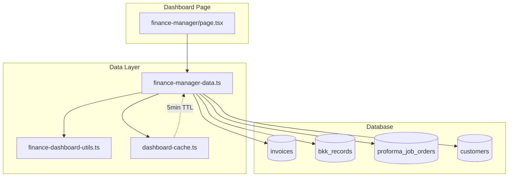

# Design Document: Finance Manager Dashboard Real Data Enhancement

## Overview

This design extends the existing Finance Manager Dashboard with comprehensive real data metrics. The enhancement builds upon the current implementation in `lib/dashboard/finance-manager-data.ts` and `app/(main)/dashboard/finance-manager/page.tsx`, adding new financial metrics, AR/AP sections, approval queues, and recent activity feeds.

The design follows the existing patterns:
- Server-side data fetching with `'use server'` directive
- 5-minute TTL caching via `lib/dashboard-cache.ts`
- Parallel query execution using `Promise.all`
- IDR currency formatting via `lib/utils/format.ts`
- TypeScript strict mode compliance

## Architecture



### Data Flow

1. Dashboard page calls `getFinanceManagerMetrics()`
2. Metrics fetcher checks cache for fresh data
3. If cache miss, executes parallel database queries
4. Aggregates results using utility functions
5. Caches results with 5-minute TTL
6. Returns typed metrics object to dashboard
7. Dashboard renders metrics with appropriate formatting

## Components and Interfaces

### Extended FinanceManagerMetrics Interface

```typescript
export interface FinanceManagerMetrics {
  // Existing metrics (unchanged)
  pendingPJOs: number
  draftInvoices: number
  documentQueue: number
  pendingBKK: number
  arOutstanding: number
  cashPosition: number
  revenueMTD: number
  revenueMTDChange: number
  grossMargin: number
  grossMarginVsTarget: number
  collectionRate: number
  costControl: number
  quotationsWonPendingPJO: number
  budgetExceededCount: number
  
  // NEW: Financial Overview
  revenueYTD: number
  expensesMTD: number
  grossProfit: number
  
  // NEW: AR Enhancement
  arOverdue: number
  arAging: ARAgingData
  overdueInvoicesCount: number
  overdueInvoicesAmount: number
  
  // NEW: Accounts Payable
  apOutstanding: number
  apDueThisWeek: number
  
  // NEW: Approval Queue
  pendingPJOApprovals: ApprovalQueueItem
  pendingDisbursementApprovals: ApprovalQueueItem
  
  // NEW: Administration Enhancement
  pjosReadyForJO: number
  josPendingInvoice: number
  adminPipeline: AdminPipelineData
  
  // NEW: Recent Activity
  recentInvoices: RecentInvoice[]
  recentPayments: RecentPayment[]
  recentPJOApprovals: RecentPJOApproval[]
}

export interface ApprovalQueueItem {
  count: number
  totalValue: number
}

export interface AdminPipelineData {
  draftPJOs: number
  pendingApprovalPJOs: number
  activeJOs: number
  completedJOs: number
}

export interface RecentInvoice {
  id: string
  invoice_number: string
  customer_name: string
  total_amount: number
  status: string
  created_at: string
}

export interface RecentPayment {
  id: string
  invoice_number: string
  customer_name: string
  total_amount: number
  paid_at: string
}

export interface RecentPJOApproval {
  id: string
  pjo_number: string
  description: string
  estimated_amount: number
  status: 'approved' | 'rejected'
  decision_at: string
}
```

### ARAgingData Interface (from existing utils)

```typescript
// Already defined in lib/finance-dashboard-utils.ts
export interface ARAgingData {
  current: AgingBucket      // 0-30 days
  days31to60: AgingBucket   // 31-60 days
  days61to90: AgingBucket   // 61-90 days
  over90: AgingBucket       // 90+ days
}

export interface AgingBucket {
  count: number
  amount: number
  invoiceIds: string[]
}
```

## Data Models

### Database Queries

#### Revenue YTD Query
```sql
SELECT SUM(total_amount) as revenue_ytd
FROM invoices
WHERE status = 'paid'
  AND paid_at >= '2026-01-01'  -- Start of current year
  AND paid_at < '2027-01-01'   -- End of current year
```

#### Expenses MTD Query
```sql
SELECT SUM(amount) as expenses_mtd
FROM bkk_records
WHERE workflow_status IN ('approved', 'paid')
  AND (approved_at >= '2026-01-01' OR paid_at >= '2026-01-01')  -- Current month
  AND is_active = true
```

#### AR Overdue Query (>30 days)
```sql
SELECT SUM(total_amount - amount_paid) as ar_overdue
FROM invoices
WHERE status IN ('sent', 'overdue')
  AND due_date < NOW() - INTERVAL '30 days'
```

#### AR Aging Query
```sql
SELECT id, due_date, total_amount, amount_paid, status
FROM invoices
WHERE status IN ('sent', 'overdue')
-- Processed by groupInvoicesByAging() utility function
```

#### AP Outstanding Query
```sql
SELECT SUM(amount) as ap_outstanding
FROM bkk_records
WHERE workflow_status IN ('draft', 'pending_check', 'pending_approval')
  AND is_active = true
```

#### AP Due This Week Query
```sql
SELECT SUM(amount) as ap_due_this_week
FROM bkk_records
WHERE workflow_status = 'approved'
  AND created_at >= NOW() - INTERVAL '7 days'
  AND is_active = true
```

#### Pending PJO Approvals Query
```sql
SELECT COUNT(*) as count, SUM(estimated_amount) as total_value
FROM proforma_job_orders
WHERE status = 'pending_approval'
  AND is_active = true
```

#### Pending Disbursement Approvals Query
```sql
SELECT COUNT(*) as count, SUM(amount) as total_value
FROM bkk_records
WHERE workflow_status IN ('pending_check', 'pending_approval')
  AND is_active = true
```

#### Recent Invoices Query
```sql
SELECT i.id, i.invoice_number, c.name as customer_name, 
       i.total_amount, i.status, i.created_at
FROM invoices i
LEFT JOIN customers c ON i.customer_id = c.id
ORDER BY i.created_at DESC
LIMIT 5
```

#### Recent Payments Query
```sql
SELECT i.id, i.invoice_number, c.name as customer_name,
       i.total_amount, i.paid_at
FROM invoices i
LEFT JOIN customers c ON i.customer_id = c.id
WHERE i.status = 'paid' AND i.paid_at IS NOT NULL
ORDER BY i.paid_at DESC
LIMIT 5
```

#### Recent PJO Approvals Query
```sql
SELECT id, pjo_number, description, estimated_amount, status,
       COALESCE(approved_at, rejected_at) as decision_at
FROM proforma_job_orders
WHERE status IN ('approved', 'rejected')
  AND is_active = true
ORDER BY COALESCE(approved_at, rejected_at) DESC
LIMIT 5
```

#### PJOs Ready for JO Query
```sql
SELECT COUNT(*) as pjos_ready_for_jo
FROM proforma_job_orders
WHERE status = 'approved'
  AND (converted_to_jo = false OR converted_to_jo IS NULL)
  AND is_active = true
```

#### JOs Pending Invoice Query
```sql
SELECT COUNT(*) as jos_pending_invoice
FROM job_orders
WHERE status IN ('completed', 'submitted_to_finance')
```

#### Admin Pipeline Query
```sql
-- Draft PJOs
SELECT COUNT(*) FROM proforma_job_orders WHERE status = 'draft' AND is_active = true;
-- Pending Approval PJOs
SELECT COUNT(*) FROM proforma_job_orders WHERE status = 'pending_approval' AND is_active = true;
-- Active JOs
SELECT COUNT(*) FROM job_orders WHERE status = 'active';
-- Completed JOs (pending invoice)
SELECT COUNT(*) FROM job_orders WHERE status IN ('completed', 'submitted_to_finance');
```

#### Overdue Invoices Query
```sql
SELECT COUNT(*) as count, SUM(total_amount - amount_paid) as amount
FROM invoices
WHERE (status = 'overdue' OR (status = 'sent' AND due_date < NOW()))
```

### Supabase Query Implementation

```typescript
// Revenue YTD
const revenueYTDResult = await supabase
  .from('invoices')
  .select('total_amount')
  .eq('status', 'paid')
  .gte('paid_at', startOfYear.toISOString())
  .lt('paid_at', startOfNextYear.toISOString())

// Expenses MTD
const expensesMTDResult = await supabase
  .from('bkk_records')
  .select('amount')
  .in('workflow_status', ['approved', 'paid'])
  .gte('approved_at', startOfMonth.toISOString())
  .eq('is_active', true)

// AR Aging (for groupInvoicesByAging)
const arAgingResult = await supabase
  .from('invoices')
  .select('id, due_date, total_amount, amount_paid, status')
  .in('status', ['sent', 'overdue'])

// Recent Invoices with customer join
const recentInvoicesResult = await supabase
  .from('invoices')
  .select('id, invoice_number, total_amount, status, created_at, customers(name)')
  .order('created_at', { ascending: false })
  .limit(5)
```

## Correctness Properties

*A property is a characteristic or behavior that should hold true across all valid executions of a system-essentially, a formal statement about what the system should do. Properties serve as the bridge between human-readable specifications and machine-verifiable correctness guarantees.*

### Property 1: Revenue YTD Calculation

*For any* set of invoices with various `status` and `paid_at` values, the Revenue YTD calculation SHALL equal the sum of `total_amount` for only those invoices where `status` is 'paid' AND `paid_at` falls within the current calendar year.

**Validates: Requirements 1.1**

### Property 2: Expenses MTD Calculation

*For any* set of BKK records with various `workflow_status` and `approved_at`/`paid_at` values, the Expenses MTD calculation SHALL equal the sum of `amount` for only those records where `workflow_status` is 'approved' or 'paid' AND the approval/payment date falls within the current calendar month.

**Validates: Requirements 2.1**

### Property 3: Gross Profit Invariant

*For any* Revenue MTD value R and Expenses MTD value E, the Gross Profit calculation SHALL equal R - E exactly.

**Validates: Requirements 3.1**

### Property 4: AR Overdue Calculation

*For any* set of invoices with various `status`, `due_date`, `total_amount`, and `amount_paid` values, the AR Overdue calculation SHALL equal the sum of (`total_amount` - `amount_paid`) for only those invoices where `status` is 'sent' or 'overdue' AND `due_date` is more than 30 days before the current date.

**Validates: Requirements 4.1**

### Property 5: AR Aging Bucket Assignment

*For any* invoice with a `due_date`, the invoice SHALL be assigned to exactly one aging bucket based on days overdue: 0-30 days → 'current', 31-60 days → 'days31to60', 61-90 days → 'days61to90', 90+ days → 'over90'. The sum of counts across all buckets SHALL equal the total number of outstanding invoices.

**Validates: Requirements 5.2**

### Property 6: AP Outstanding Calculation

*For any* set of BKK records with various `workflow_status` and `amount` values, the AP Outstanding calculation SHALL equal the sum of `amount` for only those records where `workflow_status` is 'draft', 'pending_check', or 'pending_approval' AND `is_active` is true.

**Validates: Requirements 6.1**

### Property 7: AP Due This Week Calculation

*For any* set of BKK records with various `workflow_status`, `created_at`, and `amount` values, the AP Due This Week calculation SHALL equal the sum of `amount` for only those records where `workflow_status` is 'approved' AND `created_at` is within the last 7 days AND `is_active` is true.

**Validates: Requirements 7.1**

### Property 8: Approval Queue Count and Sum Accuracy

*For any* set of records (PJOs or BKK records) with pending status, the approval queue count SHALL equal the number of records matching the pending criteria, and the total value SHALL equal the sum of the value field (`estimated_amount` for PJOs, `amount` for BKK) for those same records.

**Validates: Requirements 8.2, 9.2**

### Property 9: Recent Items Ordering and Limiting

*For any* set of records with a timestamp field, the "recent N items" query SHALL return at most N records, ordered by the timestamp field in descending order (most recent first). If fewer than N records exist, all records SHALL be returned.

**Validates: Requirements 10.1, 11.1, 12.1**

### Property 10: Currency Formatting Consistency

*For any* numeric value, the IDR compact currency formatting function SHALL produce a string containing the currency symbol and a human-readable representation of the value. Formatting then parsing (where possible) SHALL preserve the order of magnitude.

**Validates: Requirements 1.2, 2.2, 3.2, 4.2, 6.2, 7.2**

### Property 11: Cache Idempotence Within TTL

*For any* cache key and TTL period, calling the cached fetch function multiple times within the TTL SHALL return the same data object without executing additional database queries.

**Validates: Requirements 13.1**

## Error Handling

### Database Query Errors

- If any Supabase query fails, the metrics fetcher SHALL log the error and return default values (0 for numbers, empty arrays for lists)
- The dashboard SHALL display gracefully with available data, showing "N/A" or 0 for failed metrics

### Cache Errors

- If cache read fails, proceed with fresh database query
- If cache write fails, return data anyway (cache miss on next request)

### Data Integrity

- NULL values in numeric fields SHALL be treated as 0
- Missing customer relationships SHALL display "Unknown Customer"
- Invalid dates SHALL be excluded from calculations

### Error Response Pattern

```typescript
try {
  const result = await supabase.from('table').select('*')
  if (result.error) {
    console.error('Query failed:', result.error)
    return defaultValue
  }
  return result.data
} catch (error) {
  console.error('Unexpected error:', error)
  return defaultValue
}
```

## Testing Strategy

### Unit Tests

Unit tests verify specific examples and edge cases:

1. **Empty data handling**: Verify all metrics return 0 or empty arrays when no data exists
2. **Date boundary cases**: Test calculations at month/year boundaries
3. **Status filtering**: Verify correct status values are included/excluded
4. **NULL handling**: Test behavior with NULL values in numeric fields
5. **Customer join failures**: Test display when customer relationship is missing

### Property-Based Tests

Property tests verify universal properties across generated inputs. Each property test SHALL:
- Run minimum 100 iterations
- Use a property-based testing library (fast-check for TypeScript)
- Reference the design document property number

**Test Configuration**:
```typescript
// Example property test structure
import fc from 'fast-check'

describe('Finance Manager Metrics', () => {
  // Feature: v0.9.14-finance-manager-dashboard-real-data, Property 1: Revenue YTD Calculation
  it('should calculate Revenue YTD as sum of paid invoices in current year', () => {
    fc.assert(
      fc.property(
        fc.array(invoiceArbitrary),
        (invoices) => {
          const result = calculateRevenueYTD(invoices, currentDate)
          const expected = invoices
            .filter(inv => inv.status === 'paid' && isCurrentYear(inv.paid_at))
            .reduce((sum, inv) => sum + inv.total_amount, 0)
          return result === expected
        }
      ),
      { numRuns: 100 }
    )
  })
})
```

### Integration Tests

- Test full `getFinanceManagerMetrics()` function with mock Supabase client
- Verify cache behavior (hit/miss scenarios)
- Test dashboard page rendering with various metric values

### Test Coverage Requirements

- All calculation functions: 100% branch coverage
- Dashboard rendering: Snapshot tests for each section
- Error handling: All error paths tested

