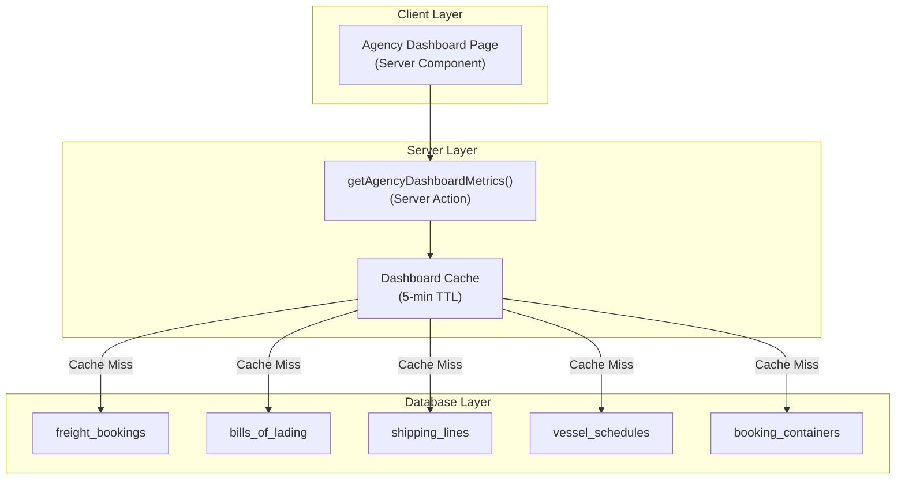
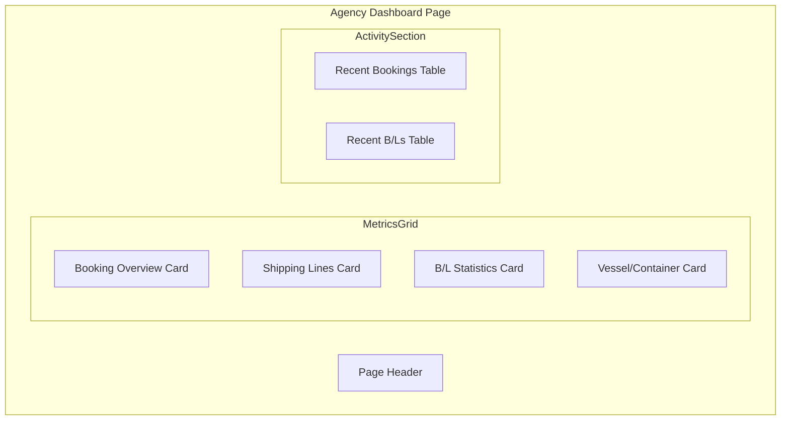

# Design Document: Agency Dashboard (v0.9.15)

## Overview

The Agency Dashboard provides real-time operational metrics for the shipping agency division of GAMA ERP. This feature replaces the current placeholder dashboard at `app/(main)/dashboard/agency/page.tsx` with live data from the Agency module tables including freight bookings, bills of lading, shipping lines, vessel schedules, and container tracking.

The implementation follows the established dashboard pattern used by the Finance Manager dashboard (`lib/dashboard/finance-manager-data.ts`), utilizing server actions with 5-minute caching for optimal performance.

## Architecture



### Component Architecture



## Components and Interfaces

### Data Fetcher Interface

```typescript
// lib/dashboard/agency-data.ts
'use server'

export interface RecentBooking {
  id: string
  bookingNumber: string
  customerName: string
  status: string
  createdAt: string
}

export interface RecentBL {
  id: string
  blNumber: string
  vesselName: string
  status: string
  issuedAt: string | null
}

export interface AgencyDashboardMetrics {
  // Booking Overview
  activeBookings: number
  bookingsThisMonth: number
  pendingConfirmations: number
  completedThisMonth: number
  
  // Shipping Lines
  totalShippingLines: number
  mostUsedShippingLine: string
  preferredLinesCount: number
  
  // Bills of Lading
  blIssuedThisMonth: number
  blPendingIssuance: number
  blDraftCount: number
  
  // Vessel/Container Status
  upcomingArrivals: number
  containersInTransit: number
  expectedArrivals: number
  
  // Recent Activity
  recentBookings: RecentBooking[]
  recentBLs: RecentBL[]
}

export async function getAgencyDashboardMetrics(): Promise<AgencyDashboardMetrics>
```

### Dashboard Page Component

```typescript
// app/(main)/dashboard/agency/page.tsx
import { getAgencyDashboardMetrics } from '@/lib/dashboard/agency-data'
import { formatDate, formatNumber } from '@/lib/utils/format'

export default async function AgencyDashboardPage() {
  // 1. Auth check and role validation
  // 2. Fetch metrics using server action
  // 3. Render dashboard with metric cards and activity tables
}
```

### Metric Card Component Pattern

The dashboard uses the existing card pattern from shadcn/ui:

```typescript
<div className="rounded-lg border p-4">
  <h3 className="font-semibold">{title}</h3>
  <div className="text-2xl font-bold mt-2">{formatNumber(value)}</div>
  <p className="text-sm text-muted-foreground">{description}</p>
</div>
```

## Data Models

### Database Tables Used

| Table | Purpose | Key Fields |
|-------|---------|------------|
| `freight_bookings` | Booking records | id, booking_number, status, customer_id, shipping_line_id, created_at |
| `bills_of_lading` | B/L documents | id, bl_number, status, vessel_name, issued_at, created_at |
| `shipping_lines` | Carrier master data | id, line_name, is_preferred, is_active |
| `vessel_schedules` | Vessel arrival/departure | id, vessel_id, scheduled_arrival, status |
| `booking_containers` | Container tracking | id, booking_id, status |
| `customers` | Customer names | id, name |

### Query Patterns

**Active Bookings Query:**
```sql
SELECT COUNT(*) FROM freight_bookings 
WHERE status IN ('draft', 'requested', 'confirmed', 'amended')
```

**Bookings This Month Query:**
```sql
SELECT COUNT(*) FROM freight_bookings 
WHERE created_at >= start_of_month
```

**Most Used Shipping Line Query:**
```sql
SELECT shipping_line_id, COUNT(*) as booking_count 
FROM freight_bookings 
WHERE shipping_line_id IS NOT NULL
GROUP BY shipping_line_id 
ORDER BY booking_count DESC 
LIMIT 1
```

**B/L Issued This Month Query:**
```sql
SELECT COUNT(*) FROM bills_of_lading 
WHERE status = 'issued' AND issued_at >= start_of_month
```

**Upcoming Arrivals (This Week) Query:**
```sql
SELECT COUNT(*) FROM vessel_schedules 
WHERE scheduled_arrival >= now() 
AND scheduled_arrival <= end_of_week
AND status = 'scheduled'
```

**Containers In Transit Query:**
```sql
SELECT COUNT(*) FROM booking_containers 
WHERE status = 'shipped'
```

### Metrics Calculation Logic

```typescript
// Date boundaries
const now = new Date()
const startOfMonth = new Date(now.getFullYear(), now.getMonth(), 1)
const startOfWeek = getStartOfWeek(now)
const endOfWeek = getEndOfWeek(now)
const sevenDaysFromNow = new Date(now.getTime() + 7 * 24 * 60 * 60 * 1000)

// Active booking statuses
const ACTIVE_BOOKING_STATUSES = ['draft', 'requested', 'confirmed', 'amended']

// Pending B/L statuses
const PENDING_BL_STATUSES = ['draft', 'submitted']
```


## Correctness Properties

*A property is a characteristic or behavior that should hold true across all valid executions of a system—essentially, a formal statement about what the system should do. Properties serve as the bridge between human-readable specifications and machine-verifiable correctness guarantees.*

### Property 1: Unauthorized Role Redirect

*For any* user role not in the allowed set ('agency', 'owner', 'director'), when accessing the agency dashboard, the system should redirect to the default dashboard rather than displaying dashboard content.

**Validates: Requirements 1.4**

### Property 2: Booking Metrics Calculation

*For any* set of freight bookings with various statuses and creation dates, the dashboard metrics should correctly calculate:
- Active bookings count equals the count of bookings with status in ('draft', 'requested', 'confirmed', 'amended')
- Bookings this month count equals the count of bookings with created_at >= start of current month
- Pending confirmations count equals the count of bookings with status 'requested'
- Completed this month count equals the count of bookings with status 'completed' and completed_at >= start of current month

**Validates: Requirements 2.1, 2.2, 2.3, 2.4**

### Property 3: Shipping Line Metrics Calculation

*For any* set of shipping lines and associated bookings, the dashboard metrics should correctly calculate:
- Total shipping lines count equals the count of shipping lines with is_active = true
- Preferred lines count equals the count of shipping lines with is_preferred = true and is_active = true
- Most used shipping line equals the line_name of the shipping line with the highest booking count

**Validates: Requirements 3.1, 3.2, 3.3**

### Property 4: B/L Metrics Calculation

*For any* set of bills of lading with various statuses and issue dates, the dashboard metrics should correctly calculate:
- B/L issued this month count equals the count of B/Ls with status 'issued' and issued_at >= start of current month
- B/L pending issuance count equals the count of B/Ls with status in ('draft', 'submitted')
- B/L draft count equals the count of B/Ls with status 'draft'

**Validates: Requirements 4.1, 4.2, 4.3**

### Property 5: Vessel and Container Metrics Calculation

*For any* set of vessel schedules and booking containers, the dashboard metrics should correctly calculate:
- Upcoming arrivals count equals the count of vessel schedules with scheduled_arrival within current week
- Containers in transit count equals the count of booking containers with status 'shipped'
- Expected arrivals count equals the count of vessel schedules with status 'scheduled' and scheduled_arrival within next 7 days

**Validates: Requirements 5.1, 5.2, 5.3**

### Property 6: Recent Bookings Ordering

*For any* set of freight bookings, the recent bookings list should:
- Contain at most 5 bookings
- Be ordered by created_at in descending order (most recent first)
- Include booking_number, customer name, status, and created_at for each booking

**Validates: Requirements 6.1, 6.3**

### Property 7: Recent B/Ls Ordering

*For any* set of bills of lading with issued_at dates, the recent B/Ls list should:
- Contain at most 5 B/Ls
- Be ordered by issued_at in descending order (most recent first)
- Include bl_number, vessel_name, status, and issued_at for each B/L

**Validates: Requirements 6.2, 6.4**

### Property 8: Cache Behavior

*For any* sequence of dashboard metric requests, the caching system should:
- Return cached data for requests within 5 minutes of the initial fetch
- Query the database and update cache for requests after cache expiration
- Use consistent cache keys based on 'agency-dashboard-metrics' prefix and 'agency' role

**Validates: Requirements 7.1, 7.2, 7.3, 7.4**

## Error Handling

### Database Query Errors

| Error Scenario | Handling Strategy |
|----------------|-------------------|
| Database connection failure | Return default metrics with zero values, log error |
| Query timeout | Return cached data if available, otherwise default metrics |
| Invalid data format | Skip malformed records, continue with valid data |

### Authentication Errors

| Error Scenario | Handling Strategy |
|----------------|-------------------|
| No authenticated user | Redirect to `/login` |
| Missing user profile | Redirect to `/login` |
| Invalid role | Redirect to `/dashboard` |

### Data Edge Cases

| Edge Case | Handling Strategy |
|-----------|-------------------|
| No bookings exist | Display 0 for all booking metrics |
| No shipping lines exist | Display 0 for counts, "-" for most used line |
| No B/Ls exist | Display 0 for all B/L metrics |
| No vessel schedules exist | Display 0 for vessel metrics |
| No containers exist | Display 0 for container metrics |
| Null dates | Format functions return "-" |

### Error Response Pattern

```typescript
// Default metrics for error scenarios
const DEFAULT_METRICS: AgencyDashboardMetrics = {
  activeBookings: 0,
  bookingsThisMonth: 0,
  pendingConfirmations: 0,
  completedThisMonth: 0,
  totalShippingLines: 0,
  mostUsedShippingLine: '-',
  preferredLinesCount: 0,
  blIssuedThisMonth: 0,
  blPendingIssuance: 0,
  blDraftCount: 0,
  upcomingArrivals: 0,
  containersInTransit: 0,
  expectedArrivals: 0,
  recentBookings: [],
  recentBLs: [],
}
```

## Testing Strategy

### Unit Tests

Unit tests focus on specific examples and edge cases:

1. **Access Control Tests**
   - Test agency role can access dashboard
   - Test owner role can access dashboard
   - Test director role can access dashboard
   - Test unauthorized roles are redirected
   - Test unauthenticated users are redirected to login

2. **Metrics Calculation Tests**
   - Test booking count with mixed statuses
   - Test B/L count with mixed statuses and dates
   - Test shipping line aggregation
   - Test vessel schedule date filtering
   - Test container status filtering

3. **Edge Case Tests**
   - Test empty database returns zero metrics
   - Test null date handling
   - Test missing customer names
   - Test missing shipping line references

4. **Formatting Tests**
   - Test date formatting with valid dates
   - Test date formatting with null values
   - Test number formatting

### Property-Based Tests

Property-based tests verify universal properties across generated inputs. Each test should run a minimum of 100 iterations.

**Test Configuration:**
- Framework: fast-check (TypeScript property-based testing library)
- Minimum iterations: 100 per property
- Tag format: `Feature: agency-dashboard, Property N: {property_text}`

**Property Tests to Implement:**

1. **Property 2: Booking Metrics Calculation**
   - Generate random sets of bookings with various statuses and dates
   - Verify count calculations match expected filters

2. **Property 3: Shipping Line Metrics Calculation**
   - Generate random shipping lines and bookings
   - Verify counts and most-used calculation

3. **Property 4: B/L Metrics Calculation**
   - Generate random B/Ls with various statuses and dates
   - Verify count calculations match expected filters

4. **Property 5: Vessel/Container Metrics Calculation**
   - Generate random vessel schedules and containers
   - Verify count calculations match expected filters

5. **Property 6: Recent Bookings Ordering**
   - Generate random bookings with various dates
   - Verify ordering is descending by created_at
   - Verify limit of 5 is respected

6. **Property 7: Recent B/Ls Ordering**
   - Generate random B/Ls with various issued_at dates
   - Verify ordering is descending by issued_at
   - Verify limit of 5 is respected

### Integration Tests

1. **End-to-End Dashboard Load**
   - Test full dashboard renders with real database
   - Test metrics display correctly formatted values

2. **Cache Integration**
   - Test cache hit returns same data
   - Test cache expiration triggers fresh fetch

### Test File Structure

```
__tests__/
├── agency-dashboard-data.unit.test.ts      # Unit tests for data fetcher
├── agency-dashboard-data.property.test.ts  # Property-based tests
└── agency-dashboard-page.test.tsx          # Component tests
```
