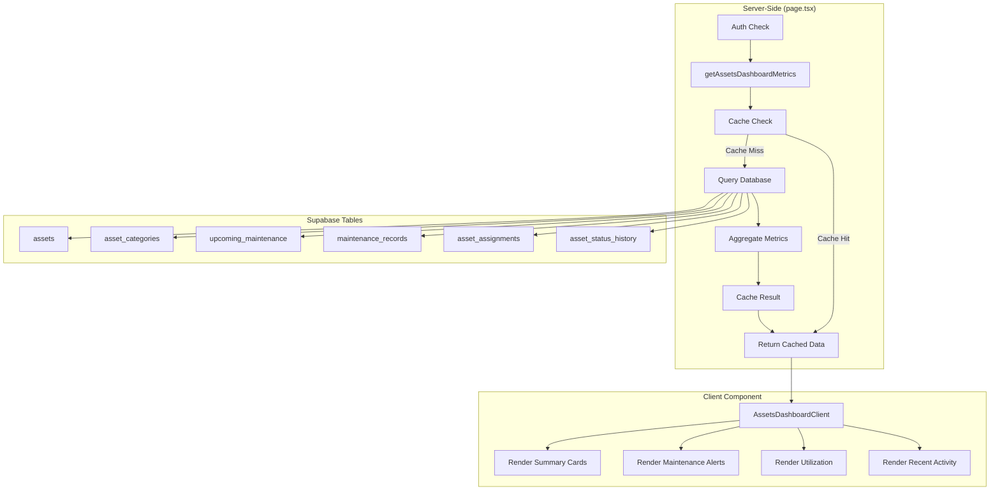

# Design Document: Assets Dashboard Real Data

## Overview

This design connects the existing Assets Dashboard to real Equipment module data by creating a server-side data fetcher (`lib/dashboard/assets-data.ts`) that aggregates metrics from multiple database tables with 5-minute caching. The client component will be updated to receive data as props instead of fetching client-side with mock data.

The implementation follows the established pattern from `lib/dashboard/finance-manager-data.ts` for consistency and maintainability.

## Architecture



## Components and Interfaces

### Data Fetcher Interface

```typescript
// lib/dashboard/assets-data.ts

export interface AssetSummary {
  total: number
  active: number        // status = 'available' or 'in_use'
  maintenance: number   // status = 'maintenance' or 'repair'
  idle: number          // status = 'available' AND assigned_to_job_id IS NULL
  disposed: number      // status = 'retired' or 'sold'
}

export interface CategoryCount {
  categoryId: string
  categoryName: string
  categoryCode: string
  count: number
}

export interface MaintenanceAlert {
  id: string
  assetId: string
  assetName: string
  assetCode: string
  maintenanceType: string
  dueDate: string
  status: 'overdue' | 'due_soon'
  overdueDays?: number
}

export interface RecentMaintenance {
  id: string
  recordNumber: string
  assetName: string
  assetCode: string
  maintenanceType: string
  maintenanceDate: string
  totalCost: number
}

export interface RecentAssignment {
  id: string
  assetName: string
  assetCode: string
  jobNumber: string | null
  assignedFrom: string
  assignedTo: string | null
}

export interface RecentStatusChange {
  id: string
  assetName: string
  assetCode: string
  previousStatus: string | null
  newStatus: string
  changedAt: string
  reason: string | null
}

export interface UtilizationMetrics {
  assignedToJobs: number
  idleAvailable: number
  utilizationRate: number  // percentage
}

export interface AssetsDashboardMetrics {
  summary: AssetSummary
  categories: CategoryCount[]
  maintenanceAlerts: MaintenanceAlert[]
  recentMaintenance: RecentMaintenance[]
  recentAssignments: RecentAssignment[]
  recentStatusChanges: RecentStatusChange[]
  utilization: UtilizationMetrics
  maintenanceStats: {
    overdueCount: number
    dueSoonCount: number
    completedLast7Days: number
  }
}
```

### Updated Client Component Props

```typescript
// app/(main)/dashboard/assets/assets-dashboard-client.tsx

interface AssetsDashboardClientProps {
  userRole: UserRole
  metrics: AssetsDashboardMetrics
}
```

### Updated Page Component

```typescript
// app/(main)/dashboard/assets/page.tsx

export default async function AssetsDashboardPage() {
  // ... existing auth check ...
  
  const metrics = await getAssetsDashboardMetrics()
  
  return <AssetsDashboardClient userRole={profile.role} metrics={metrics} />
}
```

## Data Models

### Database Queries

The data fetcher will execute the following queries in parallel using `Promise.all`:

1. **Asset Summary Query**
```sql
-- Total count
SELECT COUNT(*) FROM assets;

-- Active count (available + in_use)
SELECT COUNT(*) FROM assets WHERE status IN ('available', 'in_use');

-- Maintenance count
SELECT COUNT(*) FROM assets WHERE status IN ('maintenance', 'repair');

-- Idle count (available but not assigned)
SELECT COUNT(*) FROM assets 
WHERE status = 'available' AND assigned_to_job_id IS NULL;

-- Disposed count
SELECT COUNT(*) FROM assets WHERE status IN ('retired', 'sold');
```

2. **Category Counts Query**
```sql
SELECT 
  c.id as category_id,
  c.category_name,
  c.category_code,
  COUNT(a.id) as count
FROM asset_categories c
LEFT JOIN assets a ON a.category_id = c.id
WHERE c.is_active = true
GROUP BY c.id, c.category_name, c.category_code
HAVING COUNT(a.id) > 0
ORDER BY c.display_order;
```

3. **Maintenance Alerts Query**
```sql
SELECT * FROM upcoming_maintenance
WHERE status IN ('overdue', 'due_soon')
ORDER BY 
  CASE WHEN status = 'overdue' THEN 0 ELSE 1 END,
  next_due_date ASC
LIMIT 10;
```

4. **Recent Maintenance Query**
```sql
SELECT 
  mr.*,
  a.asset_name,
  a.asset_code,
  mt.type_name
FROM maintenance_records mr
JOIN assets a ON mr.asset_id = a.id
JOIN maintenance_types mt ON mr.maintenance_type_id = mt.id
WHERE mr.maintenance_date >= NOW() - INTERVAL '7 days'
ORDER BY mr.maintenance_date DESC
LIMIT 5;
```

5. **Recent Assignments Query**
```sql
SELECT 
  aa.*,
  a.asset_name,
  a.asset_code,
  jo.jo_number
FROM asset_assignments aa
JOIN assets a ON aa.asset_id = a.id
LEFT JOIN job_orders jo ON aa.job_order_id = jo.id
ORDER BY aa.created_at DESC
LIMIT 5;
```

6. **Recent Status Changes Query**
```sql
SELECT 
  ash.*,
  a.asset_name,
  a.asset_code
FROM asset_status_history ash
JOIN assets a ON ash.asset_id = a.id
ORDER BY ash.changed_at DESC
LIMIT 5;
```

7. **Utilization Query**
```sql
-- Assigned to jobs
SELECT COUNT(*) FROM assets 
WHERE assigned_to_job_id IS NOT NULL 
AND status IN ('available', 'in_use');

-- Total active for rate calculation
SELECT COUNT(*) FROM assets 
WHERE status IN ('available', 'in_use');
```

### Caching Strategy

```typescript
const CACHE_TTL = 5 * 60 * 1000 // 5 minutes

export async function getAssetsDashboardMetrics(): Promise<AssetsDashboardMetrics> {
  const cacheKey = await generateCacheKey('assets-dashboard-metrics', 'assets')
  
  return getOrFetch(cacheKey, async () => {
    // Execute all queries in parallel
    const [
      totalResult,
      activeResult,
      maintenanceResult,
      idleResult,
      disposedResult,
      categoriesResult,
      alertsResult,
      recentMaintenanceResult,
      recentAssignmentsResult,
      recentStatusChangesResult,
      assignedToJobsResult,
    ] = await Promise.all([...queries])
    
    // Transform and return metrics
    return { ... }
  }, CACHE_TTL)
}
```

## Correctness Properties

*A property is a characteristic or behavior that should hold true across all valid executions of a system-essentially, a formal statement about what the system should do. Properties serve as the bridge between human-readable specifications and machine-verifiable correctness guarantees.*

### Property 1: Asset Summary Status Counts

*For any* collection of assets with various statuses, the summary counts SHALL satisfy:
- `total` equals the count of all assets
- `active` equals the count of assets where status is 'available' OR 'in_use'
- `maintenance` equals the count of assets where status is 'maintenance' OR 'repair'
- `idle` equals the count of assets where status is 'available' AND assigned_to_job_id IS NULL
- `disposed` equals the count of assets where status is 'retired' OR 'sold'
- `active + maintenance + disposed` should account for all non-idle statuses

**Validates: Requirements 1.1, 1.2, 1.3, 1.4, 1.5**

### Property 2: Category Counts Exclude Empty Categories

*For any* set of asset categories, the returned category counts SHALL only include categories where count > 0.

**Validates: Requirements 2.1, 2.3**

### Property 3: Maintenance Alerts Filter by Status

*For any* set of maintenance items, the returned alerts SHALL only include items where status is 'overdue' OR 'due_soon'.

**Validates: Requirements 3.1, 3.2**

### Property 4: Recent Maintenance Date Filtering

*For any* set of maintenance records, the returned recent maintenance SHALL only include records where maintenance_date is within the last 7 days.

**Validates: Requirements 3.3**

### Property 5: Maintenance Alert Required Fields

*For any* maintenance alert returned, it SHALL contain: id, assetId, assetName, assetCode, maintenanceType, dueDate, and status.

**Validates: Requirements 3.4**

### Property 6: Overdue Days Calculation

*For any* overdue maintenance alert, the overdueDays value SHALL equal the number of days between the current date and the due date (positive integer).

**Validates: Requirements 3.5**

### Property 7: Utilization Rate Calculation

*For any* set of assets, the utilization rate SHALL equal (assignedToJobs / totalActive) * 100, where:
- assignedToJobs = count of assets with assigned_to_job_id IS NOT NULL AND status IN ('available', 'in_use')
- totalActive = count of assets with status IN ('available', 'in_use')
- If totalActive is 0, utilization rate SHALL be 0

**Validates: Requirements 4.1, 4.3**

### Property 8: Recent Activity Ordering and Limiting

*For any* set of activity records (maintenance, assignments, status changes), the returned results SHALL:
- Be limited to 5 items maximum
- Be ordered by date/timestamp descending (most recent first)

**Validates: Requirements 5.1, 5.2, 5.3**

### Property 9: No Financial Data Exposure

*For any* returned AssetsDashboardMetrics, the data SHALL NOT contain any fields related to: revenue, profit, invoice totals, or financial margins. Only maintenance costs are permitted.

**Validates: Requirements 8.1, 8.3**

## Error Handling

### Database Query Failures

- If any individual query fails, log the error and return default/empty values for that metric
- The dashboard should still render with partial data rather than failing completely
- Use try-catch blocks around each query group

### Cache Failures

- If cache read fails, proceed with fresh database query
- If cache write fails, log warning but return data successfully
- Cache failures should not block dashboard rendering

### Empty Data States

- Handle cases where tables are empty (new installation)
- Return zero counts and empty arrays rather than null/undefined
- Client component should display appropriate "no data" states

## Testing Strategy

### Unit Tests

Unit tests will verify specific examples and edge cases:

1. **Empty database state**: Verify all counts return 0 and arrays are empty
2. **Single asset scenarios**: Verify counts are correct with minimal data
3. **Status transitions**: Verify counts update correctly when status changes
4. **Date boundary cases**: Verify 7-day filtering at exact boundaries
5. **Division by zero**: Verify utilization rate handles zero active assets

### Property-Based Tests

Property-based tests will use `fast-check` library to verify universal properties:

1. **Property 1**: Generate random assets with various statuses, verify summary counts
2. **Property 2**: Generate categories with varying asset counts, verify empty exclusion
3. **Property 3**: Generate maintenance items with various statuses, verify filtering
4. **Property 4**: Generate maintenance records with various dates, verify date filtering
5. **Property 5**: Generate maintenance alerts, verify required fields present
6. **Property 6**: Generate overdue dates, verify days calculation
7. **Property 7**: Generate asset sets, verify utilization formula
8. **Property 8**: Generate activity records, verify ordering and limiting
9. **Property 9**: Verify returned metrics structure contains no financial fields

### Test Configuration

- Property tests: minimum 100 iterations per property
- Tag format: **Feature: v0.9.16-assets-dashboard-real-data, Property {number}: {property_text}**
- Use `fast-check` for property-based testing (already used in project)

