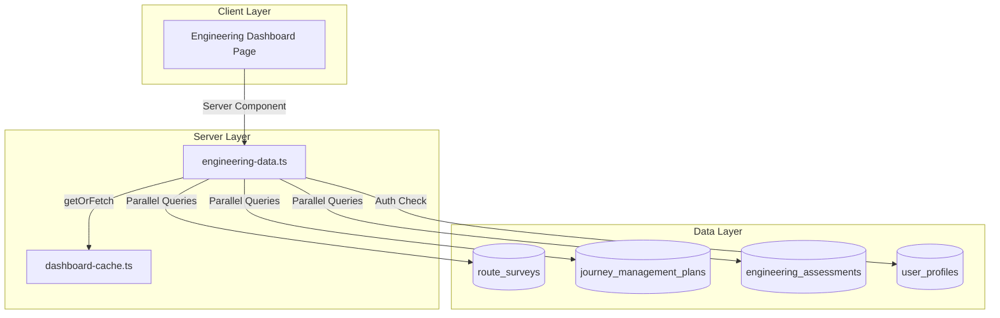

# Design Document: Engineering Dashboard

## Overview

The Engineering Dashboard provides engineers with a centralized view of their daily work including route surveys, Journey Management Plans (JMPs), and engineering assessments. This feature follows the established dashboard patterns in GAMA ERP, using server-side data fetching with 5-minute caching for optimal performance.

The dashboard will be implemented at `app/(main)/dashboard/engineering/page.tsx` with data fetching logic in `lib/dashboard/engineering-data.ts`, following the same architecture as the Agency Dashboard.

## Architecture



## Components and Interfaces

### Data Service Interface

```typescript
// lib/dashboard/engineering-data.ts

export interface RecentSurvey {
  id: string
  surveyNumber: string
  originLocation: string
  destinationLocation: string
  status: string
  createdAt: string
}

export interface RecentJmp {
  id: string
  jmpNumber: string
  journeyTitle: string
  status: string
  plannedDeparture: string | null
}

export interface RecentAssessment {
  id: string
  assessmentType: string
  status: string
  riskLevel: string | null
  createdAt: string
  pjoNumber: string | null
}

export interface MyAssignment {
  id: string
  type: 'survey' | 'jmp' | 'assessment'
  title: string
  status: string
  dueDate: string | null
  createdAt: string
}

export interface EngineeringDashboardMetrics {
  // Survey Overview
  totalSurveys: number
  pendingSurveys: number
  surveysCompletedThisMonth: number
  recentSurveys: RecentSurvey[]
  
  // JMP Status
  activeJmps: number
  upcomingJmps: number
  pendingReviewJmps: number
  recentJmps: RecentJmp[]
  
  // Engineering Assessments
  pendingAssessments: number
  assessmentsCompletedThisMonth: number
  completionRate: number
  recentAssessments: RecentAssessment[]
  
  // My Assignments
  myAssignments: MyAssignment[]
  mySurveyCount: number
  myAssessmentCount: number
  myJmpCount: number
}
```

### Dashboard Page Component

```typescript
// app/(main)/dashboard/engineering/page.tsx

interface Props {
  // Server component - no props needed
}

// Sections:
// 1. Header with title and description
// 2. Survey Overview cards (4 metrics)
// 3. JMP Status cards (3 metrics)
// 4. Assessment Metrics cards (3 metrics)
// 5. Quick Actions section
// 6. Recent Activity grid (Surveys, JMPs, Assessments)
// 7. My Assignments section
```

### Status Badge Component

```typescript
// Reusable status badge for surveys, JMPs, and assessments
function StatusBadge({ status, type }: { status: string; type: 'survey' | 'jmp' | 'assessment' }) {
  // Returns styled badge based on status and type
}
```

## Data Models

### Database Tables Used

1. **route_surveys**
   - Key columns: id, survey_number, origin_location, destination_location, status, surveyor_id, created_at, completed_at

2. **journey_management_plans**
   - Key columns: id, jmp_number, journey_title, status, planned_departure, prepared_by, convoy_commander_id, created_at

3. **engineering_assessments**
   - Key columns: id, pjo_id, assessment_type, status, assigned_to, risk_level, created_at, completed_at

### Query Patterns

```sql
-- Survey counts
SELECT COUNT(*) FROM route_surveys WHERE status IN ('requested', 'scheduled')
SELECT COUNT(*) FROM route_surveys WHERE completed_at >= start_of_month

-- JMP counts
SELECT COUNT(*) FROM journey_management_plans WHERE status = 'active'
SELECT COUNT(*) FROM journey_management_plans 
  WHERE planned_departure BETWEEN now() AND now() + interval '7 days'

-- Assessment counts
SELECT COUNT(*) FROM engineering_assessments WHERE status = 'pending'
SELECT COUNT(*) FROM engineering_assessments WHERE completed_at >= start_of_month

-- My assignments
SELECT * FROM route_surveys WHERE surveyor_id = :userId
SELECT * FROM engineering_assessments WHERE assigned_to = :userId
SELECT * FROM journey_management_plans 
  WHERE prepared_by = :userId OR convoy_commander_id = :userId
```

## Correctness Properties

*A property is a characteristic or behavior that should hold true across all valid executions of a system—essentially, a formal statement about what the system should do. Properties serve as the bridge between human-readable specifications and machine-verifiable correctness guarantees.*

### Property 1: Status Filtering Correctness

*For any* collection of records and any status filter value, the count returned by the data service should equal exactly the number of records in the collection that match the specified status.

**Validates: Requirements 1.2, 2.1, 2.3, 3.1**

### Property 2: Date Range Filtering Correctness

*For any* collection of records with timestamps and any date range (start of month to now), the count returned should equal exactly the number of records with completion dates within that range.

**Validates: Requirements 1.3, 3.2**

### Property 3: Recent Items Ordering and Limiting

*For any* collection of records, the recent items query should return at most 5 items, and those items should be ordered by created_at in descending order (most recent first).

**Validates: Requirements 1.4, 2.4, 3.4**

### Property 4: User Assignment Filtering

*For any* user ID and collection of records with assignment fields, the assignment query should return only records where the user is assigned (surveyor_id, assigned_to, prepared_by, or convoy_commander_id matches the user ID).

**Validates: Requirements 4.1, 4.2, 4.3**

### Property 5: Completion Rate Calculation

*For any* set of assessments with total count > 0, the completion rate should equal (completed count / total count) * 100, rounded appropriately. If total count is 0, completion rate should be 0.

**Validates: Requirements 3.3**

### Property 6: Cache Key Generation Format

*For any* role string and date, the generated cache key should match the pattern 'engineering-dashboard-metrics:{role}:{YYYY-MM-DD}'.

**Validates: Requirements 6.4**

### Property 7: Cache Round-Trip

*For any* valid metrics data, storing it in the cache and then retrieving it before TTL expiration should return equivalent data.

**Validates: Requirements 6.2, 6.3**

### Property 8: Unauthorized Role Redirect

*For any* user role not in the allowed set ['engineer', 'owner', 'director'], accessing the dashboard should result in a redirect to the default dashboard path.

**Validates: Requirements 7.3**

## Error Handling

### Database Query Errors

1. **Connection Failures**: If Supabase connection fails, the data service should return default empty metrics rather than throwing an error, allowing the dashboard to render with zero values.

2. **Query Timeouts**: Queries should have reasonable timeouts. If a query times out, return cached data if available, otherwise return empty metrics.

3. **Partial Failures**: If some queries succeed and others fail, return partial data with the successful metrics and zero values for failed queries.

### Authentication Errors

1. **Missing User**: If `getUser()` returns null, redirect to `/login`.

2. **Missing Profile**: If user profile cannot be fetched, redirect to `/login`.

3. **Invalid Role**: If user role is not in allowed list, redirect to `/dashboard`.

### Cache Errors

1. **Cache Miss**: Normal operation - fetch fresh data from database.

2. **Cache Corruption**: If cached data is malformed, treat as cache miss and fetch fresh data.

### Data Transformation Errors

1. **Null Values**: Handle null values gracefully in all transformations, using default values (empty strings, 0, null dates).

2. **Type Mismatches**: Use TypeScript strict typing to catch type errors at compile time.

## Testing Strategy

### Unit Tests

Unit tests will cover specific examples and edge cases:

1. **Data Transformation Tests**
   - Test row-to-model transformations with various null combinations
   - Test date formatting with null dates
   - Test status badge color mapping

2. **Edge Case Tests**
   - Empty data sets (no surveys, JMPs, or assessments)
   - Single record scenarios
   - All records in same status
   - Boundary dates (exactly at month start/end)

3. **Role Access Tests**
   - Test each allowed role (engineer, owner, director)
   - Test unauthorized roles redirect

### Property-Based Tests

Property-based tests will use `fast-check` library with minimum 100 iterations per test.

1. **Status Filter Property Test**
   - Generate random collections of records with random statuses
   - Verify filter counts match expected
   - Tag: **Feature: engineering-dashboard, Property 1: Status filtering correctness**

2. **Date Range Filter Property Test**
   - Generate random records with random dates
   - Verify date range filtering is correct
   - Tag: **Feature: engineering-dashboard, Property 2: Date range filtering correctness**

3. **Recent Items Property Test**
   - Generate random collections of varying sizes
   - Verify ordering and limit constraints
   - Tag: **Feature: engineering-dashboard, Property 3: Recent items ordering and limiting**

4. **User Assignment Property Test**
   - Generate random records with random user assignments
   - Verify only matching records are returned
   - Tag: **Feature: engineering-dashboard, Property 4: User assignment filtering**

5. **Completion Rate Property Test**
   - Generate random assessment counts
   - Verify calculation formula
   - Tag: **Feature: engineering-dashboard, Property 5: Completion rate calculation**

6. **Cache Key Property Test**
   - Generate random role strings and dates
   - Verify key format matches pattern
   - Tag: **Feature: engineering-dashboard, Property 6: Cache key generation format**

7. **Cache Round-Trip Property Test**
   - Generate random metrics objects
   - Verify store-then-retrieve returns equivalent data
   - Tag: **Feature: engineering-dashboard, Property 7: Cache round-trip**

8. **Unauthorized Role Property Test**
   - Generate random role strings not in allowed set
   - Verify redirect behavior
   - Tag: **Feature: engineering-dashboard, Property 8: Unauthorized role redirect**

### Integration Tests

1. **Full Dashboard Render Test**
   - Test complete page render with mocked data
   - Verify all sections are present

2. **Navigation Link Tests**
   - Verify all quick action links have correct hrefs

### Test Configuration

```typescript
// vitest.config.ts additions
{
  test: {
    // Property tests need more time due to 100+ iterations
    testTimeout: 30000,
  }
}
```

