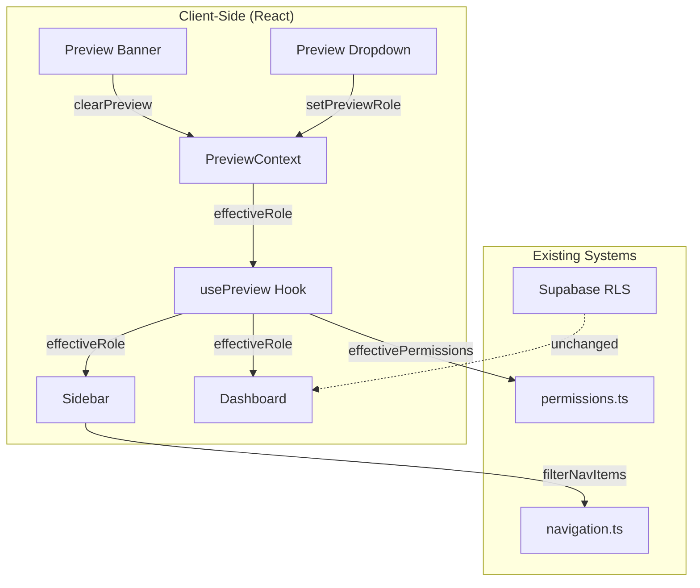

# Design Document: Role Preview Feature

## Overview

The Role Preview Feature enables the Owner to temporarily view the system as another role without creating test users. This is implemented as a client-side only feature using React Context, affecting UI presentation (sidebar navigation, dashboard selection, data visibility) while maintaining actual database permissions and audit trail integrity.

The preview state is ephemeral - stored only in React context and cleared on page refresh or logout.

## Architecture



## Components and Interfaces

### PreviewContext

```typescript
// contexts/preview-context.tsx

interface PreviewContextType {
  previewRole: UserRole | null
  setPreviewRole: (role: UserRole | null) => void
  effectiveRole: UserRole
  effectivePermissions: UserPermissions
  isPreviewActive: boolean
  canUsePreview: boolean
}

interface PreviewProviderProps {
  children: React.ReactNode
  actualRole: UserRole
  actualPermissions: UserPermissions
}
```

### usePreview Hook

```typescript
// hooks/use-preview.ts

function usePreview(): PreviewContextType
```

### Preview UI Components

```typescript
// components/preview/preview-dropdown.tsx
interface PreviewDropdownProps {
  currentRole: UserRole
  onRoleSelect: (role: UserRole) => void
}

// components/preview/preview-banner.tsx
interface PreviewBannerProps {
  previewRole: UserRole
  onExit: () => void
}
```

### Integration Points

```typescript
// lib/preview-utils.ts

// Get effective permissions for a role (actual or preview)
function getEffectivePermissions(
  actualRole: UserRole,
  actualPermissions: UserPermissions,
  previewRole: UserRole | null
): UserPermissions

// Get effective role (preview if active, otherwise actual)
function getEffectiveRole(
  actualRole: UserRole,
  previewRole: UserRole | null
): UserRole

// Check if user can use preview feature
function canUsePreviewFeature(actualRole: UserRole): boolean
```

## Data Models

### Preview State (Client-Side Only)

```typescript
interface PreviewState {
  previewRole: UserRole | null  // null = no preview active
}
```

### Available Preview Roles

```typescript
const PREVIEW_ROLES: UserRole[] = [
  'owner',
  'admin', 
  'manager',
  'finance',
  'sales',
  'ops',
  'viewer'
]
```

## Correctness Properties

*A property is a characteristic or behavior that should hold true across all valid executions of a system-essentially, a formal statement about what the system should do. Properties serve as the bridge between human-readable specifications and machine-verifiable correctness guarantees.*

### Property 1: Owner-only preview access
*For any* user role that is not 'owner', the preview dropdown SHALL NOT be visible AND calling setPreviewRole SHALL have no effect on the effective role.
**Validates: Requirements 1.4, 7.1**

### Property 2: Preview role selection updates effective role
*For any* preview role selected by the Owner, the effectiveRole SHALL equal the selected preview role immediately after selection.
**Validates: Requirements 1.3**

### Property 3: Preview banner displays correct role
*For any* active preview role, the preview banner SHALL be visible AND SHALL contain the text "PREVIEW MODE: Viewing as [RoleName]" where RoleName matches the preview role.
**Validates: Requirements 2.1, 2.2**

### Property 4: Exit preview restores owner role
*For any* active preview state, clicking "Exit Preview" SHALL set previewRole to null AND effectiveRole SHALL equal 'owner'.
**Validates: Requirements 2.4**

### Property 5: Navigation filtering matches effective role
*For any* effective role (actual or preview), the filtered navigation items SHALL match exactly what filterNavItems returns for that role with its default permissions.
**Validates: Requirements 3.1**

### Property 6: Dashboard selection matches effective role
*For any* effective role, the dashboard type returned SHALL match getDashboardPath for that role.
**Validates: Requirements 4.1**

### Property 7: Permissions match effective role
*For any* effective role, the effectivePermissions SHALL equal getDefaultPermissions for that role.
**Validates: Requirements 5.1**

### Property 8: Initial preview state is null
*For any* new PreviewContext instance, the initial previewRole SHALL be null AND isPreviewActive SHALL be false.
**Validates: Requirements 6.2**

## Error Handling

| Scenario | Handling |
|----------|----------|
| Non-owner attempts preview | setPreviewRole is no-op, canUsePreview returns false |
| Invalid role passed to setPreviewRole | Validate against PREVIEW_ROLES, ignore invalid |
| Context accessed outside provider | Throw error with helpful message |
| Preview state during logout | Context unmounts, state naturally cleared |

## Testing Strategy

### Property-Based Testing

Use `fast-check` for property-based tests:

1. Generate random roles and verify owner-only access
2. Generate random preview role selections and verify state transitions
3. Generate random effective roles and verify navigation/permission consistency

### Unit Tests

- PreviewContext initialization
- usePreview hook behavior
- Preview dropdown rendering
- Preview banner rendering
- Integration with existing navigation filtering
- Integration with existing permission checks

### Test Configuration

- Minimum 100 iterations per property test
- Each property test tagged with: `**Feature: v0.9.7-role-preview, Property {number}: {property_text}**`
